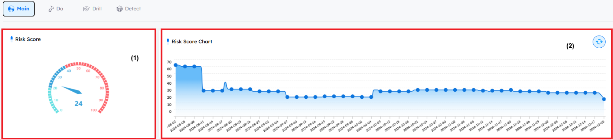

# Home Dashboard
- The dPhish Home Dashboard offers a comprehensive overview of the entity's `security posture`, providing a `risk score` along with key insights from the `Do`, `Drill`, and `Detect` modules. It presents statistics and analysis on `phishing simulations`, `awareness drills`, and `threat detection activities`. This dashboard serves as a central hub, giving administrators a clear view of ongoing activities, performance metrics, and areas that require attention.

---

## Main

- **The main dashboard is divided into two sections:**
    
    1. **Risk Score**: This section displays the current risk score of the entity, based on the activities and progress of targets, drill users’ awareness, and the security controls by emulation campaigns.
    2. **Risk Score Chart**: This section provides daily visual representation of the risk score over time, highlighting trends, fluctuations, and the impact of security efforts, helping to track improvements or identify areas needing attention.

- **Breakdown of Risk Score Calculations:**
    1. **Phishing Simulation and Adversary Emulation**: Contribute 60% of the total risk score.
    2. **Awareness Course Progress**: Contributes 30% of the total risk score.
    3. **Leaked Credentials**: Contribute 10% of the total risk score, considering only those with an open or in-progress status.
        - A single target with leaked credentials contributes the full 10%.
        - For multiple targets, the average contribution per target is capped at a maximum of 10%.

- **Breakdown of the 10% Contribution:**
    1. **Malware Logs**: Represent 80% of the 10% risk.
    2. **Public Breaches**: Represent 20% of the 10% risk.

> [!NOTE]
> The `Leaked Credentials Engine` runs every 24 hours at 12:00 AM to search for any leaked credentials from malware or public breaches for targets whose emails are imported into the tenant.

---

## Do Dashboard
- The dPhish `Do` dashboard provides a quick summary of the overall status of the do module. This summary includes statistics on reported emails and their severities, as well as data on employee leakage within the platform.

**The Do dashboard is divided into 12 sections:**

1. **Campaigns Statistics**: This section provides an overview of the total number of emails sent in campaigns, the number of targets exploited in case the campaign type is email with attachment whether the attachment in email or usb, credentials submitted by targets, targets reporting simulation emails, and USBs opened by targets.
2. **Campaigns Timeline**: This section provides daily insights into total campaign trackers (e.g., link_opened, credentials_saved, etc.).
3. **Campaigns Tracker Categories**: Breaks down the specific numbers of trackers achieved by targets during simulation campaigns. You can see the numbers by hovering over the desirable tracker.

4. **Top Used Campaign**: Highlights the campaign with the highest number of achieved trackers.
5. **Success Categories**: Summarizes successful categories across launched campaigns with a percentage chart and the total count for each category.
6. **Top Campaigns**: Lists the top 5 campaigns that collected the most trackers.
7. **Last Created Campaign**: Displays details of the most recently created campaign, including campaign type, number of targets included, and scheduling status.
8. **Top 5 Reporting Employees**: Identifies the top 5 targets who `reported` phishing simulation emails using the `add-on`.
9. **Top 5 Faild Departments**: Shows the top 5 departments with the highest failure rates, represented as a percentage chart. This analysis requires the department field to be declared for each target in the tenant.
10. **Top 5 Faild Targets**: Displays the top 5 targets who failed in simulation campaigns by achieving the success category of the campaign (e.g., link_opened, credentials_saved, etc.).

11. **Mail Reported Timeline**: Tracks the daily count of simulation campaign emails that have been reported by targets over a given time period.
12. **Mail Reported By Departments**:  Displays the total number of emails reported using the add-on, categorized by departments, along with a percentage chart for better visualization.

--- 

## Drill Dashboard
- The dPhish `Drill` dashboard provides a quick summary of course progress, including success and failure rates, as well as awareness progress. It provides statistics on employees' awareness progress, details on breached courses, and the completion status of assigned courses.

**The Drill dashboard is divided into 5 sections:**

1. **Courses Statistics**: Displays the total number of courses in the tenant, available awareness content (including course materials, templates, and awareness pages), tracks, total drill users, and the number of courses with assigned users that have breached deadlines.
2. **Employees Awareness Progress**: Provides a daily timeline of employee awareness progress which tracks courses completion and success rates.
3. **Employees Quiz Success Counts**: Offers insights into quiz performance, detailing the number of assigned users who failed to meet the quiz success threshold set by the admin and those who succeeded. The admin can control the Quiz Success Mark from settings.
4. **Courses Completion Count**: Highlights the number of courses with assigned users that have been completed with all the content inside, including quizzes, regardless of success or failure.

5. **Courses**: Provides a categorized list of courses, including:
    - Completed courses (content and quiz).
    - Uncompleted courses that have assigned users.
    - Courses with deadlines that have not been breached yet.
    - Courses with assigned users that breached the deadline without user completion.

---

## Detect Dashboard
- The dPhish `Detect` dashboard provides a quick summary of the overall status of the detection module. This summary includes statistics on reported emails and their severities, as well as data on employee leakage within the platform.

**The dashboard is visually divided into 4 sections:**

1. **Email Statistics**: This section provides an overview of the reported emails, including the total number, the sources (such as the Web UI, Add-on, or dPhish API), and the total number of emails detected as very likely threats. Additionally, it highlights the total number of registered employees on the platform who have leaked credentials.
2. **Credential Leakage**: This section details the platform's status concerning employees with leaked credentials. It outlines statistics about affected employees like the number of total leaked credentials that belong to the targets and a percentage.
3. **Analysis Severity**: A visual representation of the severity levels of the analyzed emails.
4. **Analysis Timeline**: A visual representation of the timeline for reported emails.