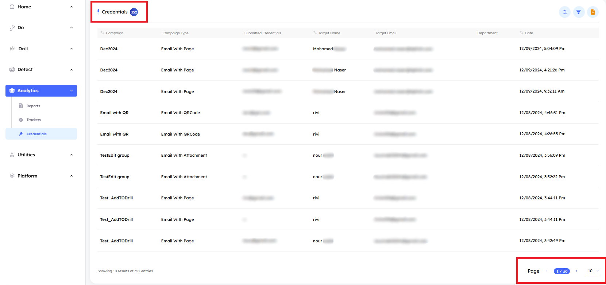
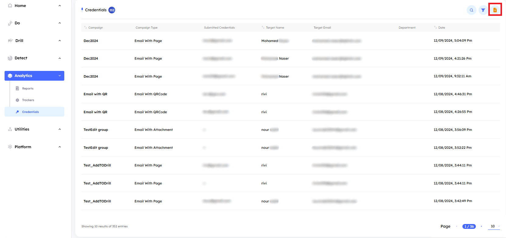
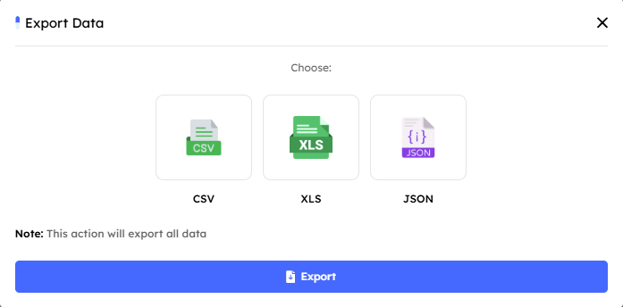

## Overview

> The `Credentials tab` displays credentials submitted by targets in launched phishing simulation campaigns, along with additional data. This section provides insights into which target entered their credentials, in which campaign, and much more information that we will explore further.

> [!NOTE]
> Passwords are not saved in our database to ensure data security.

# Main Page

Upon accessing the `Credentials tab`, users encounter key indicators at the top of the page, displaying the total number of credentials submitted by targets. The interface includes pagination controls, allowing users to set the number of credentials displayed per page by adjusting options at the bottom of the page.

---

## Credentials Features

- ### Credentials Details and Metadata

    - A comprehensive information bar is located above the credentials, displaying essential details for effective credentials management. The following components are included:

        1. **Campaign**: The name of the campaign from which the target submitted their credentials. 
        2. **Campaign Type**: The type of phishing simulation campaign.
        3. **Submitted Credentials**: The credentials entered by the target.
        4. **Target Name**: The name of the individual who submitted their credentials.
        5. **Target Email**: The email address of the target who submitted their credentials and is linked to the system.
        6. **Department**: The department to which the target belongs.
        7. **Date**: The date the credentials were submitted.

- ### Search Functionality

    - Located at the top right corner, the `Search` button allows you to quickly find a credential by its `campaign name`, `target name`, `target email`, or `submitted credentials`. Simply enter the relevant information, and the system will display matching results.

- ### Filtering Options

    - Next to the `Search` button, the `Filter` button allows you to search based on the credential's `campaign name`, or `target mail`.

- ### Export Data

    - The `Export Data` button allows you to export a file containing all credentials data in three formats: `CSV`, `XLS`, or `JSON`. Choose the format that best suits your needs. Once selected, an email will be sent to the registered admin panel email with a link to download the report.

    

    ---
    
    
