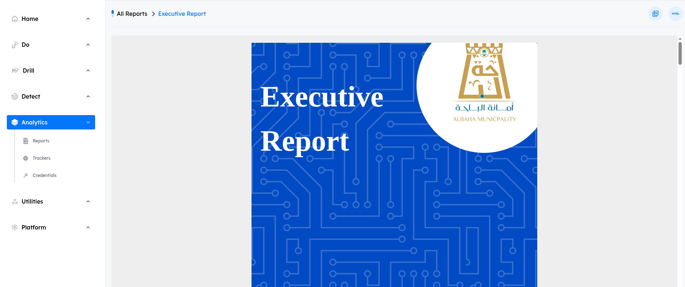
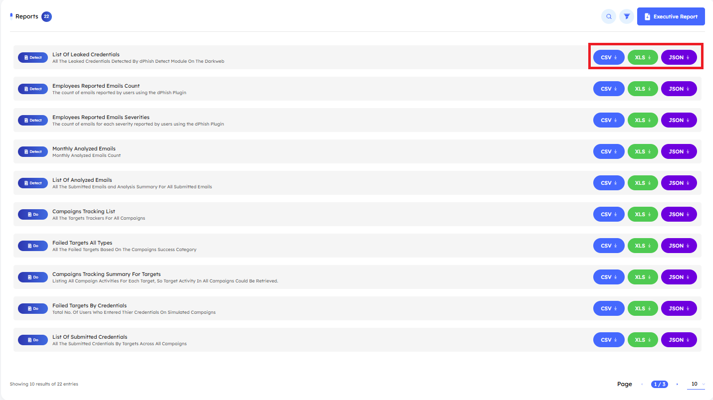

## Overview

> The `Reports` tab provides administrators with all necessary reports covering the `Do`, `Drill`, `Detect`, `General` and `Utilities`, offering detailed insights for each phase.

# Main Page

Upon accessing the `Reports tab`, users encounter key indicators at the top of the page, displaying the total number of available reports. The interface includes pagination controls, allowing users to set the number of reports displayed per page by adjusting options at the bottom of the page.

---

## Reports Features

- ### Search Functionality

    - Located at the top right corner, the search button allows you to find a report by its name quickly.

- ### Filtering Options

    - Next to the Search button, the Filter button allows you to search based on the report's name or category. The available categories for filtering are:

        1. **Do**
        2. **Drill**
        3. **Detect**
        4. **General**
        5. **Utilities**

- ### Executive Report

    - The Executive `Report` button generates a comprehensive report covering all modules (`Do`, `Drill`, `Detect`, `General`, `Utilities`). Upon triggering the button, an email will be sent to the registered admin panel email, allowing him to download the report directly.

    

    ---

    - The `HTML` and `PDF` export icons used in Executive Report view

        1. **Download HTML Report:** This button allows you to download the report in HTML format.
        2. **Download PDF Report:** This button allows you to download the report in PDF format.

    

---

- ### Reports Formats

    - Reports are available in three downloadable formats: `CSV`, `XLS`, and `JSON`. Choose the format that best suits your needs. Once selected, an email will be sent to the registered admin panel email with a link to download the report.

    

