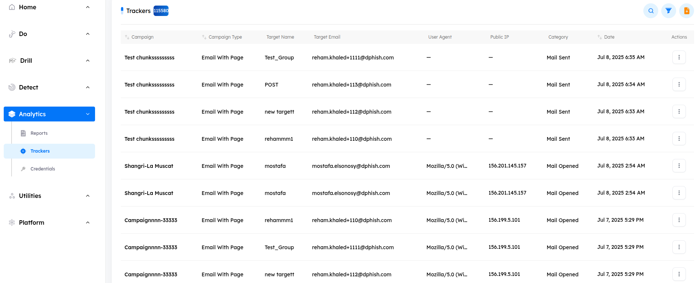

## Overview

> The `Trackers tab` displays all trackers associated with phishing simulation campaigns created on the tenant. You can also export a file containing all trackers for further analysis.

# Main Page

Upon accessing the `Trackers tab`, users encounter key indicators at the top of the page, displaying the total number of trackers. The interface includes pagination controls, allowing users to set the number of trackers displayed per page by `adjusting` options at the bottom of the page.

---

## Trackers Features

- ### Trackers Details and Metadata

    - A comprehensive information bar is located above the trackers, displaying essential details for effective trackers management. The following components are included:

        1. **Campaign**: The name of the associated campaign.
        2. **Campaign Type**: The type of phishing simulation campaign.
        3. **Target Name**: The name of the individual targeted.
        4. **Target Email**: The email address of the target.
        5. **User Agent**: Information about the device or browser used.
        6. **Public IP**: The public IP address of the target.
        7. **Category**: The category or type of activity tracked (mail_opened, link_opened credentials_saved).
        8. **Date**: The date of the tracked action.
        9. **Actions**: Options for viewing more details about the tracker.

- ### Search Functionality

    - Located at the top right corner, the `Search` button allows you to quickly find a tracker by its `campaign name`, `target name`, `target email`, or `category`. Simply enter the relevant information, and the system will display matching results.

- ### Filtering Options

    - Next to the Search button, the Filter button allows you to search based on the tracker's `campaign name`, `category`, or `target email`.

- ### Export Data

    - The `Export Data` button allows you to export a file containing all tracker data in three formats: `CSV`, `XLS`, or `JSON`. Choose the format that best suits your needs. Once selected, an email will be sent to the registered admin panel email with a link to download the report.

    

    ---
    
    
