# Analyzed Emails Overview

As stated earlier, this sub-module is the main component of dPhish Detect. It is a dashboard that aggregates all reported emails from various sources, along with email metadata such as report date and reporter email. The user interface is simple yet powerful, presenting information clearly to analysts and enabling them to take the necessary actions to assess and triage the situation.
The user interface consists of multiple elements, and each will be explained below:

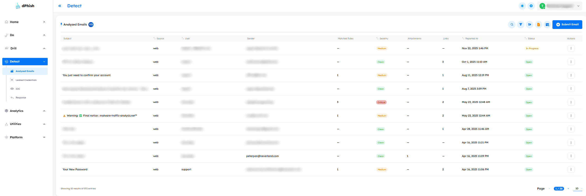

---

## Main Controls

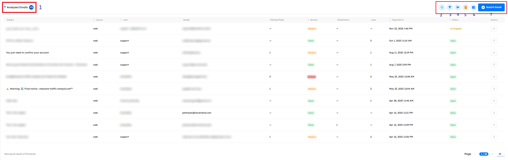

1.  Give the overall number of reported emails in the platform, including emails for all sources.
2.  **Advanced Search Across All Reported Emails** \
    The analyst can now search across all reported emails, regardless of the folder, case, or time period. Which enables broader investigation and pattern detection across multiple incidents. \
    They can search by:

    - **Subject** – Search by full or partial match.
    - **Sender Email** – Exact or partial sender address.
    - **Sender Domain** – Domain-level filtering (e.g., @example.com).
    - **Sender IP** – Search by the originating IP.

3.  **Advanced Filter Across All Reported Emails** \
    Filters the displayed emails based on:
    - **Detection Severity**
    - **Source**
    - **Status**
    - **User**
    - **Subject**
    - **Sender Domain**
    - **Date Range**: Supports precise time-based investigations (e.g., last week, last 24 hours, incident timeframe).

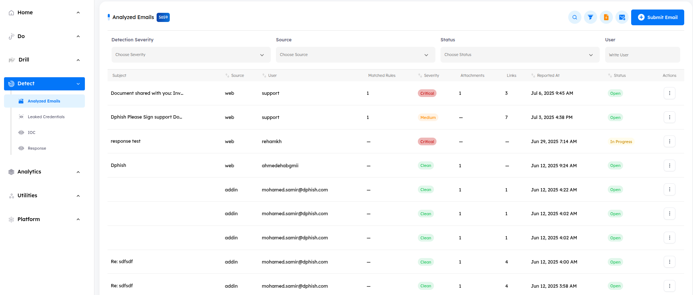

4.  Allows the admin to **Group By**:

    - Reporter
      - Added the ability to group reported emails by User.
      - When selecting a user group, the analyst can click on each subject within that group to:
        - View all reports for that subject.
        - Navigate between the user's different reported emails.

    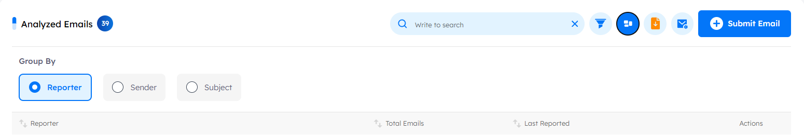

    > **Benefit:** Helps track repeated reports from the same user and understand user behavior.

    - Sender

      - The Sender (email address) is now shown clearly in the main list view.
      - Groups all reported emails from the same sender.
      - Allows quick detection of spam campaigns or malicious senders.
      - Supports navigation to all related reports with one click.

    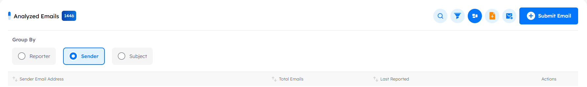

    > **Benefit:** Improves threat correlation and quickly highlights suspicious or repeated malicious senders.

    - Subject

      - The reported emails list can be grouped by email subject.
      - For each subject group, a “View Reporting Users” button is available.
      - This displays:
        - All users who reported the same email.
        - All related reports under the same subject.

    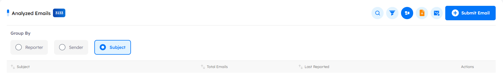

    > **Benefit:** Helps identify mass-reported phishing attempts instantly.

5.  Exports the listing data, all the analyzed emails, in CSV, XLS, or JSON format.

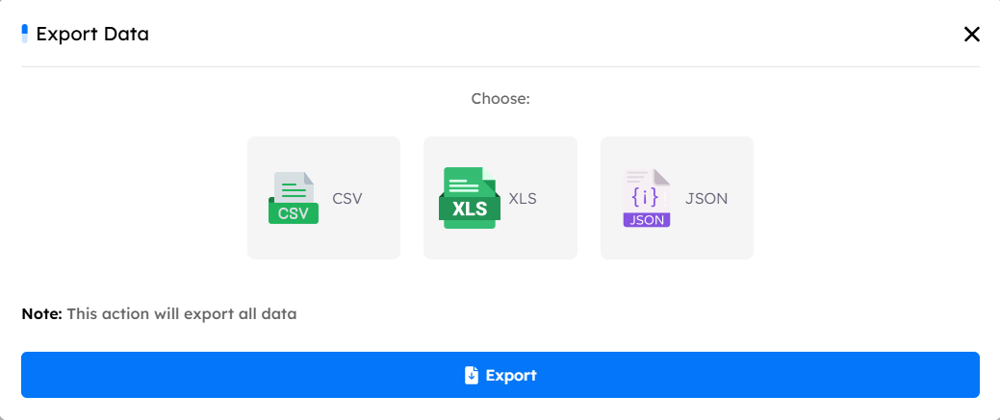

6.  **Emails Analysis Tasks**: This part displays the emails that are being analyzed right now and the status of each of their tasks.

    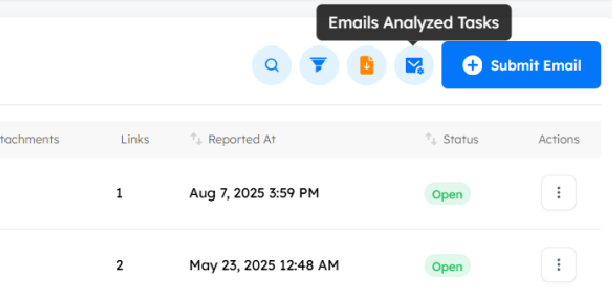

    - From the following menu, you can terminate the task that you want to stop:

    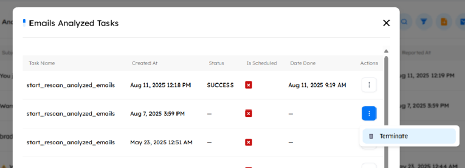

7.  **Submit Email**: Submits a new email, .eml file, for analysis.

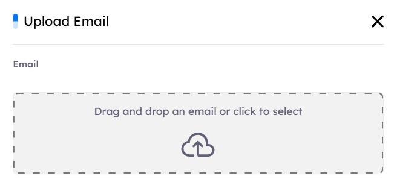

## Email Metadata

1.  **Subject**: The subject of the reported email.
2.  **Source**: The source of the reported email. It either be addon, API, or Web.
3.  **User**: The user that reported the email. The format of this value varies depending on the email source.
4.  **Sender**: The original sender of the email that was reported.
5.  **Matched Rules**: The total number of detection rules that matched the reported email.
6.  **Severity**: The overall severity of the reported email. It can be clean, informational, Low, Medium, High, and Critical.
7.  **Attachments**: The total number of attachments in the reported email.
8.  **Links**: The total number of URLs in the body of the reported email.
9.  **Reported At**: Email report timestamp.
10. **Status**: The status of the reported email. It can be open, In Progress, Resolved, or False Positive.
11. **Actions**: Enables the security analyst to take further actions on the reported email. It will be explained shortly.
12. The current listing page.

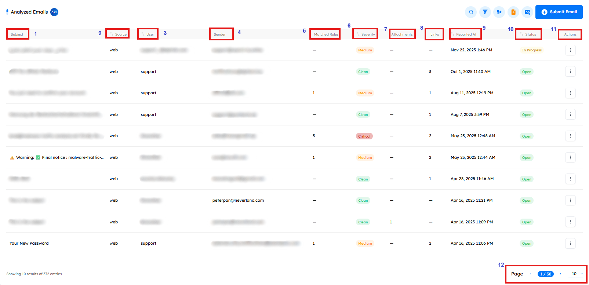

The true power of dPhish's Detect module is in the capabilities it provides to security analysts to perform the triaging as efficiently as possible. The Actions menu, number 11 in the previous screen, provides the analyst with such capabilities.

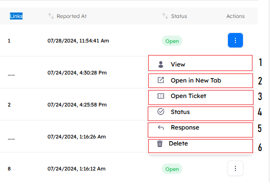

### The items of the Actions menu are as follows:

#### 1. View

Opens the scan results page for the reported email. The page provides details about the email, including attachments (if any), email headers, server hops, and observables. It also displays the scan results, such as the severity score and a list of matching rules.
The UI elements of the results page are as follows:

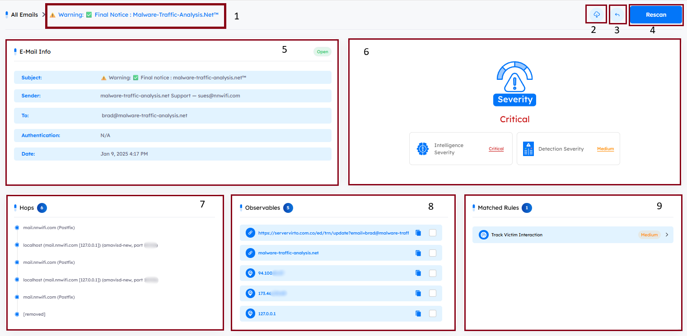

1.  The unique email identifier for the reported email.
2.  **Move From Junk**

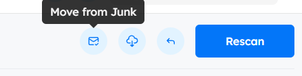

This button appears only for emails marked as Resolved or False Positive.
It allows analysts to restore emails that were blocked or moved.
For full details, see: [**Undo Email Action**](#restore-reported-email-action)

3.  Download the reported email as a .eml file.
4.  Perform response actions. Will be covered in the [**response**](#email-response-section) section.
5.  Rescan the reported email. This action updates the severity score based on detection rule modifications or updates in the IoCs.
6.  Displays the subject, sender, to, and date headers of the reported email along with its authentication result. The authentication result includes the outcomes of SPF, DKIM, and DMARC checks.
7.  The severity score of the reported email. The calculation is based on the detection score and the intelligence score.

##### 8. Hops:

A list of server hops extracted from the email headers. Each hop represents a server that processed the email during its delivery path. \
Every hop is **clickable** and opens the Hop Info panel, where detailed information about that hop is displayed.

###### Hop Details Popup

Clicking any hop opens a detailed popup divided into three sections:

1.  **Title** (From)
    Displays the From value of the hop, indicating the system or address that handed off the email at this stage.

2.  **Hop Info**
    Shows the parsed technical details of the hop, including:

    - **Time** – When the email passed through this server.
    - **Server** – The server name or IP that processed the message.
    - **Source** – The system the message was received from.
    - **Mailbox** – The associated mailbox, if available.
    - **Protocol** – The protocol used during transmission.

3.  **Raw Data**
    Provides the complete, unprocessed header content for this hop exactly as extracted from the email.

---

##### 9. Observables:

**overview**

The Observables section displays all indicators extracted from a reported email, such as IP addresses, URLs, domains, file hashes, and attachments. Each observable is **interactive**, allowing analysts to enrich it, escalate it into an IoC, or review additional metadata. Observables serve as critical components in threat investigations, enabling contextual analysis, threat intelligence correlation, and automated decision-making.

The Observables module consists of **three** major feature sets:

1. **IoC Escalation Workflow (Mark as IoC)**
2. **Enrichment Analyzers for Observables**
3. **Attachment Downloading & Rule Details**

Each of the following features is described in detail.

**1. IoC Escalation Workflow** \
Enables analysts to escalate any observable into an IoC (Indicator of Compromise) for blocking, scoping, and further threat intelligence processing. This workflow integrates with:

- The internal dPhish IoC list
- OpenCTI
- The dPhish approval workflow

This ensures accuracy, validation, and proper governance over indicators that may trigger security actions.

---

**1.1 Mark as IoC” Button on Every Observable** \
A Mark as IoC button becomes visible when the analyst selects any supported observable.

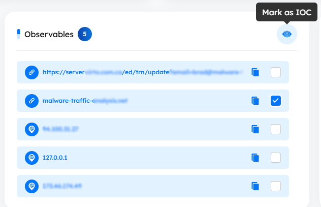

Supported types include:

- IP addresses
- URLs
- Domains
- File hashes
- Any extracted indicator that can be turned into an IoC

---

**1.2 Justification Popup** \
When the analyst clicks Mark as IoC, a justification popup appears.

The popup requires the analyst to provide:

- Justification / Reason for escalation

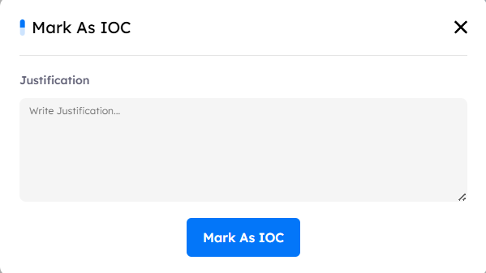

> [!Note]
> Submission is blocked until the analyst provides a valid justification.

This ensures traceability and prevents accidental IoC submissions.

---

**1.3 IoC Submission Workflow** \
Once justification is submitted, the system performs three automated actions:

**A. Add Observable to System IoC List** \
The observable is inserted into the internal IoC list within the Detect module.

**B. Push Observable to OpenCTI** \
The observable is forwarded to OpenCTI through API integration.

> [!NOTE]
> Some OpenCTI TLD/format validation requirements are pending final confirmation.

**C. Automatic Email Notification to dPhish Team** \
An email is sent to dPhish with:

- Observable value
- Observable type (IP/URL/Domain/Hash)
- Analyst-provided justification
- Analyst identity
- Timestamp

This creates a complete audit trail.

**1.4 Approval Workflow (dPhish Team)** \
After receiving the request, the dPhish team performs the final decision step:

- Approve IoC → The observable becomes active and can be used for blocking and scoping.
- Reject IoC → The IoC is not activated, and the analyst receives a notification.

This manual approval step provides governance and prevents unauthorized blocking.

---

**2. Enrichment Analyzers for Email Observables** \
Allow analysts to enrich observables using multiple analyzers, track results, view reports, and perform rescans.
This supports investigation efficiency and enhances automatic threat intelligence correlation.

---

**2.1 Analyzer Popup** \
When an analyst clicks any observable, an Analyzer Popup appears.

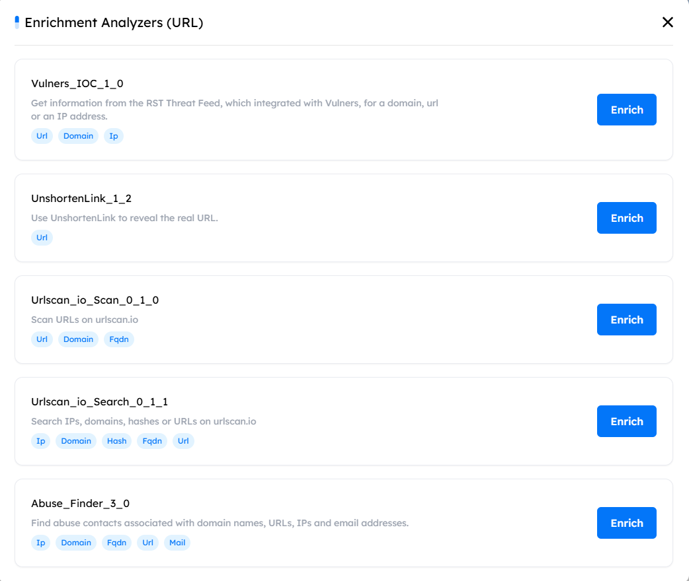

This popup:

- Lists all available analyzers
- Shows available enrichment tools for the selected observable
- Centralizes enrichment operations for convenience

---

**2.2 Enrichment Controls** \
Each analyzer includes:

- **Enrich** — triggers enrichment for that specific analyzer
- **Status indicator**, which shows one of the following states:
  - Waiting – request queued
  - In Progress – enrichment is running
  - Success – enrichment completed

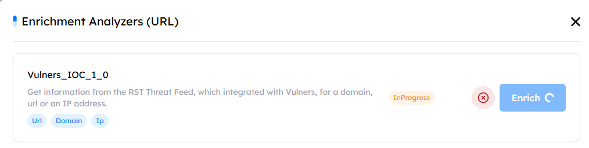

Upon successful enrichment:

- A View Report button becomes available for that analyzer.

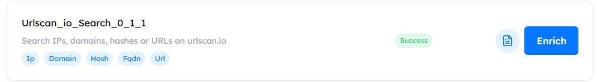

---

**2.3 Abort & Rescan** \
Analysts have control over enrichment tasks:

- **Abort** — cancels ongoing enrichment jobs
- **Rescan** — re-runs enrichment to fetch updated or refreshed data

> Rescan triggers an API call: `api/enrich/?rescan=true`

---

**2.4 Viewing Enrichment Reports** \
When the analyst selects View Report:
A dedicated popup opens with:

**1. Summary Report Section** \
High-level key findings.

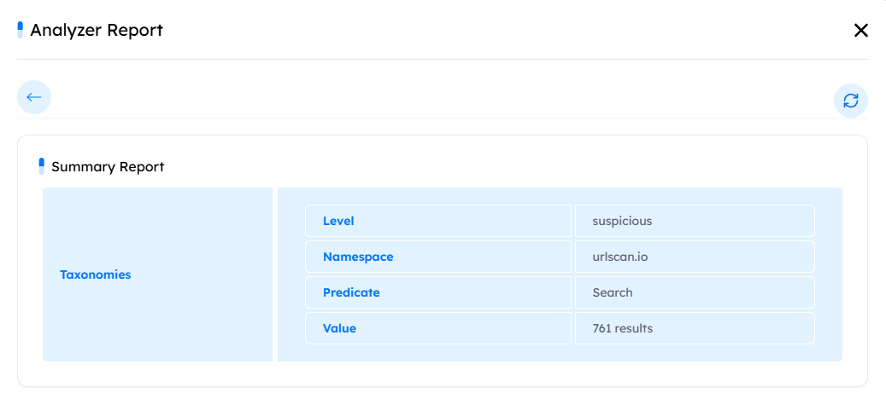

**2. Full Report Section** \
Complete, detailed enrichment output from the analyzer.

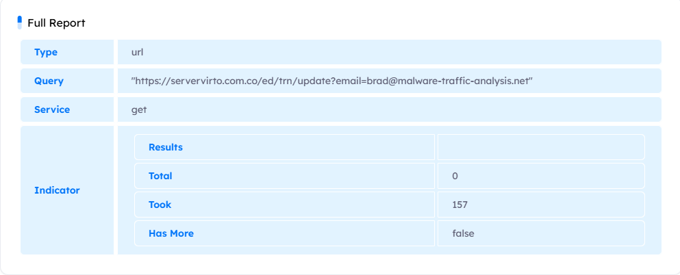

> Analysts can navigate back to the list of analyzers popup after viewing the report.

---

**3. Download Attachments & View Matched Rules** \
(Located inside the Observables section)

**3.1 Download Email Attachments** \
Analysts can directly download attachments extracted from any reported email.

This supports:

- Offline investigation
- Malware analysis
- Chain-of-custody evidence collection

Files are downloaded exactly as received in the original email.

**3.2 View Matched Rules** \
If an observable triggers a detection rule, analysts can view:

- Rule details
- Trigger context
- Why the observable matched the rule

This provides greater clarity during investigations.

---

##### 10. Matched Rules:

Matched Rules provide context on why an observable triggered alerts or was flagged during analysis.
When the user clicks a matched rule, a details popup opens displaying all rule metadata.

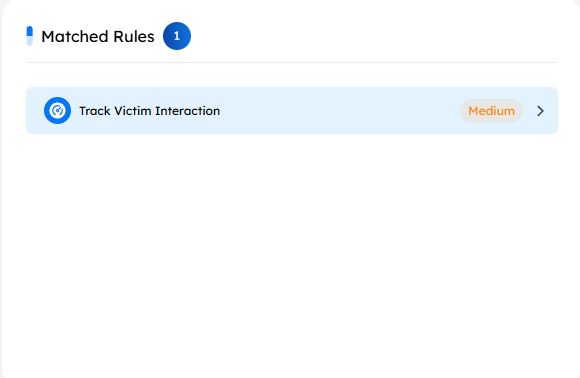

**Matched Rule Details Popup** \
The popup consists of multiple fields, giving analysts full visibility into the rule that was triggered.

1. Description

   - A clear, human-readable explanation of the rule.
   - Describes what the rule detects and why it was matched.
   - Helps the analyst understand the logic behind the rule firing.

2. Severity

   - Indicates the criticality level assigned to the rule.
   - Possible values (depending on system configuration):

     - _Low_
     - _Medium_
     - _High_
     - _Critical_

   - Severity helps triage and prioritize observable investigation.

3. Source

   - Shows where this rule originated from.
   - Examples:

     - **Internal Rule** – created by your organization's threat detection team.
     - **External Source** – imported from:

       - threat intelligence feeds
       - open-source rule sets
       - partner vendors

     - This helps analysts trust and understand the rule’s context.

4. Active / Updated Date

   - Displays when the rule was:

     - Activated (enabled for detection)
     - Last Updated (any modification to logic, severity, or metadata)

   - Useful for determining whether the matched rule is newly introduced or recently modified.

5. Creation Date

   - Indicates when the rule was originally created in the system.
   - Helps analysts understand:

     - Whether it is a long-standing rule
     - Or a newly introduced detection criteria0

---

##### 11. IoC:

The IoC section displays all **Indicators of Compromise** extracted from the message. It provides analysts with tools to review, filter, investigate, and trace each IoC back to its origin for deeper analysis.

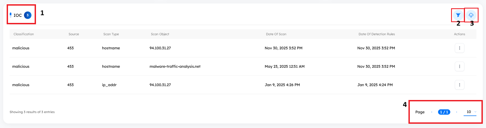

**Key Features**

1.  **Total IOC Count**
    Shows the total number of IoCs extracted from the reported email.

2.  **IOC List**
    Displays all IoCs identified in the email, including their types (IP, domain, URL, hash, attachment, etc.).

3.  **IoC Filters**
    Allows analysts to filter the listed IoCs based on scan type or scan object to quickly narrow down relevant indicators.

4.  **Download IOC List**
    Enables analysts to download the IoC list as a CSV file for offline review, correlation, or reporting.

**View Source of IoC**

Allows analysts to trace any IoC back to its originating analyzed email, improving accuracy and investigative efficiency.

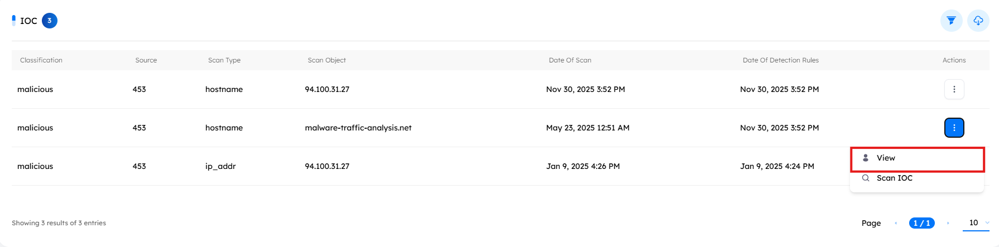

A **“View Source”** option is displayed.
Clicking it opens the original analyzed email (or a detailed summary), showing:

- Email subject
- Sender information
- Observables related to the IOC
- Other relevant metadata and context

This helps analysts quickly:

- Understand the origin of the IOC
- Validate its relevance
- Assess risk level with proper context
- Avoid manually searching across multiple emails

**Scan IoC**

Each IoC in the list includes a Scan IoC button, allowing analysts to perform an immediate on-demand scan of that specific indicator.

This action:

- Re-runs the IoC against the available analyzers
- Retrieves updated intelligence or threat information
- Refreshes the IoC’s status and metadata in the interface

The feature is useful for:

- Rechecking indicators after new threat intel updates
- Confirming if an IoC's risk level has changed
- Validating behavior during ongoing investigations

---

##### 12. ChatGPT Verdict

Analysts can request an AI-generated clarification to better understand the detection outcome associated with the reported email.
This feature provides a contextual explanation based on the indicators and matched rules linked to the email, helping analysts interpret why it was flagged and how the verdict was reached.

> [!NOTE]
> ChatGPT does not receive the email content. Only the matched rules and extracted IoCs are sent for correlation, ensuring privacy while still providing an accurate justification for the detection verdict.

---

#### 2. Open in New Tab

Opens the scan results page, the same page as in [**View**](#reported-email-view-tap), for the reported email in a new tab.

---

#### 3. Open Ticket

Open the ticket creation menu where administrators can assign email analysis tickets to a human analyst to investigate and triage the reported email. The UI of the menu is as follows:

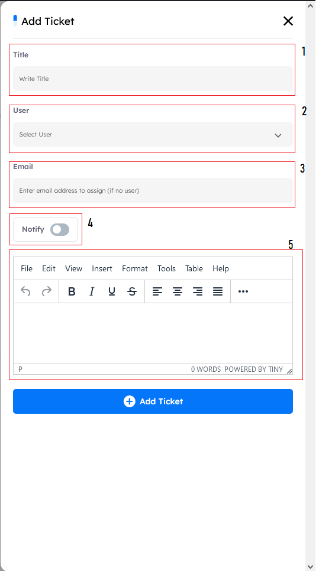

1.  **Title**: The title of the new ticket.
2.  **Priority**: To select the priority of the ticket (Hight, Medium, Low)
3.  **User**: The human analyst that will be assigned the ticket. The value of this item can be any of the users registered on the platform.
4.  **Email**: If the analyst that will be assigned the ticket is not a registered user on the platform, the ticket can still be assigned to them, and an email notification will be sent notifying them of the ticket.
5.  **Notify**: Select if you want an email notification sent to the assigned person.
6.  **Details**: Extra information that will be sent to the assigned person along with the ticket notification.

---

#### 4. My Tickets

Allow user to show all tickets and comments of the specific reported email.

---

#### 5. Status

Used to update the current status of a reported email. Each reported email is treated as an individual case within the platform, and its status reflects the outcome of the security team's investigation. Analysts can change the case status based on their findings. Available statuses include:

- Open
- In Progress
- Resolved
- False Positive

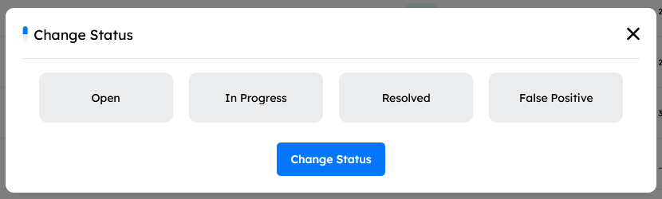

Changing the case status may also trigger user feedback actions.

**Send Feedback to Users** \
 When analysts update the case status using the **Status** button in the **Actions** menu, the system enables sending structured feedback to the reporting user. Where analysts can write a comment on the reported email. The system sends the user an email containing:

- The subject of the reported email.
- The final case status (Resolved / False Positive).
- The analyst’s comment (also available as an optional attachment).

**Feedback Triggered on Status Change** \
 When updating the case status, the system prompts the analyst to choose the type of feedback to send.

If **`Status = Resolved`**

- **Awareness Template**: Sends a predefined awareness email to educate the user about the detected threat.
- **Custom Analyst Message**: Allows the analyst to write a personalized message that will be sent directly to the reporting user.

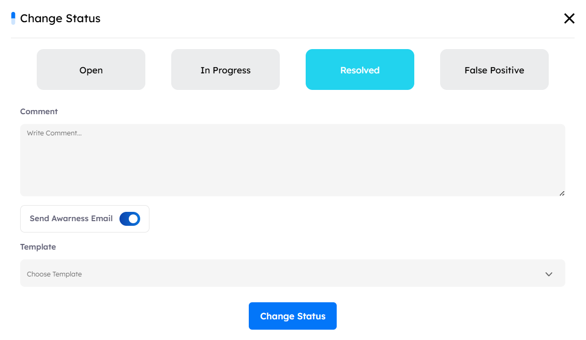

If **`Status = False Positive`**

- **Fixed False Positive Template**: Sends a predefined template informing the user that the email is safe along with the original reported email included inside the template.
- **Custom Analyst Message**: Allows the analyst to write a personalized message that will be sent directly to the reporting user.

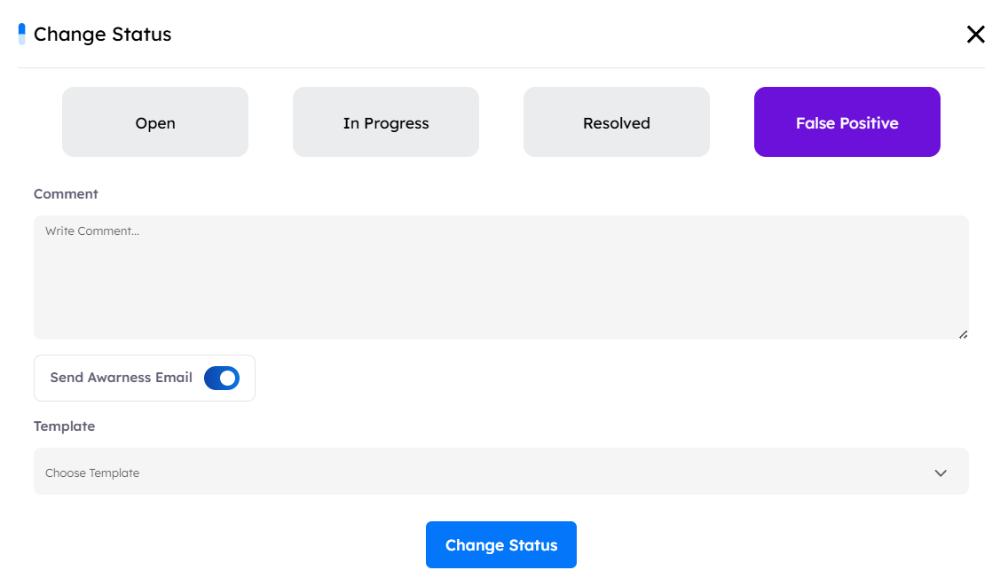

> The feedback email sent to the user always includes the final case status: **Resolved** or **False Positive**.

#### **Undo Email Action**

This action becomes available only when the case status is set to `Resolved` or `False Positive`.
It allows analysts to revert any automated action previously applied to the reported email, ensuring that legitimate emails are restored if they were blocked or moved during analysis.

**Reverts** any automated action previously applied to the reported email (e.g., block, move, quarantine).

---

#### 6. Response

Once an investigation of a reported email is completed and the final verdict was malicious, it’s crucial to accurately assess the situation to respond appropriately to the threat. The response feature allows analysts to search for an email, using either the sender, the subject of the email, or both over every mailbox in the organization. This search process, also called Scope, will aggregate all emails in the organization that match the search criteria and display them in a listing to the analyst. The UI of the response page is simple yet powerful:

The main tab is divided into two sections.  
The first section displays the **Respond to an analyzed email** that can be applied to the reported email.  
Alongside it, the second section provides **key details about the reported email** that will be affected by the selected action.  
This layout allows analysts to review the email context while performing response actions.

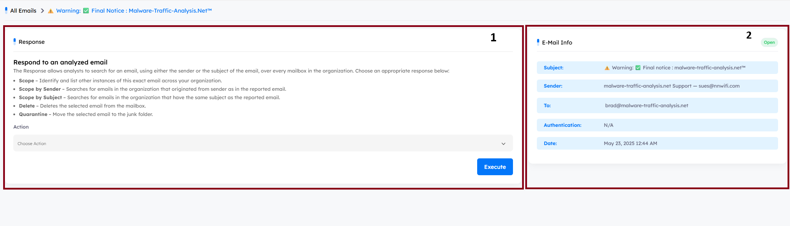

##### Available Actions

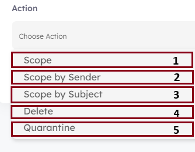

1. **Scope**: Searches across the organization’s mailboxes for emails that match **both** the subject and sender of the reported email.
2. **Scope by Sender**: Searches for all emails within the organization’s mailboxes that originated from the **same sender** as the reported email.
3. **Scope by Subject**: Searches for all emails within the organization’s mailboxes that share the **same subject** as the reported email.
4. **Delete**: Permanently deletes the matched email(s) from the mailbox of the reported user and anyone else within the organization got the same email whether reported it or not.
5. **Quarantine**: Moves the matched email(s) to the quarantine/junk folder instead of deleting them, preventing user(s) access while retaining the email for further review.

---

#### 7. **Delete**

Deletes the selected email from the dashboard listing. Any tickets opened on the deleted entry will be deleted as well.

> [!NOTE]
> This action **DOES NOT** delete the email from the reporter’s mailbox, that what response does, it just deletes it from the platform.
