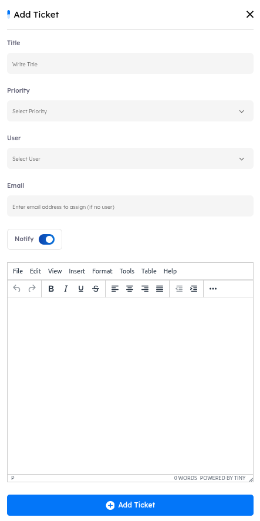

# Main Page

As stated earlier, this sub-module is the main component of dPhish Detect. It is a dashboard that aggregates all reported emails from various sources, along with email metadata such as report date and reporter email. The user interface is simple yet powerful, presenting information clearly to analysts and enabling them to take the necessary actions to assess and triage the situation.
The user interface consists of multiple elements, and each will be explained below:

---

## Analyzed Emails Details:
1. Give the overall number of reported emails in the platform, including emails for all sources.
2. Searches any of the displayed columns for emails that match the search keywords.
3. Filters the displayed emails based on severity, source, status, or user.

   

   ---

4. Exports the listing data, all the analyzed emails, in CSV, XLS, or JSON format.
5. Submits a new email, .eml file, for analysis. 
6. **Subject**: The subject of the reported email.
7. **Source**: The source of the reported email. It either be addon, API, or Web.
8. **User**: The user that reported the email. The format of this value changes based on the source.
9. **Matched Rules**: The total number of detection rules that matched the reported email.
10. **Severity**: The overall severity of the reported email. It can be clean, informational, Low, Medium, High, and Critical.
11. **Attachments**: The total number of attachments in the reported email.
12. **Links**: The total number of URLs in the body of the reported email.
13. **Reported At**: Email report timestamp.
14. **Status**: The status of the reported email. It can be open, In Progress, Resolved, or False Positive. 
15. **Actions**: Enables the security analyst to take further actions on the reported email. It will be explained shortly.
16. The current listing page.

The true power of the dPhish Detect module is in the capabilities it provides to a security analyst to perform the triaging as efficiently as possible. The Actions menu, number 15 in the previous screen, provides the analyst with such capabilities. 

### The items of the Actions menu are as follows:
1. **View**
    Opens the scan results page for the reported email. The page provides details about the email, including attachments (if any), email headers, server hops, and observables. It also displays the scan results, such as the severity score and a list of matching rules.
    The UI elements of the results page are as follows:

    

    1. The unique email identifier for the reported email.
    2. Generates a screenshot of the reported email.
    3. Download the reported email as a .eml file.
    4. Perform response actions. Will be discussed shortly.
    5. Rescan the reported email. This action updates the severity score based on detection rule modifications or updates in the IoCs.
    6. Displays the subject, sender, to, and date headers of the reported email along with its authentication result. The authentication result includes the outcomes of SPF, DKIM, and DMARC checks.
    7. The severity score of the reported email. The calculation is based on the detection score and the intelligence score. 
    8. A list of server hops extracted from the email headers.
    9. A list of observables extracted from the email, including IP addresses, URLs, and attachments. Each observable can be enriched in-place using multiple analyzers, which accept a set of observable types and return their analysis results.

   

    10. A list of detection rules that matched the reported email.

    

    11. The total number of IoCs extracted from the reported email.
    12. A listing of the IoCs extracted from the reported email. 
    13. Filters the IoCs in the listing by scan type or scan object.
    14. Downloads the IoCs in the listing as a CSV file.
    15. Requests ChatGPT clarification on the scan results. THIS OPTION DOES NOT SEND THE EMAIL TO ChatGPT; instead, it sends the matched rules and other IoCs to correlate and provide a justification for the detection verdict.

2. **Open in New Tab**
    Opens the scan results page, the same page as in View, for the reported email in a new tab. 

3. **Open Ticket**
    Open the ticket creation menu where administrators can assign email analysis tickets to a human analyst to investigate and triage the reported email. The UI of the menu is as follows:

    1. **Title**: The title of the new ticket.
    2. **User**: The human analyst that will be assigned the ticket. The value of this item can be any of the users registered on the platform.
    3. **Email**: If the analyst that will be assigned the ticket is not a registered user on the platform, the ticket can still be assigned to them, and an email notification will be sent notifying them of the ticket.
    4. **Notify**: Select if you want an email notification sent to the assigned person.
    5. **Details**: Extra information that will be sent to the assigned person along with the ticket notification.

    

4. **Status**
    Used to set the status of the reported email. Each reported email represents a case on the platform. The status of this case depends on the investigation results of the security analysts. The status of a case can be Open, In Progress, Resolved, or False Positive.

    

5. **Response**
    Once an investigation of a reported email is complete and the final verdict is malicious, it’s crucial to accurately assess the situation to respond to the threat. The response feature allows analysts to search for an email, using either the sender or the subject of the email, over every mailbox in the organization. This search process, also called Scope, will aggregate all emails in the organization that match the search criteria and display them in a listing to the analyst. The UI of the response page is simple yet powerful:

    1. **Delete**: Delete the selected email from the view page. This will delete the email from the mailbox of the reported.
    2. **Quarantine**: Same as delete, except the mail will be quarantined instead of deleted.
    3. **Scope by Sender**: Searches for emails in the organization that originated from sender as in the reported email.

    

    4. **Scope by Subject**: Searches for emails in the organization that have the same subject as the reported email.
    5. **Search**: Once the search is over, the page is populated with emails that matched the search criteria. Analysts can then take actions on these emails such as mass deletion or mass quarantine.
    6. **Delete**: Deletes the selected email from the dashboard listing. Any tickets opened on the deleted entry will be deleted as well. Note that this DOES NOT delete the email from the reporter’s mailbox, that what response does, it just deletes it from the platform.