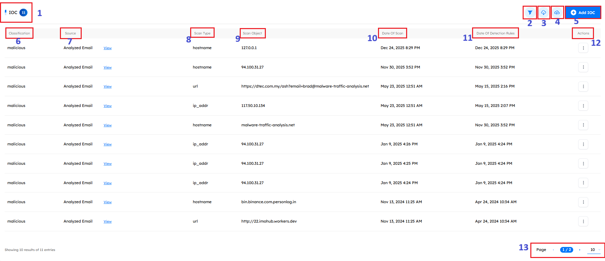
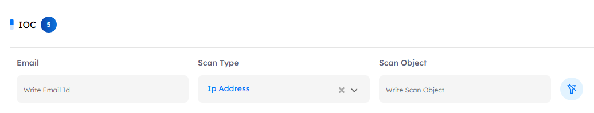
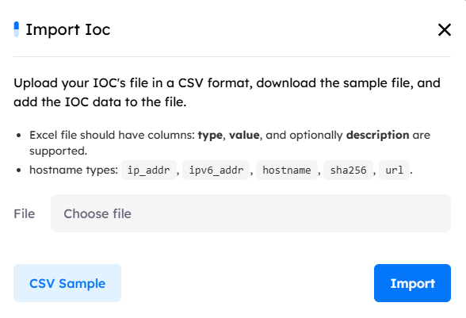
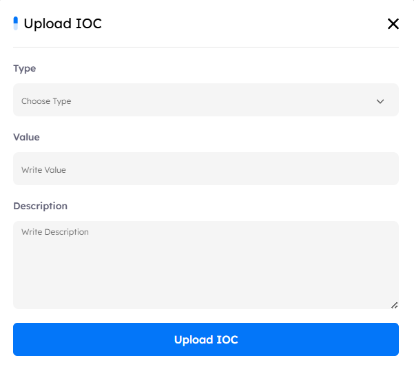
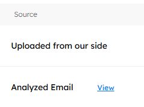
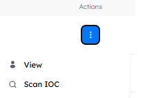
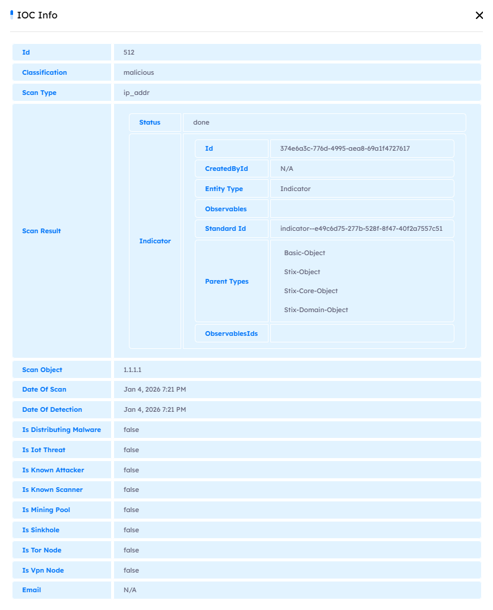

# Main Page

The `IOCs` section is a dashboard aggregating all Indicators of Compromise (IOCs) as extracted from the reported emails on the platform. The dashboard includes the following elements:

---

## IOC Details

1. Give the total number of IoCs that exist on the platform.
2. **Advanced Filter Across All IoCs** \
   Enables analysts to filter the displayed IoCs using the following criteria:
   - **Email ID**
     Filters IoCs associated with a specific reported or analyzed email id.
   - **Scan Type**
     Filters IoCs by type, including:
     IP Address, Hostname, URL, and SHA256.
   - **Scan Object**
     Allows free-text filtering by entering a keyword in the search bar to match the IoC value
     (e.g., IP address, hostname, URL, or SHA256 hash).

> **Clear Filters** \
> Use the Clear Filter button to remove all applied filters and reset the IoC list to its default view.

3. Export the all the IoCs as a CSV file.

### Import IOCs (File & Manual Entry)

#### Purpose

Allow analysts to add custom Indicators of Compromise (IOCs) to the platform and synchronize them with OpenCTI, while enforcing validation, permission control, and reliable failure handling.
This enhances analyst autonomy, strengthens threat intelligence, and ensures only valid IOCs are ingested.

#### IoC Submission

The same logic applies whether importing a CSV file or a single IOC.
**Request Body Fields**

- **type** – one of: url, domain-name, ipv4-addr, ipv6-addr, email-addr, file
- **value** – the IOC value
- **description** – optional description for the IOC

#### Successful Submission

When the submission succeeds, the IOC is:

- Added to the internal IoC list in Detect
- Pushed to OpenCTI for cross-platform threat intelligence sharing

#### Failure Handling

The system handles failures gracefully:

- Notifies the user if an IOC cannot be added
- Displays the failure reason (e.g., invalid type, duplicate IOC, OpenCTI API error)
- Ensures the internal IoC list remains consistent even if the OpenCTI push fails

#### Permission Control

- Only users with the permission `detect.upload_iocs_to_opencti` can import IOCs
- Prevents unauthorized IOC submissions

4. **Import IoCs (CSV File)** \
   Upload your IoCs using a CSV file to add them to the system.

   - You can **download and use the provided CSV sample** as a template.
   - The CSV file must include the following columns:
     - type (required)
     - value (required)
     - description (optional)

   **Supported IoC types:**

   - `ip_addr`
   - `ipv6_addr`
   - `hostname`
   - `sha256`
   - `url`

   **File Upload** \
   Click **Choose** file to upload your CSV and **Import** it.

5. **Add IOC (Manual Entry)** \
   Allow analysts to manually add a single Indicator of Compromise (IOC) directly from the IoC module without importing a file.

   The analyst must provide:

   - **Type**: IoC type
     Supported values:
     - URL
     - Domain
     - IPv4
     - IPv6
     - Email
   - **Value**: The actual IOC value
   - **Description _(optional)_** : Additional context or justification for the IOC

> [!NOTE]
> IoCs uploaded either via a file or through manual entry are labeled as **“Uploaded from our side”** in the **Source** column (see point 7).

6. **Classification**:  
   Indicates the classification of the IoC. Possible values are **Malicious**, **Suspicious**, or **Whitelisted**.

7. **Source**:  
   Indicates how the IoC was added to the system:

   - **Analyzed from Email**:  
     The IoC was extracted from a reported and analyzed email.  
     A **View** button appears next to the IoC, allowing the analyst to navigate directly to the related email details page for full context.

   - **Uploaded from Our Side**:  
     The IoC was added manually by an analyst or imported via a CSV file.

8. **Scan Type**:  
   Defines the type of the IoC. Supported types include **ip_ddr**, **hostname**, **url**, and **SHA256**.

9. **Scan Object**:  
   Displays the actual IoC value, for example: `maliciousurl.com`.

10. **Date of Scan**:  
    The date and time when the IoC was scanned or analyzed by the system.

11. **Date of Detection Rules**:  
    Indicates when the detection rule associated with this IoC was triggered.

12. **Actions**:  
    Available actions for each IoC, including:

- **View**:  
  Opens a detailed view of the scanned IoC, displaying comprehensive analysis and threat context.

  The IoC detailed view includes the following information:

  - **ID**: Unique identifier of the IoC.
  - **Classification**: Current classification of the IoC (Malicious, Suspicious, or Whitelisted).
  - **Scan Type**: The IoC type (IP Address, Hostname, URL, or SHA256).
  - **Scan Result**: Outcome of the IoC scan.
  - **Scan Object**: The actual IoC value (e.g., maliciousurl.com).
  - **Date of Scan**: Timestamp of the latest scan.
  - **Date of Detection**: Timestamp when the IoC was detected by the rules engine.
  - **Is Distributing Malware**: Indicates whether the IoC is associated with malware distribution.
  - **Is IoT Threat**: Indicates whether the IoC is related to IoT-based threats.
  - **Is Known Attacker**: Indicates whether the IoC is linked to known attacker infrastructure.
  - **Is Known Scanner**: Indicates whether the IoC is associated with scanning activity.
  - **Is Mining Pool**: Indicates whether the IoC is related to cryptocurrency mining.
  - **Is Sinkhole**: Indicates whether the IoC is a known sinkhole.
  - **Is TOR Node**: Indicates whether the IoC is part of the TOR network.
  - **Is VPN Node**: Indicates whether the IoC is associated with VPN services.
  - **Email**: The related email address, if applicable.

- **Scan IoC**: Allows targeted scanning of individual IOCs without affecting others, returns the scan results, and updates the IOC status in the system.

13. **IoC Listing & Pagination**:  
    The IoC listing allows analysts to control the number of IoCs displayed per page and navigate through pages using pagination controls.
