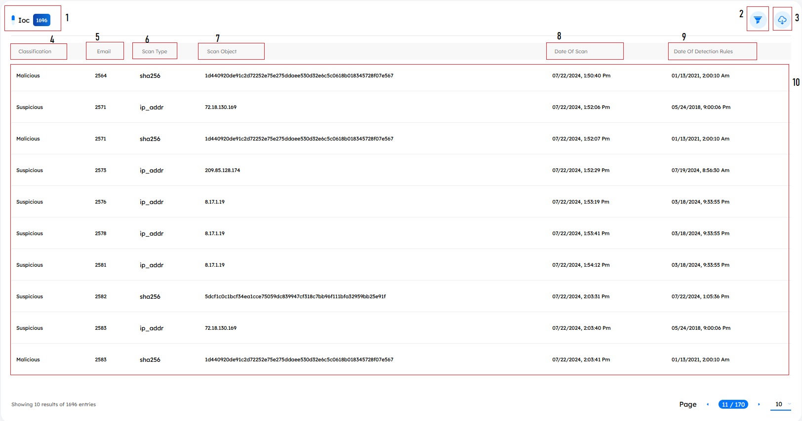

# Main Page

The `IOCs` section is a dashboard aggregating all Indicators of Compromise (IOCs) as extracted from the reported emails on the platform. The dashboard includes the following elements:

---

## IOC Details:
1. The total number of IoCs on the platform.
2. Filter the listing using Email, Scan Type, or Scan Object.
3. Export the IoCs as a CSV file.
4. **Classification**: The IoC classification. Can be malicious, suspicious, or whitelisted.
5. **Email**: The Email ID on the platform that the IoC was extracted from.
6. **Scan Type**: The type of the IoC. Can be Ip Address, Hostname, URL, or SHA256.
7. **Scan Object**: The value of the IoC for instance maliciousurl.com
8. **Date of Scan**:
9. **Date of Detection Rules**:
10. The IoC listing.