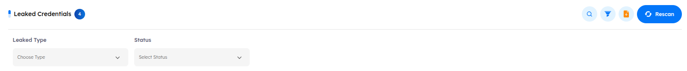
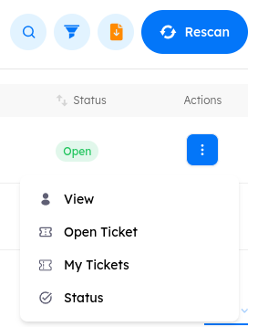

# Main Page

The leaked credentials page is a unified dashboard through which the platform keeps track of the registered targets whose credentials might have been leaked in a previous cybersecurity attack. dPhish continuously monitors all registered targets in the platform using a 3rd party that provides Dark Web monitoring services. The monitoring includes data leaks from both public breaches and malware logs.
The main page of the leaked credentials section contains the following UI elements:

---

1. The total number of targets who have had their credentials leaked.
2. Search for entries with specific keywords.
3. Filter the displayed entries based on leaked type or leak status.

---

4. Generate a report of the leaked credentials state.

---

5. Rescan the targets in the platform against the Dark Web leaks.

---

6. **Target Name**: The name of the target, as registered in the platform, whose credentials got leaked.
7. **Target Email**: The email address of the target.
8. **Department**: The department of the target.
9. **Leaked Type**: The type of data leak. Can be malware logs or public breaches.
10. **Leaks**: Keywords of the leaks regarding a target. These keywords include popular malware families as well as breached sites.
11. **Count**: The total number of data leaks found for a target.
12. **Status**: The current status of the leak. Security teams should promptly resolve cases of credential leaks by resetting the passwords or limiting access to critical infrastructure. The status can be Open, In Progress, Resolved, or False Positive.
13. **Actions**: Opens the actions menu related to a leak entry. The menu has the following options:
    - **View**: View detailed information about the leaked credentials.
    - **Open Ticket**: Used to create a new ticket and assign it to a human analyst to investigate the leak incident.
    - **My Tickets**: Used to show all tickets the leak incident.
    - **Status**: The status of the leak. Can be Open, In Progress, Resolved, or False Positive.

    

    

---

> [!NOTE]
> 1. The `Leaked Credentials Engine` runs every 24 hours at 12:00 AM to search for any leaked credentials from malware or public breaches for targets whose emails are imported into the tenant.
- If you want to perform an immediate scan, press the `Rescan` button to trigger the function instantly.

---

> [!NOTE]
> 2. The leaked credentials via (`Malwarelogs`, `Public Breaches`) contribute to calculating the total `Risk Score` of the organization:
- Only the leaked credentials that its status is `open` or in `progress` have effect on the risk score.
- If a single target has leaked credentials, it contributes `10%` to the total risk score.
- For multiple targets with leaked credentials, the average contribution of each target is capped at a maximum of `10%` of the total risk score.

---

## Breakdown of the 10% Contribution

 - If a target has both `Malwarelogs` and `Public Breaches`, the contribution to the total risk score is divided as follows:

    1. **Malwarelogs**: Represents 80% of the total 10% risk.
    2. **Public Breaches**: Represents 20% of the total 10% risk.

- This weighted calculation ensures accurate risk assessment based on the type and extent of leaked credentials.