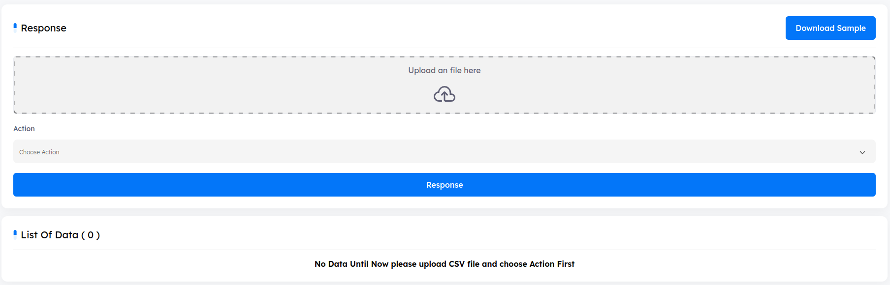

# Main Page

**Response**
Once an investigation of a reported email is complete and the final verdict is malicious, it’s crucial to accurately assess the situation to respond to the threat. The response feature allows analysts to search for an email, using either the sender or the subject of the email, over every mailbox in the organization. This search process, also called Scope, will aggregate all emails in the organization that match the search criteria and display them in a listing to the analyst. The UI of the response page is simple yet powerful:

1. **Delete**: Delete the selected email from the view page. This will delete the email from the mailbox of the reported.
2. **Quarantine**: Same as delete, except the mail will be quarantined instead of deleted.
3. **Scope by Sender**: Searches for emails in the organization that originated from sender as in the reported email.

4. **Scope by Subject**: Searches for emails in the organization that have the same subject as the reported email.
5. **Search**: Once the search is over, the page is populated with emails that matched the search criteria. Analysts can then take actions on these emails such as mass deletion or mass quarantine.
6. **Delete**: Deletes the selected email from the dashboard listing. Any tickets opened on the deleted entry will be deleted as well. Note that this DOES NOT delete the email from the reporter’s mailbox, that what response does, it just deletes it from the platform.