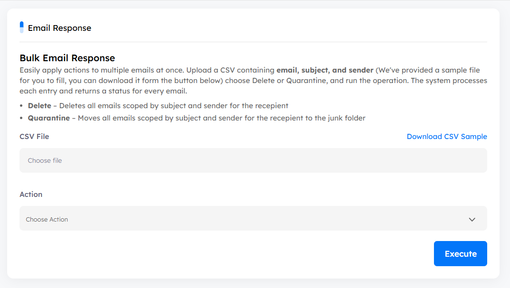

# Main Page

The **Response** tab is dedicated to performing **bulk response actions** across multiple emails within the organization.  
It allows analysts to import a list of emails and apply a selected action in a single operation, enabling faster and more efficient remediation at scale.

Analysts can upload a **CSV file** containing the required email details. A sample file is provided and can be downloaded directly from the interface to ensure the correct format is used.  
Once the file is uploaded, the analyst selects the desired response action and runs the operation.  
The system processes each entry individually and returns a **status for every email** in the file.

## Download CSV Sample

- This button allows you to download a sample CSV template that you can fill in with your data.
- The template contains three columns:
  1. **Email** – the recipient’s email address.
  2. **Subject** – the subject line of the email.
  3. **Sender** – the email address of the sender.

## CSV File

- When clicked, it opens a file selector so you can choose the CSV file you’ve filled with your data.
- Once uploaded, the platform will be ready to take action on the listed emails.

## Supported Actions

- **Delete**:  
  Permanently deletes all emails that match the provided **email, subject, and sender** criteria from the specified recipients’ mailboxes.

- **Quarantine**:  
  Moves all emails that match the provided **email, subject, and sender** criteria to the quarantine/junk folder, preventing user access while retaining the emails for further analysis.

## Execute Action (Respond)

- After selecting the desired action, you click the **Execute** button.
- This triggers the system to perform the selected action on all mailboxes that contain the listed emails.

