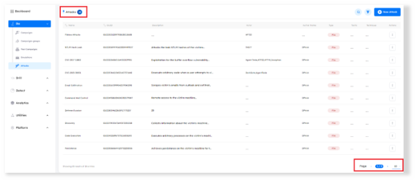
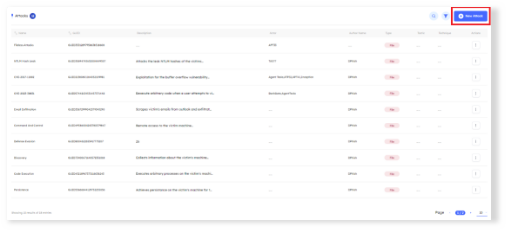
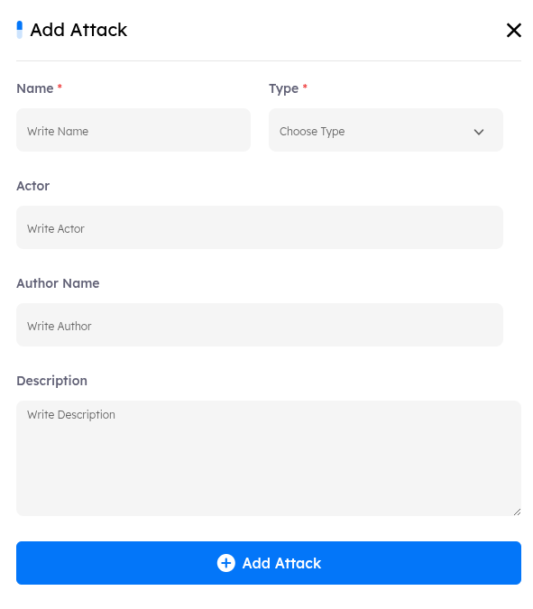
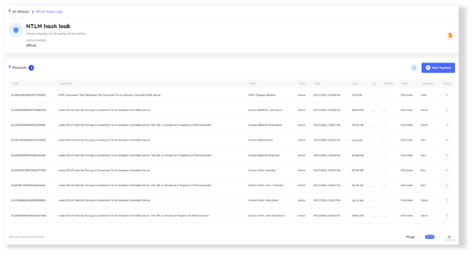
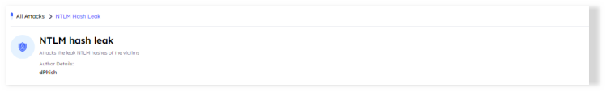
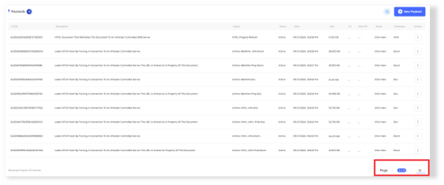
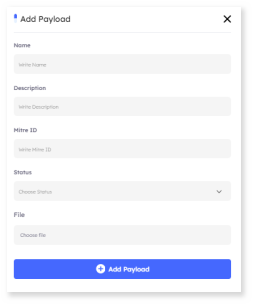

# Overview
> This tab serves as the hub for managing all attacks and their payloads. It allows you to organize and utilize attacks can be used in your emulation campaigns.

## Main Page

Upon accessing the `Attacks tab`, users will encounter key indicators at the top of the page, which display the number of attacks that existed. The interface is paginated, enabling users to customize the number of attacks displayed. You can customize the number of attacks displayed by adjusting the pagination at the bottom of the page.

***
### Attacks Features

- **Attacks Details** A comprehensive information bar is situated above the attacks, displaying essential details such as the attack name, GUID, Description, Actor, Author Name, Type, Tactic, Technique and available actions for further management
    
    1. **Name** The name of the attacks.

    2. **GUID** Each attack has its own Global Unique Identifier (GUID), which can be used for searching and identification.

    3. **Description** A brief overview of the attack.

    4. **Actor** The Individual or entity associated with the attack.

    5. **Author Name** The name of the author who created the attack.
    
    6. **Type** The classification of the attack.
    
    7. **Tactic** The overall strategy employed in the attack.

    8. **Technique** The specific methods used within the attack.

    9. **Actions**
        - **View**: View detailed information about the attack.
        - **Edit**: Modify the attack's configurations.
        - **Delete**: Permanently remove the attack.
        
    #### **Search Functionality**
    - Located at the top right corner, the search button allows you to find an attack by its name or GUID quickly.

    #### **Filtering Options**
    - A filter button is available next to the search button. This feature allows you to refine your campaign search based on the following criteria:
        1. Name
        2. GUID
        3. Author Name
        4. Technique
        5. Tactic
        6. Description

***

- **Creating New Attack** To create a new attack, click the `New Attack` button. This will direct you to the emulation campaign creation interface.

***

### Attack Details and Metadata

- **Name:** The name of the attack. (Required Field)

- **Actor:** The Individual or entity associated with the attack.

- **Type:** The type of attack `URL`, `File`. (Required Field)

- **Author Name:** The name of the author who created the attack.

- **Author Twitter:** The Twitter handle of the author.

- **Author LinkedIn:** The LinkedIn profile of the author.

- **Description:** A brief overview of the attack.

***

## Managing a Specific Attack 

After creating an attack, you can manage it by selecting `Actions` and choosing `View`. Each attack can include multiple payloads, which can be managed from the below panel.

***

### Attack Details and Metadata
This section displays the attack configurations, including:
- Attack Name
- Attack Description
- Author Details

***

### Payloads

In the `Payloads` section, you can manage all payloads associated with the attack. Here, you can customize the number of payloads displayed by adjusting the pagination settings at the bottom of the box.

1. **Search Functionality**
    - Located at the top right corner, the search button allows you to find an attack by its name, description or GUID quickly.

2. **New Payload**
    - To add a new payload, click the `New Payload` button. This will opens the payload creation interface.

***

#### Attack Details and Metadata
- **Name**: The name of the payload.
- **Description**: A brief description of the payload.
- **MITRE ID:** The MITRE ID associated with the payload.
- **Status**:  Indicates if the payload is `Active` or `Inactive`.
- **File**: An upload section used to upload the payload file.
- **URL**: URL section used to add the payload url.

    3. **Actions**: The Actions button allows you to manage specific payloads with the following options:
        - **View**: View detailed information about the payload.
        - **Edit**: Modify the payload’s configurations.
        - **Delete**: Permanently remove the payload.
