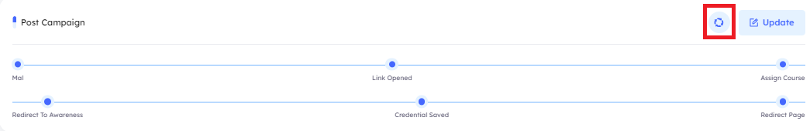

# What is The Campaign Used For?
> Specifically created to simulate attacks on individuals during various scenarios

## Main Page

Upon accessing the Campaigns tab, users will encounter key indicators at the top of the page, which display the number of created campaigns. The interface is paginated, enabling users to customize the number of campaigns displayed, you can customize the number of campaigns displayed by adjusting the pagination at the bottom of the page.

### Campaign Features

#### **Campaign Details and outer metadata**
A comprehensive information bar is situated above the campaigns, displaying essential details such as the campaign `full name`, `type`, `associated page`, `number of templates used`, `success category`, `start date`, and available `actions` for further management.

1. **Full Name** By default, the displayed campaigns are organized with the most recently created campaigns appearing first. Users can easily reorganize the list in ascending or descending order by using the arrows located next to the full campaign name in the information bar.

2. **Campaign Type** Specify the type of campaign being utilized, such as "Email with Attachment" or "Email with Page," among other options.

3. **associated page** Provide the name of the page associated with the campaign, applicable only for campaign types "Email with Page," "Email with QR Code," or "Image with QR Code."

4. **Templates** Specify the number of templates being utilized in the campaign.

5. **Success Category** Specify the success category that, if achieved, will classify the campaign as successful.

6. **Start Date** This information allows you to determine whether the campaign is scheduled for a specific start date or if it will be launched immediately.

7. **Actions** View, Edit, Export, Clone, Open Ticket, Clear Ticket, Delete

***
- **Search Functionality**
    Located at the top right corner, the search button allows you to find a campaign by its name quickly

***
- **Filtering Options**
    A filter button is available next to the search button. This feature allows you to refine your campaign search based on the following criteria:

    - **Campaign Type**
        - Email with Attachment
        - Email with Page
        - SMS
        - HID Attack
        - USB Attack
        - Email with QR Code
        - Image with QR Code (Download)

    - **Success Category**
        - Document Opened
        - Credentials Saved
        - Link Opened
        - USB Opened
        - Code Scanned
        - Stager Downloaded
        - File Opened
        - Target Exploited
    
    - **Status**
        - `Created:` Displays campaigns that have been created but not yet launched.
        - `Started:` Displays campaigns that have been created and launched.
    
    - **Tags**
        - Allows filtering of campaigns based on assigned tags.

    - **Difficulty Level**
        - Allows filtering of campaigns based on assigned Difficulty Level (`Easy` or `Medium` or `Hard`).

> [!NOTE]
> To reset the filtering settings, click the "Reset" button, followed by "Filter."

***
## Creating a New Campaign
To create a new campaign, click the `New Campaign` button. This will direct you to the campaign 
creation interface.

### Do-Phish Campaign Creation Wizard
Creating a campaign involves a step-by-step process guided by a wizard, which helps users define 
campaign details and metadata, as well as configure specific campaign parameters. Here's what the 
wizard entails: 

- **Campaign Details and outer metadata**

    1. **Campaign Name** Provide a descriptive and unique name for your campaign, which helps identify it among other campaigns.
    
    2. **Success Category** Choose the category that best reflects the intended outcome or success criteria of your campaign. This category may include options such as `Mail Sent`, `SMS Sent`, `Mail Opened`, `Document Opened`, `Credential Saved`, `Link Opened`, `USB Opened`, `Code Scanned`, `Stager Downloaded`, `File Opened`, `Target Exploited`.

    3. **Difficulty Level** Determine the level of complexity or challenge associated with your campaign. Options typically range from `easy` to `medium` to `difficult`, depending on the sophistication of the simulated attacks.

    4. **Tracker Host** Specify the host used to track campaign-related activities, such as `email opens`, `link clicks`, or `document downloads`.

    5. **Attack** choosing the attack type, for example, `Fake Voice Recorder`, `Google Translate Redirection (URL attack)`, `Document Template Injection`, `Image ISO File` etc.

    6. **Attack Requirements** User can upload a `zip file` that contains additional requirements for the campaign.

    7. **Tags** Assign relevant tags or labels to your campaign for easy organization and categorization.

    8. **Dates** Set the start and end dates for your campaign to define its duration and availability to participants.
    
    9. **Emails Sending Setup** This feature allows you to configure the number of emails you wish to send, separating them into intervals. For example, if you want to send `1,000 emails` in `500 chunks` over `30 seconds`, this means the emails will be processed twice within a `60-second period`.
        
        - **How It Works** Specify the desired number of emails in the chunks field and set the interval that separates each chunk.
        - **Benefits** Prevents the exhaustion of both the client’s mail gateway resources and our own mail gateway.

- **Campaign Type** The wizard prompts users to select the type of campaign they want to create.
    
    1. **Image with QR Code** Utilize images containing QR codes that, when scanned lead to simulated phishing websites.

    2. **Email with QR Code** Distribute emails containing QR codes, similar to the above method, `but delivered via email`.

    3. **USB Attack** Simulate the distribution of infected USB drives to test users' responses to physical media threats.

    4. **SMS** Send simulated phishing or security awareness messages via SMS to participants' mobile devices.

    5. **HID Attack** Mimic attacks involving Human Interface Devices such as keyboard or mouse emulators, to test physical security controls.

    6. **Email With Page** Send emails containing the selected page, like the below method, but delivered via email.

    7. **Email With Attachment** Distribute emails with attachments designed to test users' caution when opening or downloading files.

- **Select Sender, Page and Templates** Choose the sender responsible for dispatching the campaign emails to the targets. Next, select the page and templates that will be included in the emails sent to the targets.

- **Post Campaign** After completing the campaign settings, you can select multiple post-campaign actions to be assigned. These post-campaigns are triggered upon achieving specific conditions, such as when a `link is opened`, or `credentials are saved` etc.

***

## Campaign attacks

1. Regular Attachment  
    - This is a regular attachment without any trackers.

2. [IcedID] ISO File Contains LNK File Executing BAT File  
    
    - **Flow**: Mail Sent > Mail Openeded > Target Exploited  
    - **Steps**: 
        - .iso file will be sent to the target, when the target open the iso or extract it, he will get the following:  
            
            

        - max: a Folder containing 2 files: “easygoing.dat” and “eyewear.bat”  

            

        - documents.lnk: which after click on it, execute “eyewear.bat” file located in “max” folder.  
        - After executing “eyewear.bat” file, it will send `Target Exploited` tracker to the platform:

            

        And a message box will appear to the target like this:  

        

3. Google Translate Redirection (URL Attack)  
    - **Flow**: Mail Sent > Mail Openeded > Link Opened > Credential Saved  
    - **Steps**: 
        - This is a normal Campaign with Page but the url {{url}} in the email is creafted to be look it is going to the official Google Translate website, but the URL will redirect the target to the phishing page:

    

    - **URL Format**: https://translate.google.com/translate?sl=en&tl=en-US&hl=en-US&u=LINK_TO_PHISHING_PAGE &client=webapp  

    >[!Note]
    >The URL in the email template will be written as {{url}} with no differences.

4. Document Template Injection

    - **Flow**: Mail Sent > Mail Openeded > Stager Downloaded > Target Exploited  
    - **Steps**: 

        

        - When the target opens the .docx file and click `Enable Content` / `Enable Editing`, a tracker “Stager Downloaded” will be sent to the platform and a .dotm file will be automatically downloaded and executed which will send another tracker “Target Exploiteded” to the platform.

5. SVG File  
    - **Flow**: Mail Sent > Mail Openeded > File Openeded  
    - **Steps**: 
        - The target will receive SVG file called Attachment.svg.  
        - After opening the SVG file, a tracker “File Openeded” will be sent to the platform.

        

6. SVG File Downloading BAT File  
    - **Flow**: Mail Sent > Mail Openeded > File Openeded > Stager Downloaded > Target Exploited  
    - **Steps**:  
        - The target will receive SVG file called Attachment.svg.  
        - After opening the SVG file, trackers “File Openeded” and “Stager Downloaded” will be sent to the platform and .bat file will be downloaded automatically.

        

        If the target opens the .BAT file, it will send “Target Exploited” tracker to the platform and show a message box to the target saying, “You have been Compromised!”:

        

7. SVG File Downloading HTA File  
    - **Flow**: Mail Sent > Mail Openeded > File Openeded > Stager Downloaded > Target Exploited  
    - **Steps**:  
        - The target will receive SVG file called Attachment.svg.  
        - After opening the SVG file, trackers “File Openeded” and “Stager Downloaded” will be sent to the platform and .hta file will be downloaded automatically.

        

        If the target opens the .HTA file, it will send “Target Exploited” tracker to the platform  and show a message box to the target saying, “You have been Compromised!”:

        

8. HTA File  
    - **Flow**: Mail Sent > Mail Openeded > File Openeded > Target Exploited  
    - **Steps**:  
        - The target will receive HTA file called Attachment.hta.  
        - After opening the HTA file, trackers “File Openeded” and “Target Exploited” will be sent to the platform, and a message box will be displayed saying “You have been Compromised!”:

        

9. XLSX File with tracking  
    (This attack has an issue in its structure and we will create a ticket for CST to solve it, if they can’t, it may be deleted and replaced with a new attack that hasn’t been added to the production environment yet “Excel File Injection”)

10. XLM Macro Enabled File  
    - **Flow**: Mail Sent > Mail Opened > File Openeded  
        - This Excel sheet contains macros that trigger the File Opened tracker.  
    - **Steps**:  
        - The target will receive `Excel` file called `Attachment.xlsm`.  
        - After opening the `Excel` file, trackers “File Openeded”

11. HTML File  
    - Mail Sent > Mail Opened > File Opened  
    - This HTML file contains JavaScript code that silently triggers a tracker in the background without the victim’s awareness. It can also be customized by replacing the HTML content with any desired material, while still triggering the tracker in the background.

12. Qbot PDF With Link To ZIP ISO WSF   
    - Mail Sent > Mail Openeded > Stager Downloaded > Target Exploited  
    - attack starts with a `PDF` file that looks normal but has a picture inside.
    
    

    - When you click the picture, it downloads a `ZIP` file.

     

    - Inside the ZIP is an `ISO` file (like a virtual CD).

    

    - When you open the `ISO`, it shows a `WSF` file.

    

    - When you run this WSF it will show you this

    

13. Qbot PDF With Link To ZIP ISO CMD WSF
    - Mail Sent > Mail Openeded > Stager Downloaded > Target Exploited  
    - attack starts with a `PDF` file that looks normal but has a picture inside.

    

    - When you click the picture, it downloads a `ZIP` file.

    

    - Inside the ZIP is an `ISO` file (like a virtual CD).  

    

    - When you open the `ISO`, it shows a `CMD` file.  

    

    If you run the `CMD` file, it executes a script – in this case it only shows a message that it was a phishing test.
    
    

***

## Managing Campaign
After creating a campaign, you can manage it by selecting `Actions` and choosing `View`, or you will be automatically redirected to the management interface upon completing the
creation process.

- **Campaign Details and Metadata**
This section displays all the campaign settings, including the tracker host, success category, number of templates used, campaign type, used sender, and difficulty level.

***
- **Tracks Timeline**
Once the campaign is launched, this section displays data on various metrics, including the total number of phishing emails sent, emails opened, links clicked, saved credentials, USB access, and a timeline of campaign activities. It also provides daily insights while the campaign is running, such as the number of specific interactions (e.g., 105 tracks on a given day for emails sent, links opened, and credentials saved).

***

- **Campaigns Targets** Upon navigating to the `Campaign Targets`, you can manage the targets for the phishing campaign. Here, you can customize the number of targets displayed by adjusting the pagination settings at the bottom of the box.

    1. **Search Functionality** Located at the top right corner, the search button allows you to find a target by its Name, Email, Title and Department quickly
    2. **Import Targets** This button enables you to upload a bulk list of targets to your phishing campaign using two methods:
        - **CSV Sample** When selected, a CSV template containing the necessary data fields will be downloaded automatically. After filling in your target information, select the completed file and upload it to the system.
        
 - **LDAP Integration** Connects the client’s tenant to their on-premises Active Directory, allowing them to pull targets directly into the phishing campaign.
        
    3. **Export Targets** The `Export Targets` button allows users to download an Excel file containing target data used in the campaign. This feature enables easy access to and analysis of campaign targets.
        
    4. **Select Targets** The `Select Targets` button allows users to manually choose targets based on various attributes, including `title`, `department`, `tags`, `location`, `manager`, and `company`. When selecting any of these options, all matching targets are automatically selected.
        
    5. **Assign All Targets** The `Assign All Targets` button assigns every target uploaded in the tenant to the campaign. Users can review and manage these targets by navigating to `Utilities > Targets`, ensuring accurate oversight and control over the selected target audience.
        
    6. **New Target** The New Target option allows users to manually add a new target to the campaign. Once added, this target is also saved in the tenant’s target list, making it available for selection in future campaigns
        - When adding a new target, `the Name` and `Email` fields are mandatory. Other fields—such as `title`, `phone`, and location—are optional but recommended. Leaving these optional fields empty may limit the functionality of targeted selection by metadata (e.g., selecting by title or location). Filling out these fields enhances the accuracy and flexibility of target selection in future campaigns.
        

    7. **Actions**
        
        - **Tracker** The `Tracker button` allows administrators to monitor the interactions and actions of a specific target throughout the campaign duration. This feature provides real-time insights into the target’s engagement and response to the campaign since its launch The `Track Target Actions button` allows administrators to monitor the interactions and actions of a specific target throughout the campaign duration. This feature provides real-time insights into the target’s engagement and response to the campaign since its launch.
        

        - **Tracker Details**
        The `Tracker Details` feature provides in-depth information on specific actions taken by a target. This includes details such as the location from which the target submitted their `credentials`, `IP address`, `VPN usage`, and the `user agent` (e.g., Chrome, Microsoft Edge) used for access. This detailed view supports security monitoring and enhances understanding of target behavior within the campaign.

        
***
- **Post Campaign** Post-campaign actions are triggered by specific user actions during a phishing simulation,  like clicking a link or entering credentials. These actions can include:
    
    - **Assign Course** Enroll the user in a specific training course.
    
    - **Send Email** Provide follow-up information or reminders.
    
    - **Redirect to Page** Direct the user to an informational or training page.
    
    - **Add to Drill Group** Adds targets that meet the condition to a group named after the condition, allowing the admin to assign a course to all members of the group. You can find the group under `Drill > Groups`.

    

    ##### These actions allow for customized follow-up and effective user tracking post-campaign.
    - **Execute** The `Execute button` manually triggers selected post-campaign actions for past campaign data.
        While post campaign actions typically run automatically, this option allows you to apply them 
        `retroactively` if needed.
        
    - **Update** The Update button allows you to add or modify post-campaign actions.
        - **Before Campaign Launch** Simply add or edit post-campaign actions, then launch as usual.
        - **After Campaign Launch** If the campaign is already running and you wish to add new actions, select the desired action and use the `Execute button` to apply it retroactively based on its trigger conditions.
***
- **Saved Credentials** This feature provides insights into the credentials saved by `Targets` during a campaign. It highlights the domains users submitted credentials for, and whether the credentials were numeric or not.

    - **Purpose**
        1. To understand which domains were targeted by users.
        2. To determine if credentials were valid or just dummy data (e.g., numeric values).
        3. To get a count of how many credentials were submitted per domain/type.

    - **How it works:** 
        - When a user submits credentials:
            1. If the credential is purely numeric, it’s considered invalid and shown with a domain value of N/A.
            2. Otherwise, the system extracts the domain part and counts the number of submissions per domain.
        - If the credential is purely numeric, it’s considered invalid and shown with a domain value of N/A.
        - Otherwise, the system extracts the domain part and counts the number of submissions per domain.
        - The data is displayed in the campaign results, showing:
            1. Credential Type: Numeric / Text.
            2. Domain: Actual domain or N/A.
            3. Count: How many times it was submitted.

***

- **Latest Trackers** The `Latest Trackers feature` offers detailed insights on target actions within a campaign, 
supporting security monitoring and target behavior analysis. Key details include:

- **Location** The origin of credential submissions.
- **IP Address and VPN Usage** Information on target IPs and VPN access.
- **User Agent** Browser or app used (e.g., Chrome, Edge).

- **Export Excel** This button allows you to download an Excel report containing all tracker data for the campaign. The report includes:
    - **Campaign Name** Identifies the campaign the trackers belong to.
    - **Target Email** Lists each target’s email address.
    - **Tracker Category** Details tracker status, such as `Link Opened`, `Credentials Saved`, `Email Sent`, etc.
    - **Date** The date each action was taken.

    >[!Note]
    >This report provides a comprehensive overview of target interactions, aiding in detailed campaign analysis and record-keeping.

    

***

- **Header**
    1. **Test Mode**
        - The `Test Mode` feature enables campaign to simulate a campaign without affecting actual analytics, reports, or user metrics. This is especially useful for testing email delivery and template rendering and ensuring the campaign behaves as expected before going live.

        - **How it works:** 
            - When Test Mode is enabled for a campaign:
                1. Emails are sent normally to the selected test users.
                2. No data is recorded in the analytics, dashboards, or reports.
            - Each user row in the campaign setup screen has a toggle named `Test Mode`. You can enable this per user to specify which users are part of the test.

        
        

    2. **Executive Report**
        - Click the Report button to view an executive report for this specific campaign. 
        This will open a new tab with a browser-based report, allowing you to monitor campaign performance and the detailed analysis.
        
        

        - To request a downloadable executive report, click the Download button next to the Report button. An email with a download link will be sent to the email address associated with the logged-in user who made the request.

            
            
            

    3. **Edit the Campaign**  Click this button to be redirected to the edit page, where you can modify the  campaign settings.
        
        

    4. **Launch the Campaign** Use this button to `Launch` the campaign. If the campaign has been launched  previously, the button title changes to `Relaunch`. You can also view the `Launch` History to track previous launches and `terminate` specific ones if needed. A pop-up displays each launch’s `Created Date`, `Status`, `Is Scheduled` (e.g., scheduled with a start date), and `Date Done`.
       
       
