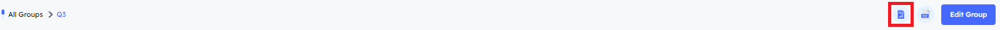

# Introduction
> You can group multiple campaigns together and download a consolidated executive report. This report provides performance metrics and detailed analysis for all campaigns within the group allowing for comprehensive insights in one document.

- **Campaigns Groups Information and Metadata**

    1. **Name** The title of the group, which will be displayed in the admin panel.
    2. **Number of Campaigns** The number of the campaigns included in the group
    3. **New Group** Click this option to create a new group and begin managing your campaigns within it.
        
        
    4. **Actions**

        - **view** Click `View` to access the group and manage all campaigns within it. From here, you can also generate the executive report for the entire group.

        - **Edit** Click `Edit` to modify the group name and manage the campaigns included in the group.
        

        - **Delete** Click `Delete` to delete the group .

***

- **Manage Group** To manage the group and generate an executive report for all campaigns within it click  the `three-dot menu` and select `View` to access the management page.

    

    - **Main**
        

        1. **Name** The title of each campaign included in the group, as displayed in the `Campaigns tab`.

        2. **Campaign Type** Indicates the type of each campaign within the group, such as `Email with Attachment`, `Email with Page`, and other available options.

        3. **Tracker Host** Displays the tracker host used for each campaign.

        4. **Success Category** Displays the intended outcome or success criteria for your campaign, such as `Link Opened` or `Credentials Saved`.

        5. **Date**

        6. **Actions**
            
            - **View** Redirects you to the management panel for the selected campaign.

            - **Remove from Group** Removes the selected campaign from the group’s campaign collection.

            - **Delete Campaign** Deletes the campaign from the database permanently.
    - **Header**

        1. **Executive Report**
            
            - Click the `Report button` to view a compiled executive report for all campaigns in the group. This will open a new tab with a browser-based report, allowing you to monitor campaign performance and detailed analysis.
            
            
            - To request a downloadable executive report, click the `Download button` next to the Report button. An email with a download link will be sent to the email address associated with the logged-in user who made the request.
            

        2. **Edit Group** selected campaigns within the group or change the group name
        
        
