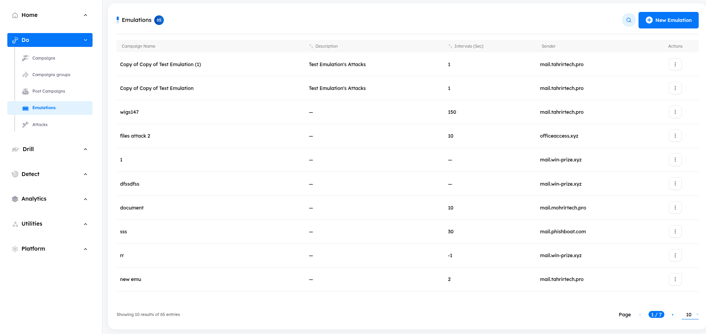
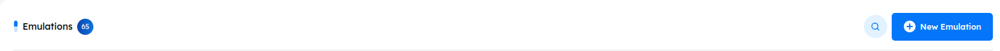

# Overview
> This campaign type is designed to test the effectiveness of email security controls, such as email gateways and email sandboxes. The key difference between emulation and phishing campaigns is that emulation campaigns do not require whitelisting the sender, as the goal is to test the email gateway system under real-world attack conditions.

### Emulation Campaigns Management

- **Main** Upon accessing the `Emulations tab`, users will encounter key indicators at the top of the page, which display the number of created emulation-campaigns. The interface is paginated, enabling users to customize the number of emulation-campaigns displayed. You can customize the number of emulation-campaigns displayed by adjusting the pagination at the bottom of the page.

***
### Emulation Features

- **Emulations Campaigns Details** A comprehensive information bar is situated above the emulation-campaigns, displaying essential details such as the emulation-campaign name, Description, Intervals (sec), Sender and available actions for further management.
    
    1. **Campaign Name**

    2. **Description** A brief overview of the Emulation campaign, such as:

        - **Intervals (Sec)** The interval is the time, in seconds, that separates each attack when the emulation campaign is launched. Setting an interval is important because it allows you to test the effectiveness of security controls. Sending attacks too quickly could cause them to be blocked by rules unrelated to individual payloads, rather than by the mail gateway's targeted defenses.

        - **Sender** Choose the sender responsible for dispatching the campaign attacks to the targets or the security control system.
            > [!NOTE]
            > You only need to choose one target for the emulation campaign, as all targets are protected by the same security control system. Whatever applies to one target will apply to the rest

        - **Actions**
            - **View**: View detailed information about the emulation.
            - **Edit**: Modify the emulation's configurations.
            - **Delete**: Permanently remove the emulation.
            - **Clone**: Duplicate the emulation to create a new one.
            - **Export**: Export the emulation to a CSV file.
            - **Open Ticket**: Open a ticket for the emulation campaign.
        
        - **Search Functionality** Located at the top right corner, the search button allows you to find a campaign by its name quickly.

***

- **Creating New Emulation** To create a new emulation campaign, click the **New Emulation** button. This will direct you to the emulation campaign creation interface

***
### Emulation Campaign Details and Metadata

- **Emulation Name** The title of the emulation campaign, which will be displayed in the admin panel.

- **Intervals** The interval is the time, in seconds, that separates each attack when the emulation campaign is launched.

- **Description**

***

##### Attacks 
Select the attacks to be used in the emulation campaign. Each attack may contain multiple payloads.

#### Sender 
Select the sender that will be used to deliver the attacks to the target.

#### Target
Select the target that will receive the attack payload.