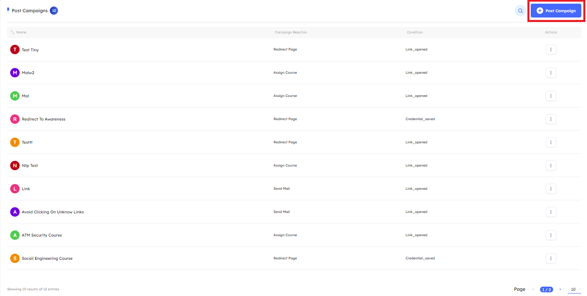

# Overview
> The primary purpose of post campaigns is to deliver awareness to targeted users. They are triggered by  specific user actions, such as clicking a link or entering credentials during a phishing simulation.

### Post Campaigns Management

- **Main** Upon accessing the `Post Campaigns tab`, users will encounter key indicators at the top of the page, which display the number of created post-campaigns. The interface is paginated, enabling users to customize the number of post-campaigns displayed. You can customize the number of post-campaigns displayed by adjusting the pagination at the bottom of the page.

    

***
### Post Campaigns Features

- **Post-Campaign Details** A comprehensive information bar is situated above the post-campaigns, displaying essential details such as the post-campaign name, Campaign Reaction, Condition, and available actions for further management.
    
    1. **Name** By default, post-campaigns are displayed with the most recently created ones at the top. Users can reorder the list in ascending or descending order by clicking the arrows next to the name in the information bar.

    2. **Campaign Reaction** Each post-campaign performs a single action once a specific condition is met, such as:

        - **Send Email** Sends an email containing awareness information or a policy once the condition is met

        - **Assign Course** Automatically assigns a course to the target and sends an email notification. If the target does not have LMS access, the system will create an account and email the credentials along with the course assignment.

        - **Redirect Page** Redirects the target to a page with awareness tips or policy information.

        - **Add Tag to Target Info** Adds tag to the target with the condition name automatically so, the admin can perform another campaign on them again and be easy to select them by tag.

        - **Add To Drill Group** Adds targets that meet the condition to a group named after the condition, allowing the admin to assign a course to all members of the group. You can find the group under `Drill > Groups`.

    3. **Condition** Each post-campaign has a specific condition that, when met, triggers one of the defined actions:
        - **SMS Sent**
        - **Mail Opened**
        - **Document Opened**
        - **Credentials Saved**
        - **Link Opened**
        - **USB Opened**
        - **Code Scanned**
        - **Stager Downloaded**
        - **File Opened**
        - **Target Exploited**

    4. **Actions** 
        - **View**
        - **ُEdit**
        - **Delete**

    5. **Search Functionality** Located at the top right corner, the search button allows you to find a campaign by its name quickly

***

- **Creating New Post Campaign** To create a new post campaign, click the "Post Campaign" button.

    

    1. **Name**

    2. **Condition** When met, triggers one of the defined actions:

        - **SMS Sent**
        - **Mail Opened**
        - **Document Opened**
        - **Credentials Saved**
        - **Link Opened**
        - **USB Opened**
        - **Code Scanned**
        - **Stager Downloaded**
        - **File Opened**
        - **Target Exploited**

    3. **Action** This action will be performed after a specific condition is met. The service is dynamic; each action has its own purpose and logic, so the available options will change based on the selected action:

        - **Send Email** Sends an email containing awareness information or a policy once the condition is met.
            - **Template** Select the template to be sent to the target via email.
            > [!NOTE]
            > Only templates with the **announcement** category will be displayed

            - **Sender** Select the sender that will send the email.

            - **Assign Course** Automatically assigns a course to the target and sends an email notification. If the target does not have LMS access, the system will create an account and email the credentials along with the course assignment.
                - **Course** Select the course to be assigned to the target once the condition is met.
            
            - **Redirect Page** Redirects the target to a page with awareness tips or policy information.
                - **Page** Select the page to which the target will be redirected.
                
                > [!NOTE]
                > Only Pages with the **announcement** category will be displayed
                 
            - **Add Tag to Target Info** Adds tag to the target with the condition name automatically so, the admin can perform another campaign on them again and be easy to select them by tag.

            - **Add To Drill Group** Adds targets that meet the condition to a group named after the condition, allowing the admin to assign a course to all members of the group. You can find the group under `Drill > Groups`.

    

