# Overview
> The Announcements feature functions similarly to phishing campaigns, with the key difference being its focus on awareness. It is designed to manage awareness campaigns aimed at educating targets through tips, awareness content, or company policies. The feature enables administrators to create and distribute announcements to enhance users' understanding of security, best practices, and internal guidelines.  

## Main Page

In the `Announcements tab`, key indicators at the top display the total count of created announcements. Administrators can adjust the pagination settings at the bottom of the page to control the number of announcements displayed per page, enabling efficient navigation through the list. 

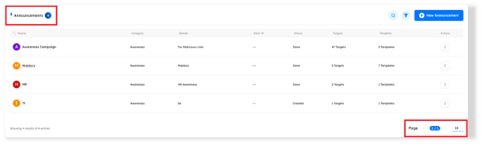

---

# Announcements Features

 - ### Announcements Details and Metadata 

    A comprehensive information bar is located above the campaigns, displaying essential details for effective campaigns management. The following components are included: 

    1. #### Name

        - Campaigns are displayed in order of creation, with the most recently created appearing first.

        - Administrators can reorganize the list in ascending or descending order using the arrows next to the campaign name in the information bar.

    2. #### Category 

        - Specifies the type of campaign: Awareness, Policy, or Others. 

    3. #### Details 

        - Provides additional information about the campaign.

    4. #### Start At
        - The scheduled date and time for the campaign to begin. 
    
    5. #### Status
        - Displays the campaign's progress, marked as "Done" or "Created."
    
    6. #### Targets
        - Indicates the number of targets included in the campaign. 
    
    7. #### Templates
        - Shows the number of templates utilized within the campaign.  
 
    8. #### Actions
        - **View**: Navigates to the management interface of the campaign.
        - **Edit**: Enables editing of campaign settings.
        - **Delete**: Permanently removes the campaign from the system.

### Search Functionality

- Located at the top right corner, the search button allows you to find a campaign by its name quickly. 

### Filtering Options 

- A filter button is available next to the search button. This feature allows you to refine your campaign search based on the category of the campaign. 

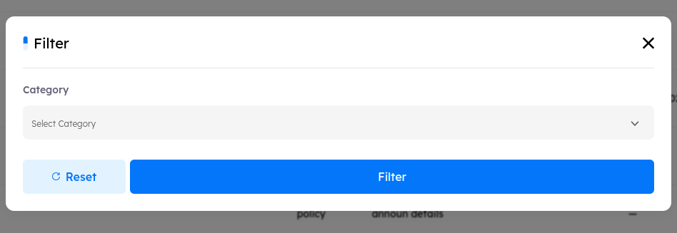

**Category**
- Allows filtering of announcements based on assigned Category.

> [!NOTE]
> To reset the filtering settings, click the "Reset" button, followed by "Filter."

- ### Create New Announcement Campaign  

To create a new campaign, click the "New Announcement" button. This will direct you to the campaign creation interface.  

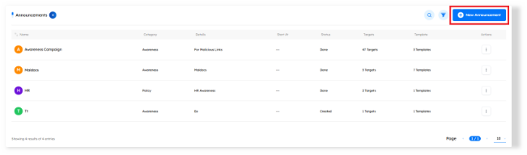

# Announcements Details and Metadata

Each campaign is defined by the following metadata fields: 

1. **Announcement Name**: The title of the campaign, which will be displayed in the admin panel.
2. **Announcement Details**: Provides additional information about the campaign.  
3. **Category**: Specifies the type of campaign: Awareness, Policy, or Others.
4. **Start At**: This information enables you to schedule the campaign for a specific start date or choose to launch it immediately by leaving it empty.

### Select Template and Page 

- Choose the template and page to be included in the email sent to the targets. The template provides the main content for the announcement, while the page serves as the destination link for recipients, guiding them to additional information if required. 

### Target 

- Select multiple targets to receive the announcement. This allows you to direct the campaign to specific groups or individuals within the organization. To add a new target, click the New Target button. After entering the target's data, they will automatically be added to the global targets list, where you can manage and perform any operations on them. 

# Managing Announcements Campaign

After creating a campaign, you can manage it by selecting “Actions” and choosing “View” 
or you will be automatically redirected to the management interface upon completing the 
creation process. 

 - ## Announcements Details and Metadata 

    This section displays all campaign settings, including the campaign name, number of templates used, selected page, campaign category (e.g., Awareness or Policy), current status (either "Created" or "Done"), and the campaign start date. 

    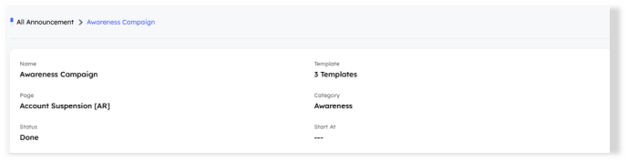

 - ## Tracks Timeline 

    Once the campaign is launched, this section displays data on key metrics, including the percentage of emails received, emails opened, accepted, and those received but not accepted. 

    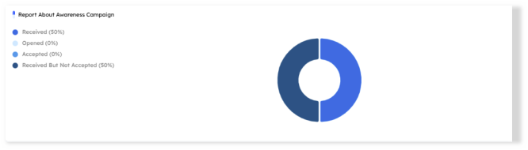

 - ## Announcement Targets 

    Upon navigating to the Announcement Targets, you can manage the targets for the announcement campaign.  
    Here, you can customize the number of targets displayed by adjusting the pagination settings  
    at the bottom of the box. 

    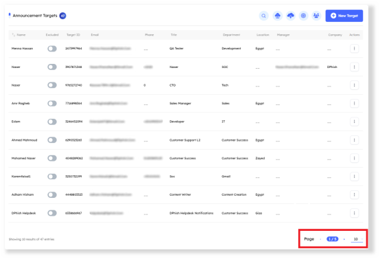

    1. Search Functionality 

        Located at the top right corner, the search button allows you to find a target by its Name,  
        Email, Title and Department quickly. 

    2. Import Targets  

        This button enables you to upload a bulk list of targets to your awareness campaign using two methods: 

        - **CSV Sample**: When selected, a CSV template containing the necessary data fields will be downloaded automatically. After filling in your target information, select the completed file and upload it to the system. 

        - **LDAP Integration**: Connects the client’s tenant to their on-premises Active Directory, allowing them to pull targets directly into the phishing campaign. 
    
    3. Export Targets 

        The **Export Targets** button allows users to download an Excel file containing target data used in the campaign. This feature enables easy access and analysis of campaign targets. 

    4. Select Targets

        The **Select Targets** button allows users to manually choose targets based on various attributes, including title, department, tags, location, manager, and company. When selecting any of these options, all matching targets are automatically selected.

    5. Assign All Targets

        The **Assign All Targets** button assigns every target uploaded in the tenant to the campaign. Users can review and manage these targets by navigating to Utilities > Targets, ensuring accurate oversight and control over the selected target audience.

    6. New Target

        The New Target option allows users to manually add a new target to the campaign.  
        Once added, this target is also saved in the tenant’s target list, making it available for selection in future campaigns.
           
        - When adding a new target, the Name and Email fields are mandatory. Other fields—such as title, phone, and location—are optional but recommended. Leaving these optional fields empty may limit the functionality of targeted selection by metadata (e.g., selecting by title or location). Filling out these fields enhances the accuracy and flexibility of target selection in future campaigns. 

    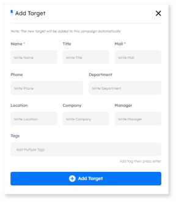

    7. Actions

        - Tracker 
           button allows administrators to monitor the interactions and actions of a specific target throughout the campaign duration. This feature provides real-time insights into the target’s engagement and response to the campaign since its launch The Track Target.

        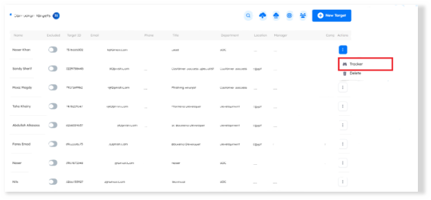

        - Tracker Details 
            Feature provides in-depth information on specific actions taken by a target. This includes details such as the location from which the target submitted their credentials, IP address, VPN usage, and the user agent (e.g., Chrome, Microsoft Edge) used for access. This detailed view supports security monitoring and enhances understanding of target behavior within the campaign. 
        
        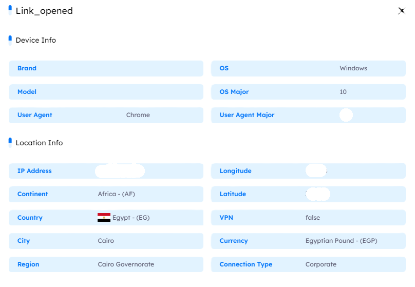

        - **Delete**: Removes the selected target from the campaign.Removes the selected target from the campaign.

 - ## Latest Trackers

    The **Latest Trackers** feature offers detailed insights on target actions within a campaign,  
    supporting security monitoring and target behavior analysis. Key details include:

    - **Location**: The origin of credential submissions. 

    - **IP Address and VPN Usage**: Information on target IPs and VPN access. 

    - **User Agent**: Browser or app used (e.g., Chrome, Edge).  

        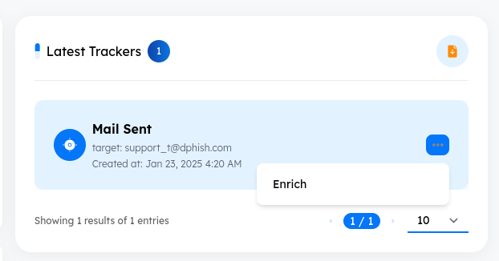

 - ## Header
    
    1. **Edit the Announcement** 

        Click this button to be redirected to the edit page, where you can modify the announcement settings. 
        
        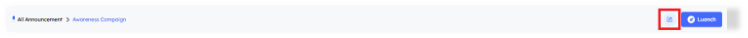

    2. **Launch the Announcement Campaign**

        Use this button to **Launch** the campaign. You can also view the **Launch History** to track previous launches and terminate specific ones if needed. A pop-up displays each launch’s **Created Date, Status, Is Scheduled** (e.g., scheduled with a start date), and **Date Done**.  
            
        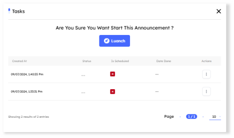