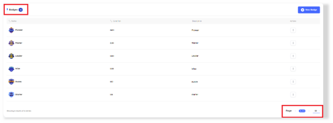
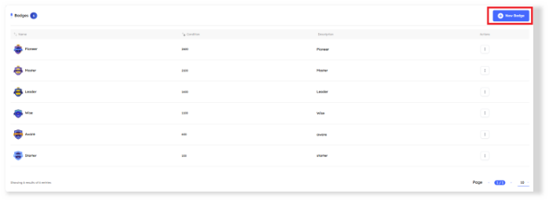
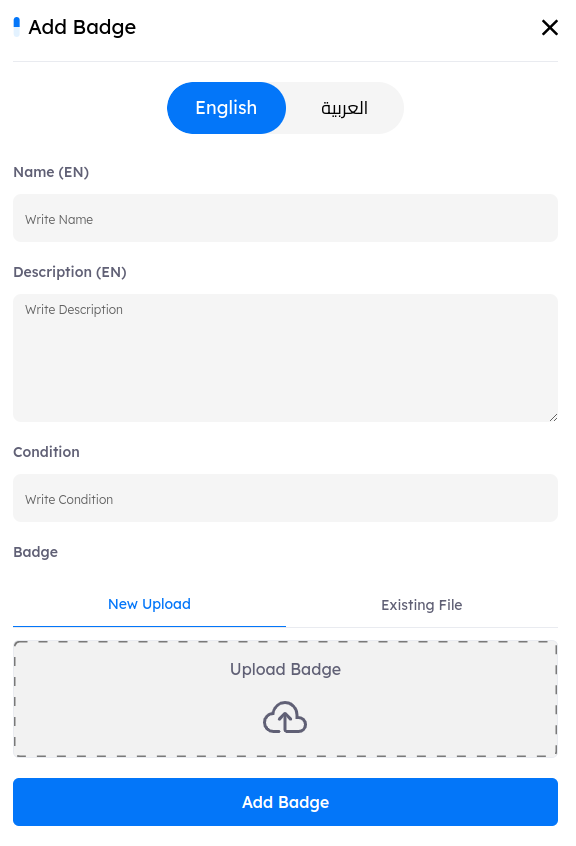

# Overview
> **Badges** are awarded to Drill users upon meeting specific achievement conditions. They serve as motivation, encouraging users to remain cyber-aware and engaged with security practices.

## Main Page

In the `Badges tab`, key indicators at the top display the total count of badges. Administrators can adjust the pagination settings at the bottom of the page to control the number of badges displayed per page, enabling efficient navigation through the list.

---

# Badges Features

- ## Badges Details and Metadata

    A comprehensive information bar is situated above the badges, displaying essential details such as the badges name, condition, description, and available actions for further management.

    1. **Name**
        - badges are displayed in order of creation, with the most recently created appearing first.
        - Administrators can reorganize the list in ascending or descending order using the arrows next to the badges name in the information bar.
    2. **Condition**
        - A numeric value that, when achieved by the user, awards them the badge.
        - Administrators can reorganize the list in ascending or descending order using the arrows next to the condition in the information bar.
    3. **Description**
        - A brief overview explaining the purpose or significance of the badge.
    4. **Actions**
        - **Edit**: Modify the badge’s information, such as its name, condition, or description.
        - **Delete**: Remove the badge. When a badge is deleted, it is also removed from all users' badge collections.

- ## Create New Badge

    - To create a new badge, click the `New Badge button`. This action will open the badge creation tab, where you can add all necessary information.

    
    
- # Badges Details and Metadata 
    Each badge is defined by the following metadata fields: 

    1. **Name**: The title of the badge. 

    2. **Description**: A brief explanation of the badge's purpose or significance. 

    3. **Condition**: The required number or points a user must achieve to earn the badge. 

    4. **Badge**: An upload filed where administrators can add the badge’s image. For optimal quality, it’s recommended to use an SVG file extension.  

    
