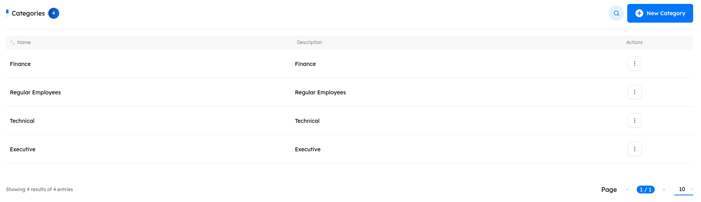
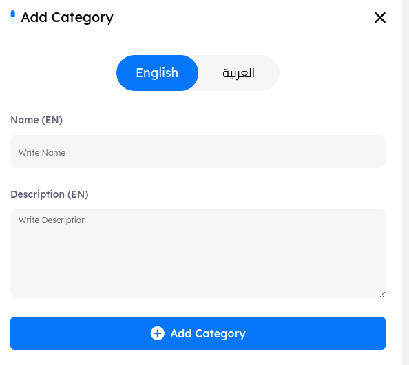
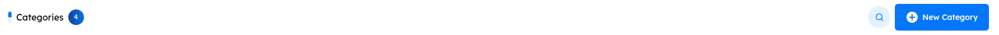

# Overview
> Categories are used to filter courses, allowing you to organize each course under a specific category for better visibility and accessibility.

## Main Page

In the `Categories tab`, key indicators at the top display the total number of categories created. Administrators can adjust the pagination at the bottom of the page to set the number of categories shown per page, allowing for easy navigation through the category list. 

# Categories  Features

 - ### Categories Details and Metadata 

    A comprehensive information bar is located above the stories, displaying essential details for effective stories management. The following components are included:

    1. #### Name

        - Categories are displayed in order of creation, with the most recently created appearing first. 

        - Administrators can reorganize the list in ascending or descending order using the arrows next to the category name in the information bar.

    2. #### Head

        - Indicates the person responsible for managing the category.

    3. #### Description

        - A brief summary of the category’s content or purpose.

    4. #### Actions

        - **View**: Displays the category information without allowing any modifications.
        - **Edit**: nables you to update the category settings.
        - **Delete**: Removes the selected category from the system.

### Search Functionality

- Located at the top right corner, the search button allows you to find a category by its name quickly. 

- ## Create New Category

- To create a new category, click the New Category button. This action will open the category creation tab, where you can add all necessary details and media. 

# Categories Details and Metadata 

Each category in the admin panel is defined by the following metadata fields: 

- **Name**: The title of the category, which will appear to users. 
- **Head**: Indicates the person responsible for managing the category.
- **Description**: A brief summary of the category’s content or purpose.

