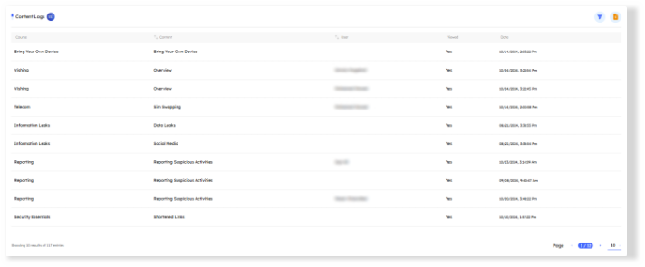
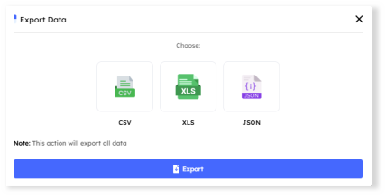
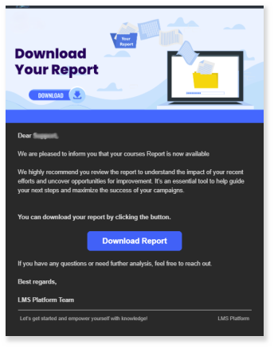

# Overview
> The **Content Logs** section records all interactions between drill users and the courses' content. It allows administrators to monitor which content has been accessed, and when it was viewed. This helps ensure that users engage with the content as intended. It serves as an effective tool for monitoring user activity.

## Main Page

In the `Content Logs tab`, key indicators at the top display the total count of logs. Administrators can adjust the pagination settings at the bottom of the page to control the number of logs displayed per page, enabling efficient navigation through the list.

---

# Content Logs Features

  A comprehensive information bar is situated above the content logs, displaying essential details for efficient tracking and management. The following components are included:

1. **Course**
    - The name of the course associated with the content.
2. **Content**
    - The specific content (e.g., videos, blog, etc.) that the user interacted with.
3. **User**
    - The name or identifier of the user who interacted with the content.
4. **Viewed**
    - Indicates whether the content was viewed by the user (yes/no).
5. **Date**
    - The date and time the content was accessed or viewed by the user.

> [!NOTE]
> The system allows to sort logs by column headers by `Content` and `User` to help administrators organize and analyze data efficiently.

### Filtering Options

- A **filter** button is available in the Content Logs section, allowing administrators to refine their search by selecting specific criteria. The available filtering options include:

    1. **User**
        - Filter the logs based on a particular user to view their interactions with the content.
    2. **Course**
        - Filter the logs by a specific course to track interactions related to that course.

### Export Data

- The **Export Data** button enables administrators to export content log data in the selected format (CSV, XLS, or JSON). However, instead of immediate download, an email will be sent to the administrator. The email will contain a link to download the data in the chosen format.

