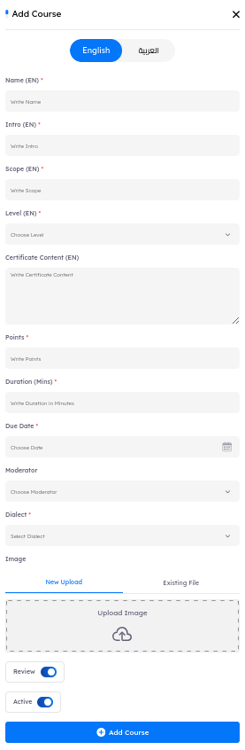

# Main Page

Upon accessing the `Courses tab`, users will encounter key indicators at the top of the page, which display the number of created courses. The interface is paginated, enabling users to customize the number of courses displayed. You can customize the number of courses displayed by adjusting the pagination at the bottom of the page.  

---

## Courses Features

- ### Courses Details and Outer Metadata

A comprehensive information bar is located above the courses, displaying essential details for effective course management. The following components are included:

1. **Name**
    - Courses are displayed in order of creation, with the most recently created appearing first.  
    - Administrator can reorganize the list in ascending or descending order using the arrows next to the course name in the information bar.

2. **Scope**
    - Provides a brief overview of the course's objectives and target audience.

3. **Duration**
    - Indicates the total time required to complete the course, helping users understand their time commitment.

4. **Level**
    - Specifies the difficulty level of the course (e.g., Beginner, Intermediate, Advanced).

5. **Deadline**
    - Displays the due date for course completion, essential for tracking progress and ensuring timely submissions.

6. **Content**
    - A numerical indicator representing the total amount of content included in the course, such as videos, walkthroughs, infographics, and other materials.

7. **Active**
    - Shows the status of the course (active or inactive), allowing users to quickly identify available courses.

8. **Actions**
    - View  
    - Edit  
    - Delete  

- ### Search Functionality

Located at the top right corner, the search button allows you to find a course by its name quickly.

- ### Filtering Options

A filter button is available next to the search button. This feature allows you to refine your course search based on the following criteria:

- Scope
- Level
- Active status

---

- ## Create New Course

To create a new course, click the `New Course` button. This will direct you to the course creation interface.

---

### Course Details and Metadata

Each course in the admin panel and LMS is defined by the following metadata fields:

1. **Name**: The title of the course, visible in both the admin panel and the LMS for easy identification.

2. **Intro**: A short introduction summarizing the course and capturing the key highlights or purpose.

3. **Scope**: Provides a brief overview of the course's objectives and target audience.

4. **Level**: Specifies the difficulty level of the course (e.g., Beginner, Intermediate, Advanced).

5. **Points**: Indicates the total points awarded to users upon completing the course. These points contribute to their overall leaderboard ranking, motivating engagement.

  > [!NOTE]
  > If the course includes a quiz, the points are divided into two parts—one portion for completing the content and the other for successfully passing the quiz. LMS users receive the full points only upon completing both the content and the quiz.

6. **Duration (Mins)**: Displays the total time required to complete the course in minutes, giving learners an idea of their time commitment.

7. **Due Date**: The course's due date or deadline for completion, important for tracking progress and ensuring timely completion.

8. **Moderator**: Identifies the course moderator or instructor, giving learners a point of contact for questions or support.

9. **Dialect**: Allows selection of the course's language or dialect, currently limited to four options:  
  English, فصحى (Classical Arabic), مصري (Egyptian Arabic), and سعودي (Saudi Arabic). This ensures the course is accessible to targeted audiences based on their preferred dialect.

10. **Image**: A thumbnail or featured image representing the course, which adds visual appeal and helps learners identify the course at a glance.

11. **Review**: An on/off toggle that controls whether users can rate and review the course. When enabled, users can provide feedback, which may help future participants gauge the course quality.

12. **Active**: Indicates the course’s availability status. If set to inactive, the course will not appear in the LMS for users, allowing administrators to control course visibility.

## Managing Course

After creating a course, you can manage it by selecting **Actions** and then **View** for the desired course. This will take you to the course management panel, where you can manage its content, categories, enrolled users, groups, quizzes, FAQs, and comments.

- ### Course Details and Metadata

This section provides comprehensive course information, including the number of students, lessons, duration, videos, skill level, and available languages & dialects.

---

## Course Management Section

- ### Content

    - Manage course content by adding, deleting, or modifying entries.
    - An information bar displays details like content category, description, and actions (edit/delete).
    - Key indicators show the number of contents, with a paginated interface to customize displayed contents.
    - Admins can reorder content by dragging and dropping items.

1. ### Adding New Content

To add new content to the course, select the **New Content** button. This action opens the content creation interface, where you will need to complete the following key fields:

- **Description**
  - Provide a brief but clear description of the content, outlining its main focus or purpose.

- **File**
  - Use the upload section to add the content file. Ensure that the file format aligns with the content requirements and is properly named for easy identification.

- **Category**
  - Specify the type of content being added. The following categories are available:
    - **Video**: For video lectures or tutorials.
    - **Presentation**: For slides or presentation materials.
    - **Infograph**: For visual data or diagrammatic content.
    - **Walkthrough**: For step-by-step instructional guides.

> **Hint:** Both **Presentation** and **Walkthrough** content types must be uploaded as PDFs. Other formats are not accepted for these categories.

> [!NOTE]
> If you specified certain dialects during course creation, these would become required fields when adding content. To adjust this, navigate to **Courses > Actions > Edit** for the course in question, and remove any unnecessary dialects or languages to make them optional in content creation.

2. ### Adjusting Content

To adjust content, select **Actions** next to the desired content and choose **Edit**. This opens the content creation interface, allowing you to modify any existing data as needed.

3. ### Deleting Content

To delete content, select **Actions** next to the desired content and choose **Delete**.

---

- ### Categories

    Categories are used to filter courses, allowing you to organize each course under a specific category for better visibility and accessibility.

    1. #### Assign Category

        To assign a category to a course, select the **Assign Category** button. This action opens a list of available categories to choose from. If you need a new category, you can create one from the **Categories tab**, making it available for assignment to courses.

- ### Users

    - Manage users by assigning, clearing trackers, or deleting users.

    - An information bar displays details about the users like username, full name, email, the completion percentage of the content, quiz result, and actions (clear trackers/delete).
    - Key indicators show the number of users, with a paginated interface to customize displayed users.

1. #### Assign User

    There are 5 methods to assign a course to users, each with its own logic:

    - #### Assign Users Manually

        To assign a new user to the course, select the **Assign User** button. This action opens a list of drill users to choose from. If you want to add new drill users, you can add them from the **Users tab** in the Drill module, making them available for assignment to courses.

    - #### Assign Users by Their Company

        To add multiple users from the same company, select the **Assign User** button, then choose **Company**. This action opens a list of available companies to select from.

        **How It Works:** When adding users to the system, you specify relevant information, including their company affiliation.

        **Use Case:** This feature is particularly useful for companies with multiple divisions, as it simplifies the process of assigning users to courses based on their organizational structure.

    - #### Assign Course to All Users

        To assign the course to all users, select the button located next to the **Assign User** button. Once activated, all users will be assigned to the course and will receive a notification if the notification feature is enabled.

    - #### Assign via Groups

    - #### Assign via Post Campaigns

2. #### Search Functionality

    The search button allows you to quickly find a user by their name or email.

3. #### Actions on Users

    - **Clear Trackers**: This action will clear the user timeline tracking, completion percentage, and quiz result.
    - **Delete**: This action removes the user’s enrollment in the course and clears all associated trackers.

---

- ### Groups

    This service allows the administrator to assign the course to groups, and each group can include multiple users.

    - An information bar displays details about the groups like group name, and actions (delete).
    - Key indicators show the number of users, with a paginated interface to customize displayed users.

    

    1. #### Assign Group

        To assign a group to a course, select the **Assign Group** button. This action opens a list of groups to choose from. If you want to add new groups, you can add them from the **Groups tab** in the Drill module, making them available for assignment to courses.

---

- ## Quiz

    - In this section, administrators can manage the course quiz by adding, editing, or deleting questions.

    - Each course is limited to one quiz, which supports only multiple-choice questions (MCQs).
    - An information bar displays details about the quiz like quiz name, description, and actions (edit/questions/delete).

    

    1. #### Create New Quiz

        To add a quiz to the course, click the **Add Quiz** button to open the quiz creation interface. Complete the following fields in both languages:

        - **Name**: The quiz title.
        - **Description**: A brief overview of the quiz content.

        

        After creating the quiz, click **New Question** to add a question. Navigate to **Actions > Questions** to manage them. This opens the question creation interface, where all fields are required. Select the “correct option” to indicate the correct answer.

        

        

        An information bar displays details about the quiz’s questions, like question name, options of choices, and actions (edit/delete).

        - **Edit**: Modify the question to correct typos or make updates.
        - **Delete**: Permanently removes the question.

2. #### Edit Existing Quiz

    Two main areas can be edited within a quiz:

    - **Quiz Information**: Update the quiz name and description as it appears to users. Click **Actions** next to the quiz, then select **Edit**.
    - **Quiz Questions**: To edit questions, click **Actions > Questions** for the quiz containing the question, then select **Actions > Edit** next to the specific question.

3. #### Delete Existing Quiz

    You can delete either the entire quiz or individual questions within it:

    - **Delete Quiz**: To delete the entire quiz, click **Actions** next to the quiz, then select **Delete**.
    - **Delete Question**: To delete a specific question, go to **Actions > Questions** for the quiz, then click **Actions > Delete** next to the desired question.

---

## FAQ

**Purpose** The FAQ section addresses frequently asked questions and can also serve as a tool for raising security awareness by including relevant questions and answers.

**Information Bar** Displays details for each FAQ, such as the question, answer, and available actions (Edit/Delete).

1. #### Create New FAQ

To add a new FAQ to the course, click the **New FAQ** button, which opens the FAQ creation interface. Complete the following fields in both languages:

- **Question**: The FAQ topic or title.
- **Answer**: A brief response or explanation.

2. #### Edit FAQ

    To edit an existing FAQ, select Actions > Edit next to the specific Frequently Asked Question (FAQ) you wish to modify. This allows you to update the question or answer as needed.

3. #### Delete FAQ

    To delete a specific FAQ, navigate to **Actions > Delete** next to the FAQ you want to remove. This action will permanently remove the FAQ from the course.

---

## Comments

**Purpose** The comments section allows administrators to manage users’ ratings and feedback for the course.

**Information Bar** Displays details for each comment, including the text, star rating, user, creation date, and available actions (e.g., Delete).

---

## Timeline Tracking

This section provides comprehensive information about all users enrolled in the course and their interactions with the content. It includes details such as:

- **Username**: The name of the enrolled user.
- **Activity Timestamp**: The date and time when the activity occurred.
- **Content Interaction**: The specific content with which the user interacted. 

