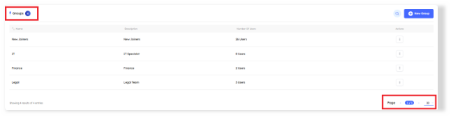
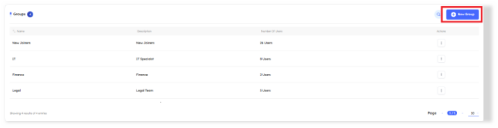
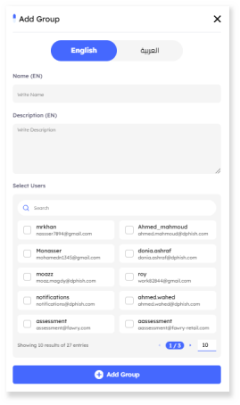

# Overview
> The Groups feature enables administrators to organize users into specific groups, making it easier to assign courses to multiple users at once. This setup is particularly useful for segmenting company departments into distinct groups, allowing each department to include its relevant users for streamlined training and management. 

## Main Page

In the `Groups tab`, key indicators at the top display the total number of groups created. Administrators can adjust the pagination at the bottom of the page to set the number of groups shown per page, allowing for easy navigation through the category list. 

---

# Groups Features

 - ### Groups Details and Metadata 

    A comprehensive information bar is located above the groups, displaying essential details for effective groups management. The following components are included: 

    1. #### Name

        - Groups are displayed in order of creation, with the most recently created appearing first. 

        - Administrators can reorganize the list in ascending or descending order using the arrows next to the group name in the information bar.

    2. #### Description

        - Brief details or purpose of each group.

    3. #### Number Of Users 

        - Displays the total number of users included in each group. 

    4. #### Actions

        - **View**: Allows viewing of group details without modification.
        - **Edit**: Enables editing of group settings.
        - **Delete**: Removes the group and its associated data.

### Search Functionality

- Located at the top right corner, the search button allows you to find a group by its name quickly.  

- ## Create New Group

    - To create a **new group**, click the New Group button. This action will open the group creation tab, where you can add all necessary details and media. 

# Groups  Details and Metadata 

Each group in the admin panel is defined by the following metadata fields: 

- **Name**: The designated name of the group.
- **Description**: A brief overview or purpose of the group.
- **Select Users**: Option to select users to include within the group. 

> [!NOTE]
> The search button allows you to find a user by its name or email quickly"