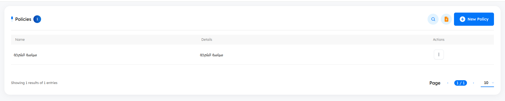
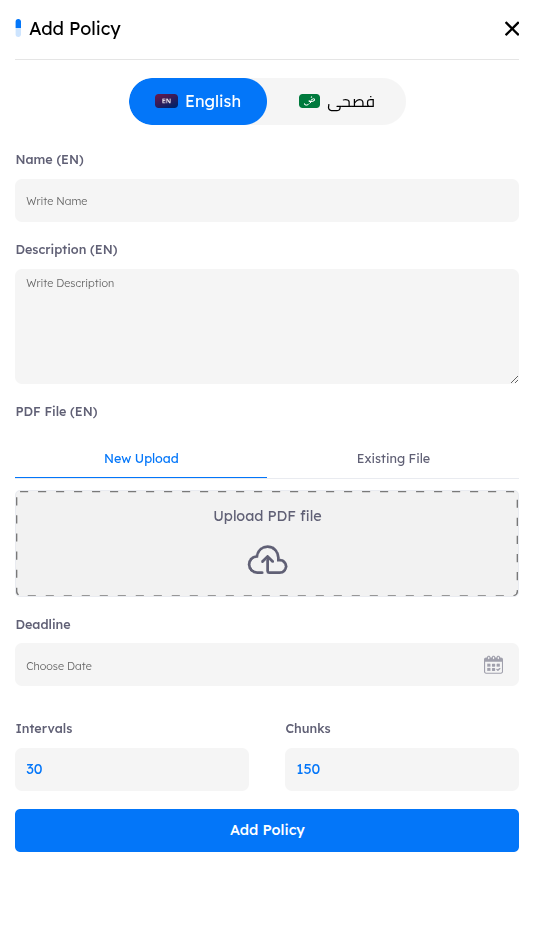

# Overview
> The Policies section allows administrators to upload and manage organizational policies, which Drill users can access via the LMS under the "Policies" tab. Once a policy is uploaded, users can view it in the system and are given the option to accept it after reviewing.

Key features for administrators include:

- **Uploading Policies**: Administrators can upload new policy documents, making them accessible to users in the LMS.
- **Managing Policies**: Policies can be edited, updated, or deleted as needed.
- **User Interaction Tracking**: Administrators can track user engagement with each policy, including who viewed, opened, or accepted it.

## Main Page

In the `Policies tab`, key indicators at the top display the total count of policies. Administrators can adjust the pagination settings at the bottom of the page to control the number of policies displayed per page, enabling efficient navigation through the list.

---

# Policies Features

- ## Policies Details and Metadata

    A comprehensive information bar is situated above the policies, displaying essential details such as the policies name, details, and available actions for further management.

    1. **Name**
        - Displays the title of the policy.
    2. **Details**
        - Provides an overview or description of the policy
    3. **Actions**
        - **Edit**: Allows administrators to modify the policy content or details.
        - **Delete**: Removes the policy from the system.
        - **Trackers**: Enables administrators to monitor user interactions with the policy, including viewing, opening, and acceptance statuses.

### Search Functionality

- Located at the top right corner, the search button allows you to find a policy by its name quickly.

- ## Create New Policy

    - To create a new policy, click the `New Policy` button. This action will open the policy creation tab, where you can add all necessary information.

    
    
- # Policies Details and Metadata 
    Each policy is defined by the following metadata fields: 

    1. **Name**: The title or identifier of the policy.

    2. **Description**: A brief summary of the policy's purpose, scope, and any key details. 

    3. **PDF File**: An upload field allowing administrators to upload the full policy document in PDF format, which users can access and review in the LMS.

    
