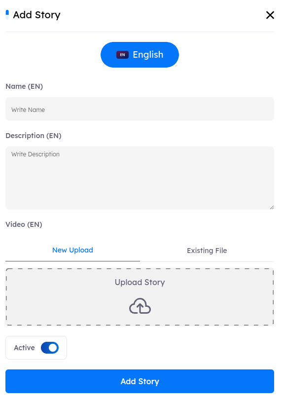

# Overview
> The Stories feature is designed to enhance user awareness through engaging narratives. Unlike traditional training modules, this feature does not include progress tracking or quizzes, focusing solely on delivering informative and captivating stories to the users.

## Main Page

Upon accessing the `Stories tab`, users encounter key indicators at the top of the page, displaying the total number of created stories. The interface includes pagination controls, allowing users to set the number of stories displayed per page by adjusting options at the bottom of the page.

# Stories Features

 - ### Stories Details and Outer Metadata

    A comprehensive information bar is located above the stories, displaying essential details for effective stories management. The following components are included:

    1. #### Name

        - Stories are displayed in order of creation, with the most recently created appearing first.

        - Administrators can reorder the list in ascending or descending order using the arrows next to the story name in the information bar.

    2. #### Description

        - A brief overview of each story’s content.

    3. #### Duration

        - Indicates the total length of the story, applicable for both audio (podcast) and video formats.

    4. #### Actions

        - **Edit**: This option allows you to modify the details of a specific story, including its name, description, and associated video.
        - **Delete**: Selecting this option will permanently remove the story from the system.

### Search Functionality

- Located at the top right corner, the search button allows you to find a story by its name quickly.

- ## Creating New Story

- To create a new story, click the **New Story** button. This action will open the story creation tab, where you can add all necessary details and media.

# Stories Details and Metadata

Each story in the admin panel and LMS is defined by the following metadata fields:

- **Name**: The title of the story, which will appear to users.
- **Description**: A brief overview of the story's content.
- **Video**: The field where you can upload the story's media or video file from `New Upload `or you can select the story's media or video file from `Existing File` which includes all files that you uploaded before.
- **Active toggle**, It controls the visibility of the story in the LMS. When enabled, the story is visible to users, but when disabled, it is hidden from users.

