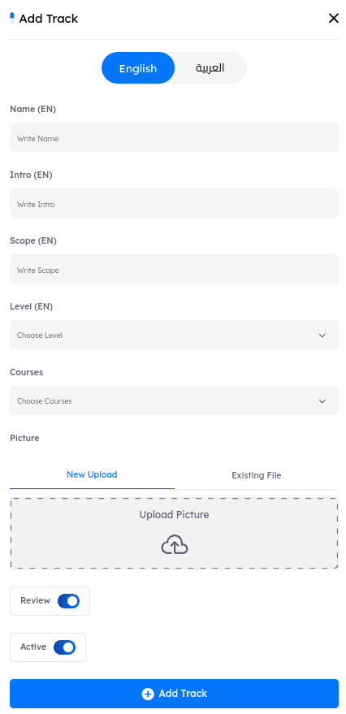

# Overview
> The Tracks section is designed to create a structured path that encompasses multiple courses, all aimed at delivering a cohesive learning experience in a specific field. This organization allows users to focus on related courses within the same track, enhancing their understanding and engagement with the material. By grouping courses together, administrators can ensure that users receive a well-rounded education on particular topics or skills.

## Main Page

Upon accessing the `Tracks tab`, users encounter key indicators at the top of the page, displaying the total number of created tracks. The interface includes pagination controls, allowing users to set the number of tracks displayed per page by adjusting options at the bottom of the page.

---

# Tracks Features

- ## Tracks Details and Metadata

    A comprehensive information bar is located above the tracks, displaying essential details for effective tracks management. The following components are included:

    1. **Name**: The title of the track, identifying its focus or subject matter.
    2. **Intro**: A brief introduction to the track, outlining its purpose and objectives.
    3. **Scope**: The range of content in the track, specifying the knowledge or skills covered.
    4. **Level**: The difficulty level of the track, indicating whether it is intended for beginners, intermediate, or advanced learners.
    5. **Courses**: The total number of courses included in the track.
    6. **Actions**
        - **View**: Displays the track information without allowing any modifications.
        - **Edit**: Enables you to update the track settings.
        - **Delete**: Removes the selected track from the system.

### Search Functionality

- Located at the top right corner, the search button allows you to find a track by its name quickly. 

- ## Creating New Story

    - To create a new track, click the New Track button. This action will open the track creation tab, where you can add all necessary details and media. 

    
- # Tracks Details and Metadata 

    Each track in the admin panel and LMS is defined by the following metadata fields: 

    1. **Name**: The title of the track, identifying its focus or subject matter. 

    2. **Intro**: A brief introduction to the track, outlining its purpose and objectives. 

    3. **Scope**: The range of content in the track, specifying the knowledge or skills covered. 

    4. **Level**: The difficulty level of the track, indicating whether it is intended for beginners, intermediate, or advanced learners. 

    5. **Courses**: The total number of courses included in the track. 

    6. **Image**: The field where you can upload the track’s image. 

    Review: An on/off toggle that controls whether users can rate and review the track. When enabled, users can provide feedback, which may help future participants gauge the track quality. 

    Active: Indicates the track’s availability status. If set to inactive, the track will not appear in the LMS for users, allowing administrators to control track visibility. 

