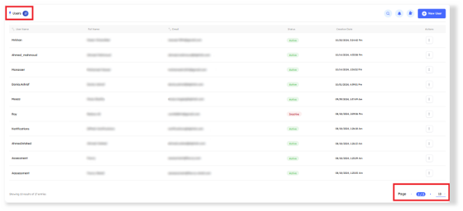
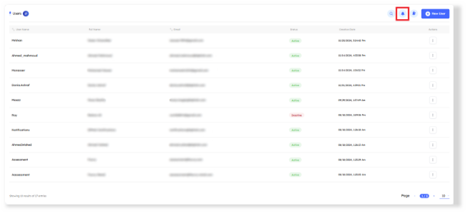
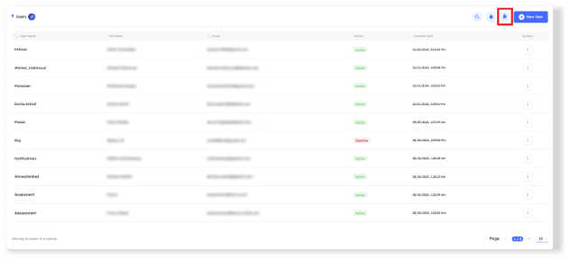
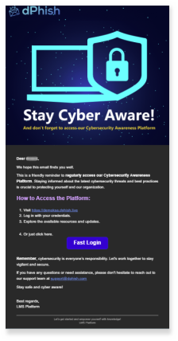
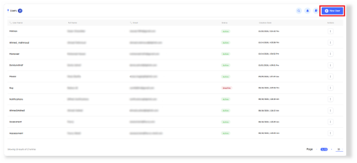
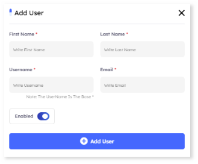

# Overview
> This section enables administrators to manage all Drill users with access to the LMS (Learning Management System). Administrators can perform actions such as updating user information, adding new users, resetting access credentials, and notifying users who may not be aware of their access.

## Main Page

In the `Users tab`, key indicators at the top display the total count of users. Administrators can adjust the pagination settings at the bottom of the page to control the number of users displayed per page, enabling efficient navigation through the list.

---

# Users Features

- ## Users Details and Metadata

    A comprehensive information bar is situated above the users, displaying essential details such as the users name, full name, email, status, creation date, and available actions for further management.

    1. **Username**: By default, users are displayed with the most recently created ones at the top. Admins can reorder the list in ascending or descending order by clicking the arrows next to the username in the information bar.
    2. **Full Name**: Shows the user’s full name.
    3. **Email**: The email address associated with the user's account or access.
    4. **Status**: Indicates whether the account is `Active` or `Inactive`.
    5. **Creation Date**: Displays the date the user account was created.
    6. **Actions**
        For each user, the following actions are available:
        - **Change Password**: Allows the administrator to reset the user’s password.
        - **Edit**: This option allows administrators to modify user information, including the first name, last name, username, email, and account status (Active/Inactive).
        - **Delete**: Removes the user account.

### Search Functionality

- Located at the top right corner, the search button allows you to find a user by its username or email quickly.

- ## Notify and Reset Drill Users Access

    - This activity intends to reset the users’ credentials who didn't log in before and notify them with new credentials. 

    
    
- ## Notify Drill User to Stay Cyber Aware! 

    - This feature sends notifications to users reminding them of their LMS access and encouraging them to stay vigilant with cybersecurity practices.

    

    

- ## Create New User 

    - To create a new user, click the New User button. This action will open the user creation tab, where you can add all necessary information.

    

- ### Users Details and Metadata

Each user is defined by the following metadata fields:

1. **First Name**
2. **Last Name**
3. **Username**: The unique identifier for the user in the system.
4. **Email**: The email address associated with the user’s account.
5. **Enabled**: This is an enable button that toggles the user’s account status between Active and Inactive.

    

    > [!NOTE]
    > After creating a new user, they will receive an email with their access credentials and a link to the tenant. This feature will only execute if enabled in the settings (Settings > Platform > Notify user on creation).