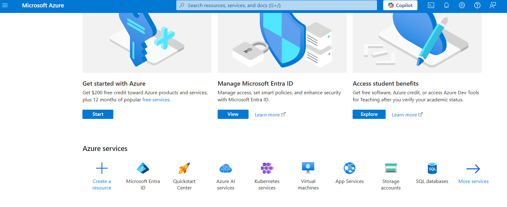
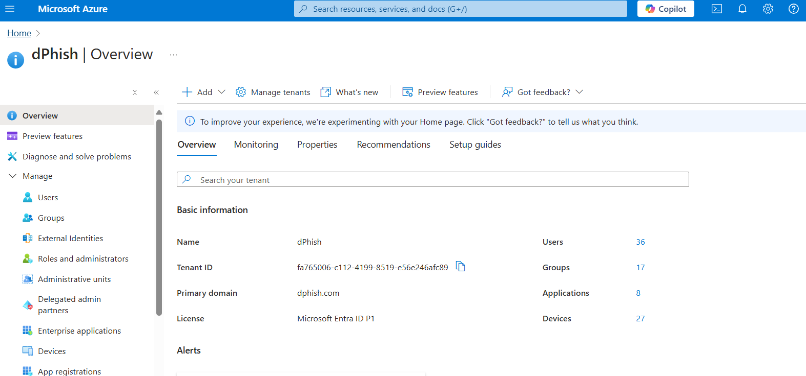
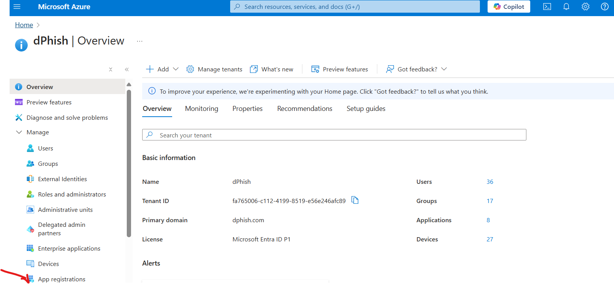
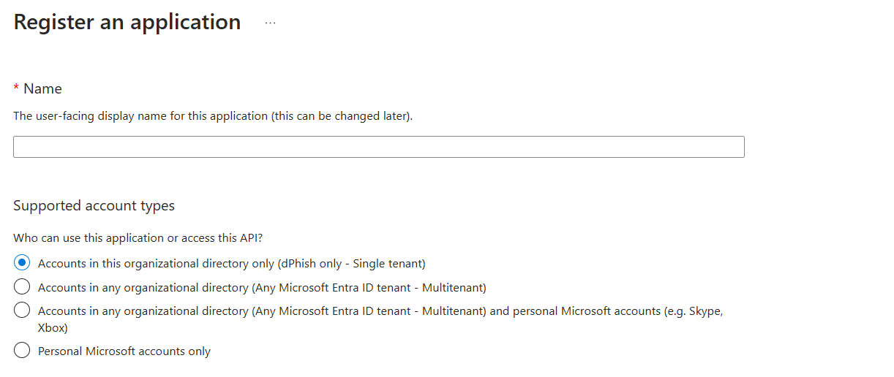
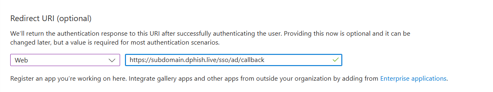
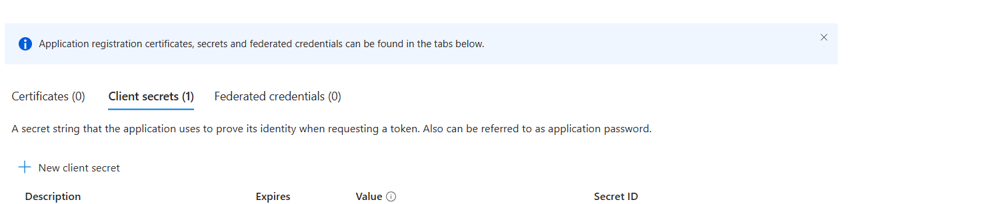
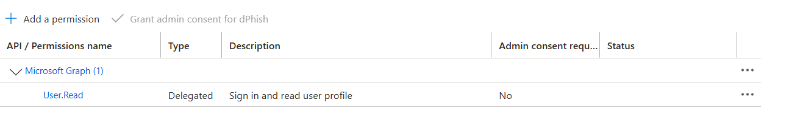
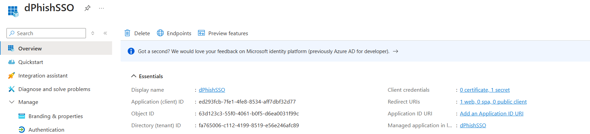
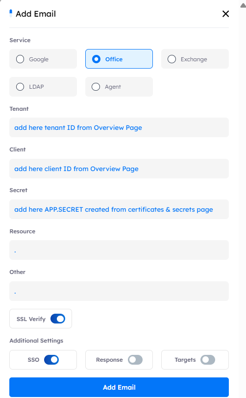

## Setup Azure

- all our work will be done in the Microsoft Azure → Microsoft Entr ID

---

- the click on Microsoft Entra ID

---

- To set up Single Sign-On (SSO) using Azure AD, follow these steps

   1) Go to an App Registration in Microsoft Azure.                      

   2) Click over New Registration Button.                     

   3) choose suitable name for the app and which tenant would you like to work on.

   4) choose Redirect Url as web and its value: `https://subdomain.dphish.live/sso/ad/callback`.

   5) Go to certificates & secrets and Click on New client secret and choose suitable expiry date and copy its value when its created and save it for later user we will refere to it as APP.SECRET

   6) Go to Api Permissions and granting User.Read from Microosft Graph.

   7) Go to overview page for newly created application we will need client ID and tenant ID.

   Go to dPhish Platform navigate to Platform → Email Services then click over New Email with the following information.

---

#### if you would like to use the same service for import target

- we need to add the following permission `User.ReadAll`

#### if you would like to use the same service for Response

- we need to add the following permissions

   1. Mail.Read

   2. Mail.ReadWrite

   3. SecurityAlert.Read.All

   4. SecurityAlert.ReadWrite.All

   5. SecurityAnalyzedMessage.Read.All

   6. SecurityAnalyzedMessage.ReadWrite.All

   7. SecurityEvents.ReadWrite.All

   8. SecurityIncident.Read.All

   9. SecurityIncident.ReadWrite.All

   10. User.Read

   11. User.Read.All

#### issues

1. make sure you are using secret value not secret id.

2. make sure you use client id and tenant id correctly.

3. The mailbox is either inactive, soft-deleted, or is hosted on-premise.

---