## dPhish – SSO Integration

### Configure SAML Single Sign On with AD-FS

Security Assertion Markup Language (SAML) is an open standard for exchanging authentication and authorization data between an identity provider (AD FS) and a service provider (dPhish App).

**Required Information:**
- **Login Service URL**
- **Federation Service Identifier**
- **X509 Certificate for AD FS Platform**

---

### Configure SAML

#### Setup Identity Provider Login Service URL
1. Go to the AD FS management tool.
2. Select **AD FS > Service > Endpoints** in the left panel.
3. Copy the value and paste it in the **Client** field inside the email service with type **Exchange**.

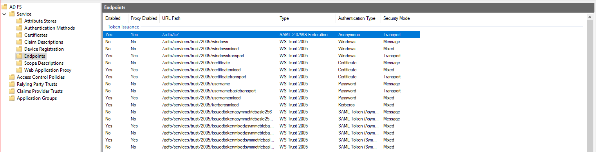

---

#### Setup Identity Provider Entity ID
1. From the **Federation Service Properties** dialog, copy the value under **Federation Service identifier**.
2. Paste it into the **Server** field inside the email service with type **Exchange**.

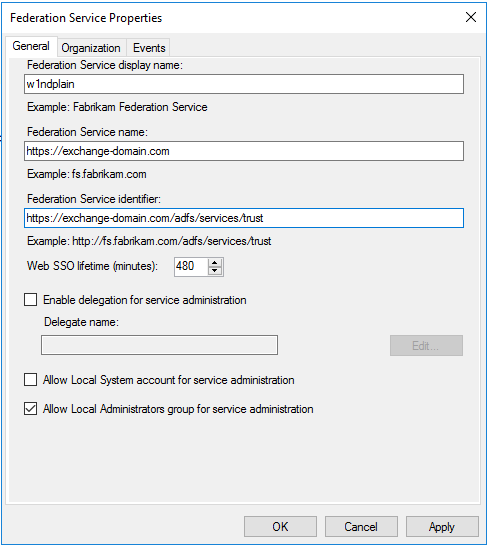

---

#### Setup X509 Certificate
1. From the AD FS management tool, select **AD FS > Service > Certificates** from the right panel. Right-click the certificate under the **Token-signing** section and click **View Certificate**.

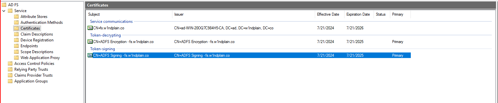

---

2. From the **Certificate** dialog, switch to the **Details** tab and click **Copy to File**.

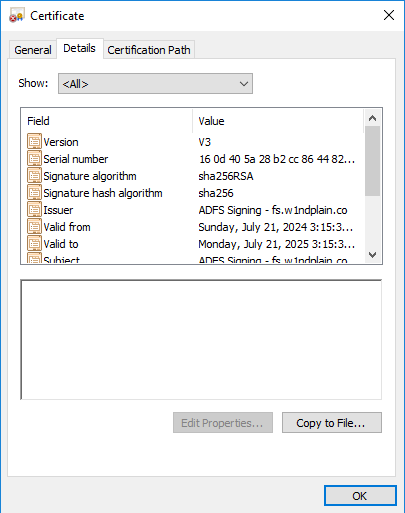

---

3. From the **Certificate Export Wizard**, click Next Select **Base-64 encoded X.509 (.CER)** for the format and click Next.

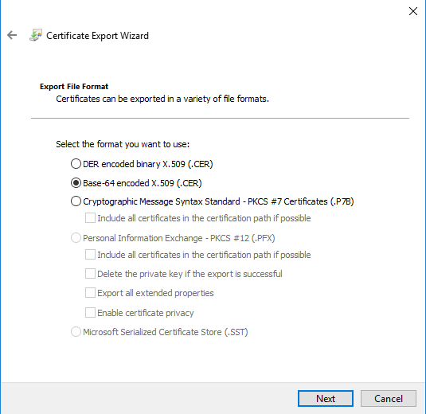

---

### Configure Relying Party Trust

1. From the **AD FS management tool**, expand **AD FS** from the left panel, Select **Relying Party Trusts** and click **Add Relying Party Trust** from the right panel.

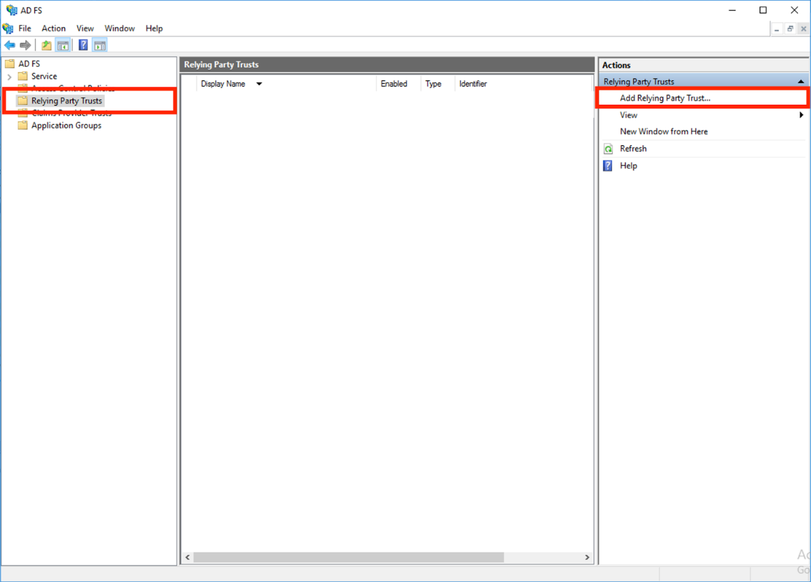

---

2. From the **Add Relying Party Trust Wizard**, select **Claim Aware** and click Start.

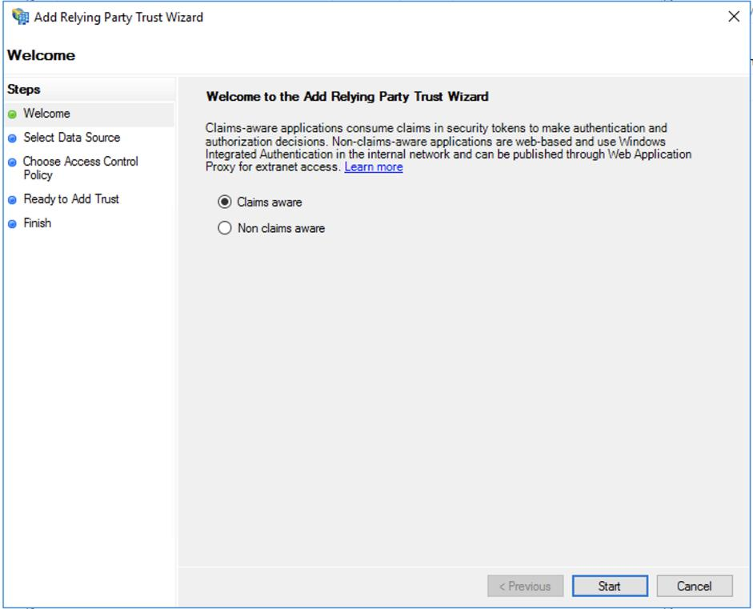

---

3. Select **Enter data about relying party manually** and click Next.

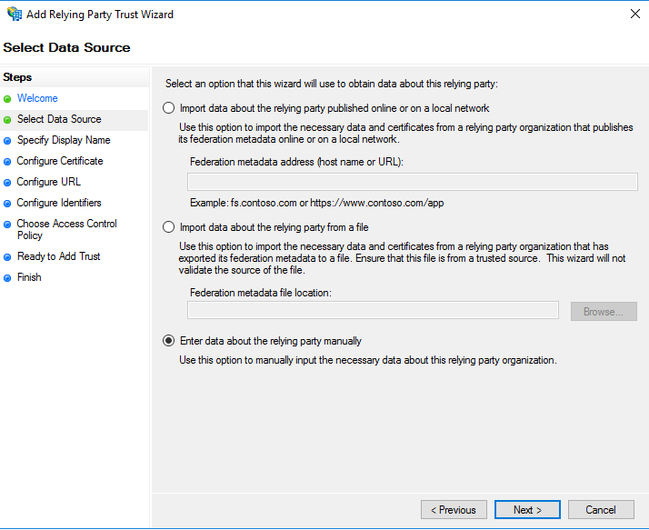

---

4. Enter a **Display name** for your relying party and click Next. This name will appear under your **Relying Party Trusts** list in the AD FS management tool.

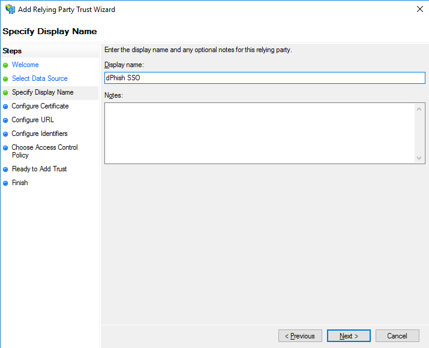

---

5. From the **Configure Certificate step**, click Next. You don’t need to encrypt any of the tokens as part of the setup.

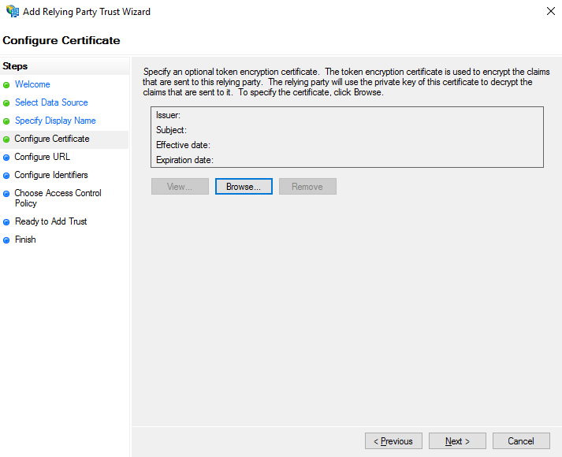

---

6. Select **Enable support for the SAML 2.0 Web SSO protocol**.

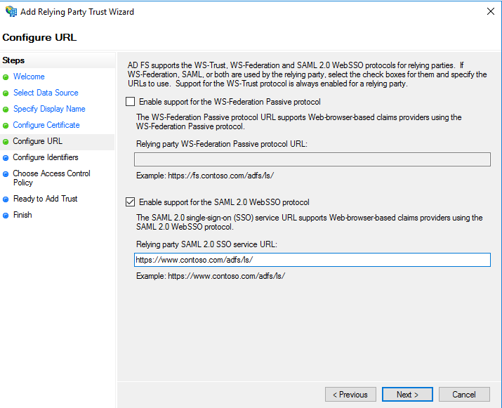

---

7. In the **Configure URL** page, copy the following **SP Assertion Consumer Service URL** and paste the value into the **Relying party SAML 2.0 SSO Service URL** field in the AD FS wizard.
   - **URL**: `https://subdomain.dphish.live/api/sso/adfs/callback/`
8. In the **Configure Identifier** page, copy the following identifier and paste the value into the **Relying Party Trust identifier**.
   - **URL**: `https://subdomain.dphish.live/api/sso/adfs/metadata/`

   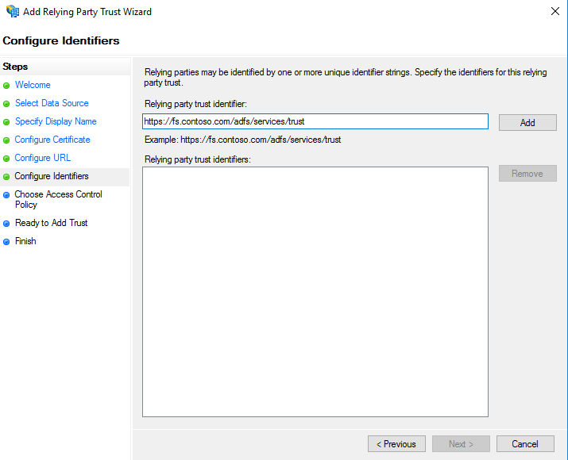

---
9. In the **Choose Access Control Policy** page, select: **Permit Everyone**.

   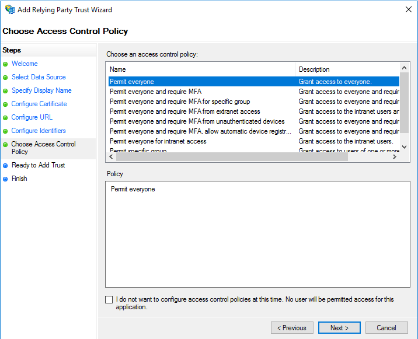

---

10. In the **Ready to Add Trust** page, click Next.
11. Click **Close** on the final page.

---

### Edit Claim Issuance Policy for Our Trust

After the user finishes the login process, AD FS will send back the claim, so it should be configured.

1. Right-click on the trust created earlier and choose: **Edit Claim Issuance Policy**.

   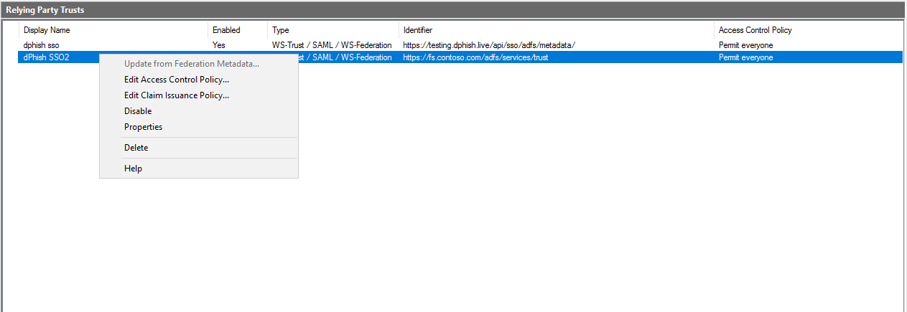

---
2. In the edit page, click **Add Rule**.

   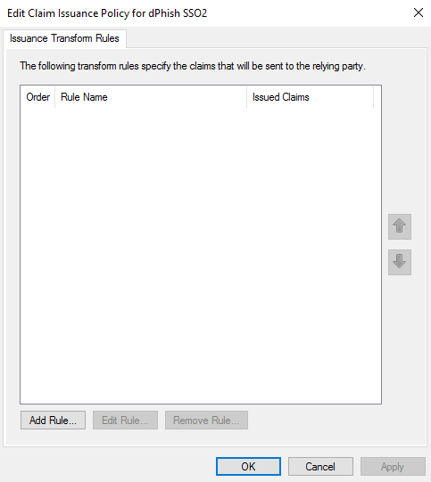

---

3. In the **Select Rule Template**:
   - Set claim attribute to **Send LDAP Attributes as Claims**.

      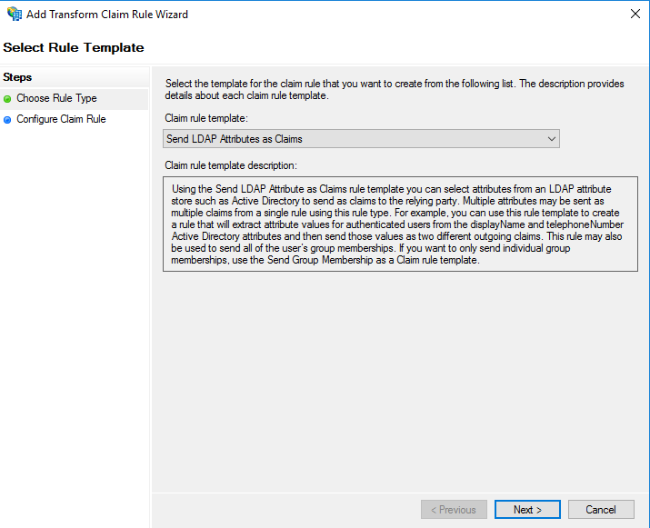

---

4. Add the following in the **Configure Claim Rule**:

   a) 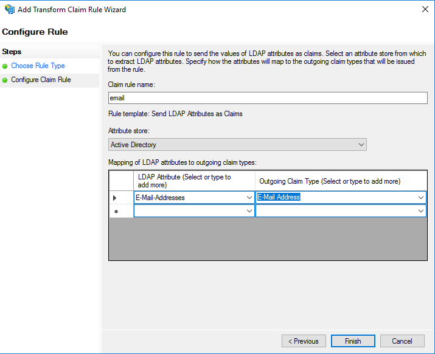

---

   b) 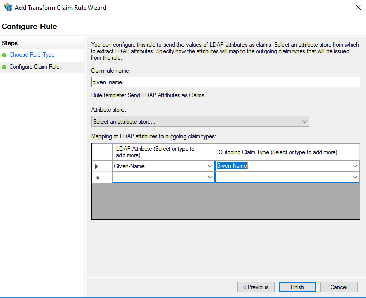

---

   c) 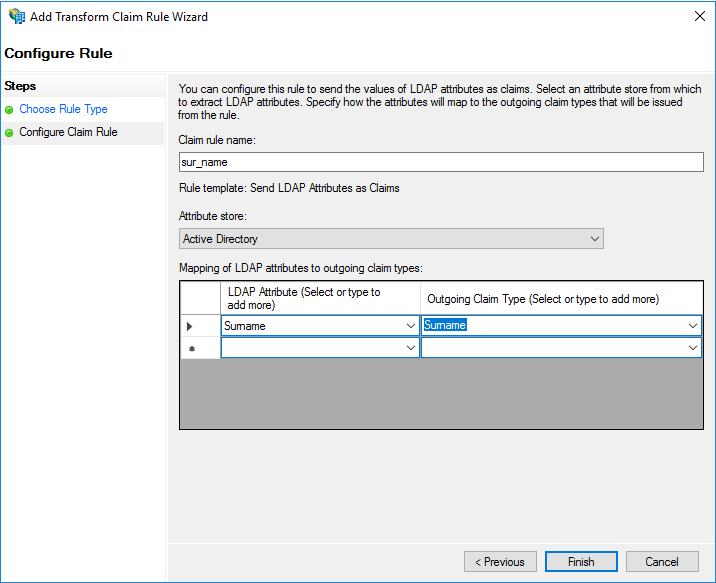

---

5. Next, configure the transform rule as follows:

   a) 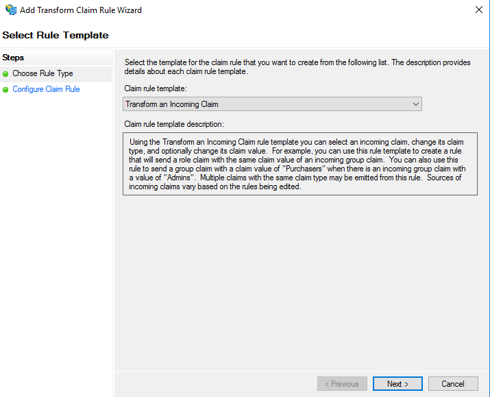

---

   b) 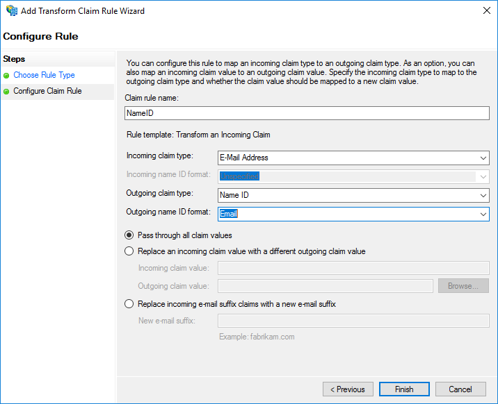

---

   c) 

---

