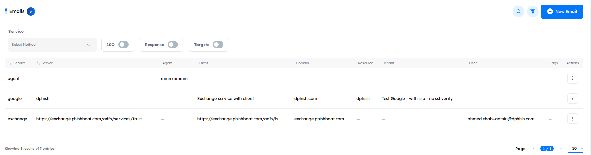
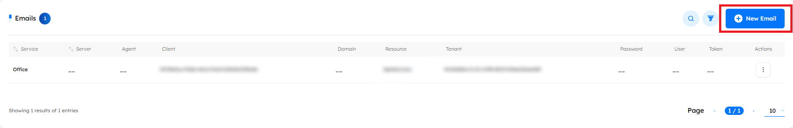
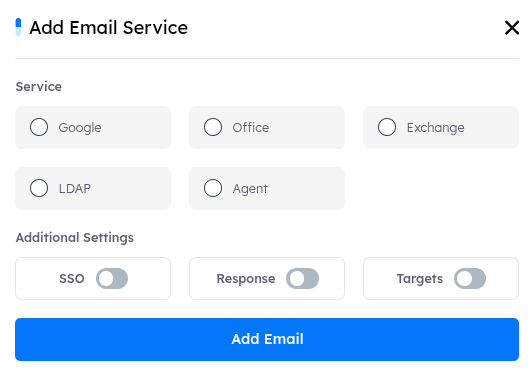

## Email Services

- integration between the client’s `Active Directory (AD)` and the tenant, streamlining the connection, onboarding process, and user management. This service enables seamless synchronization of user accounts, authentication, and access control, leveraging the client's existing AD setup. By integrating the AD with the tenant, this service reduces manual configurations and enhances security, making it easier to manage users.  
- Additionally, it supports efficient onboarding of new users by syncing user information from the AD to the tenant, ensuring consistency and accuracy.

### Available email services

1. Google
2. Office
3. Exchange
4. LDAP
5. Agent

---

### Inside Services for Email Integration

- The following inner services are part of the integration process for each email system (Google, Office, Exchange, LDAP, and Agent) and can be configured to meet the specific `needs` of the tenant for secure and efficient email communication and user management:

    1. **SSO (Single Sign-On)**: This service allows users to authenticate once across multiple systems without having to re-enter their credentials. For example, integrating Google or Office services with SSO would allow users to access various systems using their existing Google or Office credentials.

    2. **Response**: This service handles email interactions like bouncebacks, message delivery notifications, and tracking responses from emails sent through the system. It's useful for managing email campaigns and monitoring email status.

    3. **Target**: This service involves setting up email integrations with specific targets within the tenant, such as syncing user data with email systems (e.g., LDAP or Exchange) and ensuring smooth management of user access and authentication.

---

### Email Services Features

#### Actions Features

- **Edit**: Modify the email's configurations.
- **Delete**: Permanently remove the email.

#### Search Functionality

- `Search` button Located at the top right corner, allows you to find the email service by its `service`, or `server` used quickly.
- `Filter` button Next to the `Search` button, allows you to search based on the `service`, or `integration service`.

    

---

### Email Service Management

#### New Email Service
- To add a new email service, click the "New Email" button, select the desired service (e.g., `Google`, `Office`, `Exchange`, `LDAP` or `Agent`), and configure the necessary settings. You can also enable inner services like `SSO` (Single Sign-On), `TLS` (Transport Layer Security), `Response`, and `Target` for integration.

    

    

**How to**: After choosing the desired service, the required configuration settings will appear to fill out. Then, choose the integration services needed for the connection.
