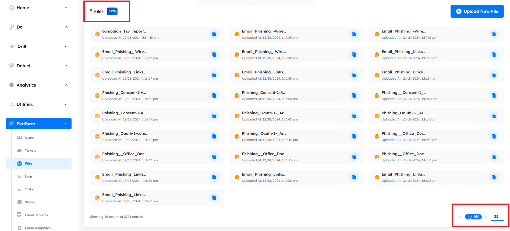
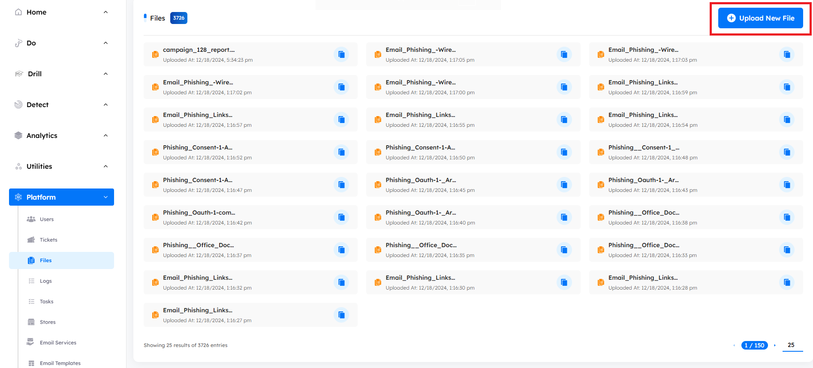
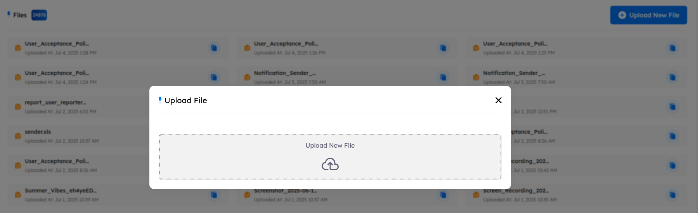

# Overview
> dPhish features an integrated file management system to handle all assets, including images, videos, icons, and other resources. These assets are securely hosted within dPhish’s file management infrastructure, ensuring efficient organization and accessibility.

## Main Page

Upon accessing the `files tab`, users encounter key indicators at the top of the page, displaying the total number of files. The interface includes pagination controls, allowing users to set the number of files displayed per page by adjusting options at the bottom of the page.

---

- ### Upload New File

    - Users can upload assets to dPhish’s file management system, allowing them to host files for use in awareness or phishing campaigns. These files can also be used for external purposes, providing flexibility in how they are utilized across different initiatives.
    

---

