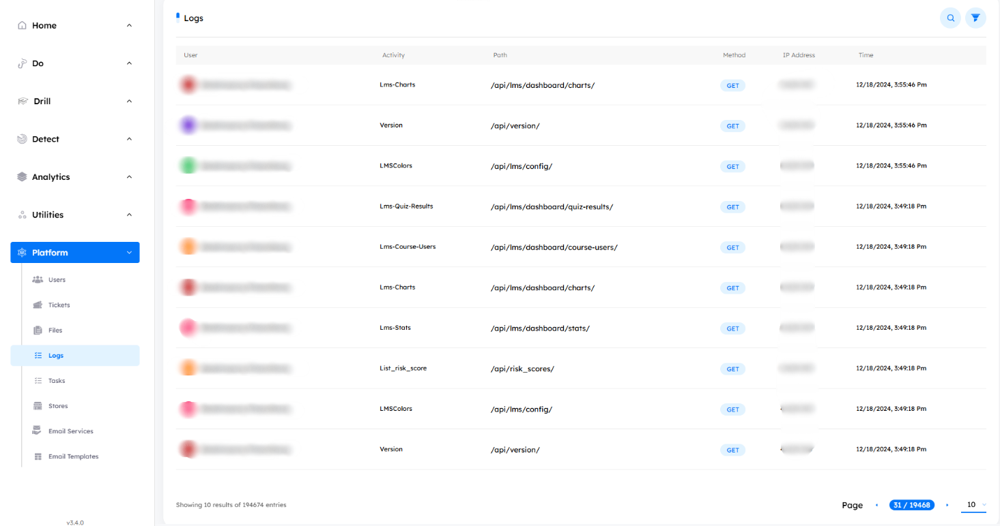

# Overview
> Inside the `logs tab`, you can monitor the interactions of all the admin users with access to the admin portal. It provides detailed records of their activities, including navigated paths, performed actions, timestamps, IP addresses, and HTTP methods used.

## Main Page

The interface includes pagination controls, allowing users to set the number of logs displayed per page by adjusting options at the bottom of the page.

---

## Logs Features

- ### Search Functionality

    - Located at the top right corner, the search button allows you to find the logs by its `path`, or `method` used quickly.

- ### Filtering Options

    - Next to the `Search` button, the `Filter` button allows you to search based on the log’s `method`, or `User`