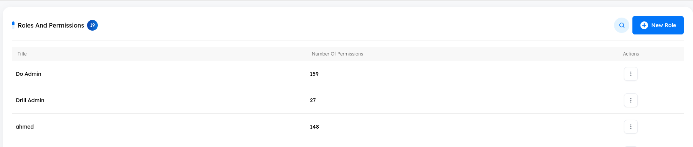
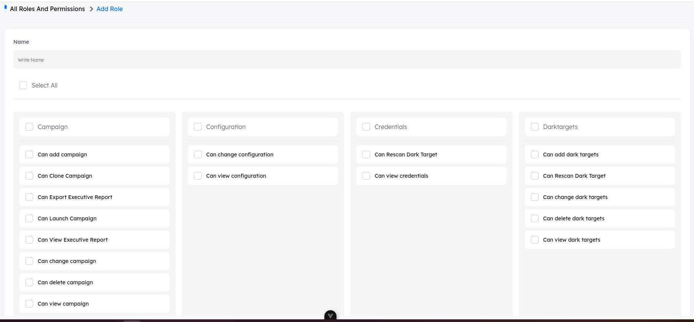

# Roles and Permissions Module Documentation

## Overview
The `Roles` and `Permissions` module allows administrators to define access control by assigning specific permissions to different roles. This ensures that users only have access to the functionalities required for their responsibilities.

## Features
- Create and manage roles.
- Assign permissions to roles.
- Group permissions into categories for better organization.
- Bulk selection of permissions.
- Assign multiple permissions to a role at once.

## User Interface Components

### Roles Page
This page allows administrators to create new roles and define their permissions.

#### Fields and Options
- **Name Field**: Input field where the administrator specifies the role name.
- **Select All Checkbox**: Enables the administrator to grant all permissions at once.
- **Permission Categories**

## Functionalities

### 1. Creating a Role
1. Click "Add Role" in the navigation.
2. Enter a role name in the Name field.
3. Select the required permissions by checking the boxes.
4. Click Save to create the role.

### 2. Assigning Permissions
- Administrators can manually select individual permissions.
- Using the Select All option will assign all available permissions to the role.

### 3. Editing a Role
1. Navigate to the Roles List page.
2. Click on the role to edit.
3. Modify the name or permissions as needed.
4. Click Save Changes.

### 4. Deleting a Role
1. Navigate to the Roles List.
2. Select the role to delete.
3. Click Delete and confirm the action.

## Access Control Implementation
The assigned permissions determine what actions a user can perform in the system. The backend should enforce these permissions using a middleware or policy-based system.

## Future Enhancements
- Role-based dashboard customization.
- Import/export permissions settings.
- API endpoints for programmatic role management.

---

## Modules and Required Permissions

### Dashboaard
The Dashboard module requires permissions from:
- **Platform**
- **Riskscore**

#### 1) Main
- **Can View Main Dashboard**
- **Can Run Risk Score**

#### 2) Do
- **Can View Do Dashboard**

#### 3) Drill
- **Can View Drill Dashboard**

#### 4) Detect
- **Can View Detect Dashboard**
---

### Do

### 1) Campaign
In the Campaign module, multiple permissions are required for full access. This module depends on permissions from different categories, including:
- **Campaign**
- **Target**
- **Post Campaign**
- **Tracker**
- **Sender**
- **Pages**
- **Templates**
- **Tickets**

### 2) Campaign Group
The Group Campaign module requires permissions from:
- **Campaign Group**
- **Campaign**
- **Target**
- **Post Campaign**

### 3) Post Campaign
The Post Campaign module depends on:
- **Post Campaign**

### 4) Emulations
The Emulations module requires permissions from:
- **ECampaign**
- **ETracker**
- **Sender**
- **Target**
- **Attack**
- **Tickets**
- **Report**

### 5) Attacks
The Attacks module requires permissions from:
- **Attacks**
- **AttacksVersion**

---

### Drill

#### 1) Courses
The Courses module requires permissions from:
- **Courses**
- **Content**
- **FAQ**
- **Quiz**
- **Course Comment**
- **Tracker**
- **Files**

#### 2) Stories
The Stories module requires permissions from:
- **Story**
- **Files**

#### 3) Tracks
The Tracks module requires permissions from:
- **Track**
- **Files**

#### 4) Categories
The Categories module requires permissions from:
- **Department**

#### 5) Groups
The Groups module requires permissions from:
- **Drillgroup**

#### 6) Announcements
The Announcements module requires permissions from:
- **Announcement**
- **Announcementtracker**
- **Target**

#### 7) Users
The Users module requires permissions from:
- **Drilluser**

#### 8) Badges
The Badges module requires permissions from:
- **Badge**
- **Files**

#### 9) Policies
The Policies module requires permissions from:
- **Policttrans**
- **Policytracker**
- **Report**
- **Files**

#### 10) Content Logs
The Content Logs module requires permissions from:
- **Contentlog**
- **Report**

---

### Detect

#### 1) Analyzed Emails
The Analyzed Emails module requires permissions from:
- **Email**
- **Ioc**
- **Rescan dark target**
- **Run response in Email Permission**
- **Ticket**
- **Report**

#### 2) IOC
The IOC module requires permissions from:
- **Ioc**

#### 3) Leaked Credentials
The Leaked Credentials module requires permissions from:
- **Darktargets**
- **Tickets**
- **Rescan dark target**
- **Report**

#### 4) Response
The Response module requires permissions from:
- **Run response in Email Permission**

---

## Analytics

### 1) Reports
The Reports module requires permissions from:
- **Report**  

### 2) Trackers
The Trackers module requires permissions from:
- **Tracker**  
- **Report**  

### 3) Credentials
The Credentials module requires permissions from:
- **Credentials**  
- **Report**  

---

## Utilities

### 1) Target
The Target module requires permissions from:
- **Target**  
- **Drilluser**  

### 2) Pages
The Pages module requires permissions from:
- **Page**  

### 3) Templates
The Templates module requires permissions from:
- **Template**  
- **Report**  

### 4) Sender
The Sender module requires permissions from:
- **Sender**  
- **Report**  

---

## Platform

### 1) Roles and Permissions
The Roles and Permissions module requires permissions from:
- **Roles**  

### 2) Users
The Users module requires permissions from:
- **User**  

### 3) Tickets
The Tickets module requires permissions from:
- **Ticket**  
- **Ticketcomment**

### 4) Files
The Files module requires permissions from:
- **Files**  

### 5) Logs
The Logs module requires permissions from:
- **Activitylog**  

### 6) Tasks
The Tasks module requires permissions from:
- **Taskmetainfo**  

### 7) Stores
The Stores module requires permissions from:
- **Can View Stores in Platform Permission**

### 8) Email Services
The Email Services module requires permissions from:
- **Emailservice**

### 9) Email Templates
The Email Templates module requires permissions from:
- **Template**
