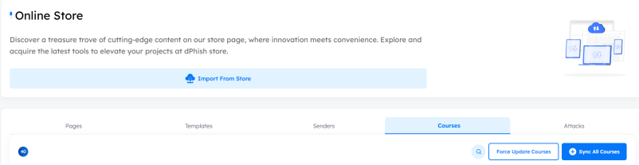

# Overview
> dPhish provides a `store` where clients can access the latest updates and assets, such as `pages`, `templates`, `senders`, `courses`, and `attacks`. This feature ensures users have a diverse and up-to-date collection of `phishing simulation tools` and `awareness content` to enhance employee security awareness and test organizational `security controls` against modern threats.

> [!NOTE]
> The term "assets" encompasses all pages, templates, senders, courses, and attacks.

## Import From Store
 - The `Import from Store` button allows users to import all available store content, including `pages`, `templates`, `senders`, `courses`, and `attacks`, directly into their tenant.

- #### General Notes:

    1. Importing from the store runs as a background task, ensuring it does not disrupt user interactions with other tenant services.
    2. The import operation does not modify existing assets or client-created assets within the tenant.
    3. Once the import is completed, the synced assets become part of the user's collection, and future imports will not affect them.
    4. If new content is added to an existing course in the store, the import operation will automatically incorporate the new content.

---

## Selective Import

- If the user prefers not to import all assets into their tenant, they can choose to import specific assets individually, such as:
    1. **Pages**
    2. **Templates**
    3. **Senders**
    4. **Courses**
    5. **Attacks**

    

---

## Pages

- Includes the latest available pages used for `login`, `announcement` or `awareness in campaigns`. These pages can be applied in various campaign types, including:
    1. **Email with Page**
    2. **Email with QR Code**
    3. **Email with QR Code (Download)**
    4. **Announcement Campaign**

    - Additionally, these pages can serve as `post-campaign service` as `redirect page` action, triggered after meeting specific `conditions` (e.g., `link_opened`, `credentials_saved`).

    - **How to synchronize Pages**: Click `Sync All Pages` button. This will import all the pages from the store into the tenant without affecting the existing pages.

    

---

## Templates

- Includes the latest available templates used for `email phishing`, `announcement` or `awareness tips`. These templates can be applied in various campaign types, including:
    1. **Email with Attachment**
    2. **Email with Page**
    3. **HID Attack**
    4. **SMS**
    5. **Email with QR Code**
    6. **Email with QR Code (Download)**
    7. **Announcement Campaign**

    - Additionally, these templates can serve in `post-campaign service` as `send email` action, triggered after meeting specific `conditions` (e.g., `link_opened`, `credentials_saved`).

    - **How to synchronize Pages**: Click `Sync All Templates` button. This will import all the templates from the store into the tenant without affecting the existing templates.

    

---

## Sender

- Includes the latest available senders used for sending `phishing campaigns`, `announcement campaigns` or `adversary emulation`.
- Additionally, these senders can also be utilized in `post-campaign services` such as `send email`. The sender will be used to send the template chosen, triggered after meeting specific `conditions` (e.g., `link_opened`, `credentials_saved`).
- **How to synchronize Pages**: Click `Sync All Senders` button. This will import all the senders from the store into the tenant without affecting the existing ones.
  
    

---

## Courses

- Courses include the latest training materials and up-to-date content designed to enhance the awareness and knowledge of the targets.
- **How to synchronize Courses**: Click `Sync All Courses` button. If new content is found that doesn't already exist in the same course within the tenant, the import operation will automatically add this new content. Existing content in the tenant will not be affected.
    
    

---

## Attacks

- Attacks include the latest simulation scenarios and attack vectors used for phishing campaigns or adversary emulation to test and evaluate security controls. These attacks are regularly updated to reflect current threat landscapes and modern tactics.
- **How to Synchronize Attacks**: Click the `Sync All Attacks` button to import all available attacks from the store into the tenant without affecting the existing attacks already in use. If any new attacks are available, they will be added to the tenant, while existing assets remain unchanged.    
    
    
