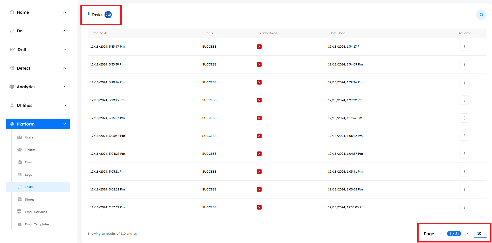
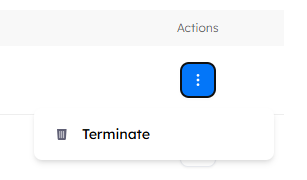

# Overview
> The `Tasks tab` displays all launched tasks across the tenant, including awareness campaigns, regular phishing, and adversary emulation campaigns. Admins can terminate ongoing tasks either directly from the Tasks tab or through task-specific management panel. For example, to terminate an adversary emulation, navigate to Do > Emulations > Campaign_Name > Actions > View, and use the Launch button to see the tasks history and terminate the chosen one.

## Main Page

Upon accessing the `Tasks tab`, users encounter key indicators at the top of the page, displaying the total number of tasks. The interface includes pagination controls, allowing users to set the number of tasks displayed per page by adjusting options at the bottom of the page.

---

## Tasks Features

- ### Actions Features

    - **Terminate Task**: Admins can `terminate` any ongoing task directly from the `Tasks` tab or through the task's specific management panel.
    

- ### Search Functionality

    - Located at the top right corner, the search button allows you to find the tasks by its `Task Name` used quickly.
