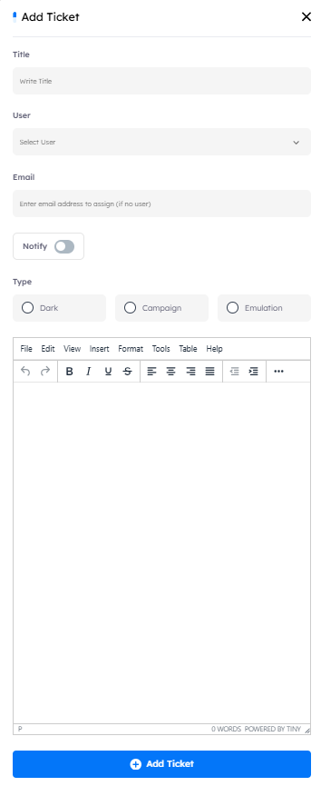

## Main Page

dPhish provides a comprehensive ticketing system to manage all services it covers, from raising a ticket to its resolution and closure.

- Utilization
    1. Raise tickets for issues or requests related to platform services.
    2. Track ticket statuses and updates throughout the resolution process.
    3. Manage and close tickets efficiently to ensure streamlined support.
    
---

## Tickets Features

- ### Actions Features

    - View Ticket: Allows viewing the details of an open ticket and provides the option to close it.
    - Delete: Permanently removes a ticket from the system

- ### Search Functionality

    - Located at the top right corner, the search button allows you to find a ticket by its name or User quickly.

---

## Managing Tickets

- ### New Ticket

    - **How to**: To open a new ticket, click on the `New Ticket` button. An interface will appear requiring the following details:
    
    1. **Title**: The title of the ticket (mandatory).
    2. **User**: The user assigned to the ticket.
    3. **Email**: An alternative email address if the assigned person lacks access to the dPhish system.
    4. **Type**: The type of ticket being raised (e.g., Dark/Detect, Campaign, Emulation).
    5. **Description**: Additional information or context related to the ticket.
    6. **Priority**: Select priority of the ticket (e.g, `low`, `medium`, `high`).

---

- #### General Notes:

    - Make sure that the `Notify` button is enabled to alert the assigned user about the raised ticket.
    - Tickets can be opened for the following modules:
        
        1. **Phishing Simulation Campaigns (Do)**: Manage issues related to phishing campaigns.
        2. **Adversary Emulation Campaigns (Do)**: Address concerns related to adversary emulation.
        3. **Analyzed Emails (Detect)**: Handle issues regarding analyzed emails.
        4. **Leaked Credentials (Detect)**: Raise tickets for leaked credentials.

---

- ### How to Close an Open Ticket

    - To close an open ticket, navigate to the `Actions` button next to the ticket and select `View Ticket`. This will open the ticket details interface, where you can review the ticket's information and choose the option to close it.

    - There are two separate pages for open and closed tickets. To navigate between them, use the `Get Closed Tickets` button to view all closed tickets. To return to the open tickets page, click the `Get Opened Tickets` button, and you'll be able to see the open tickets again.
