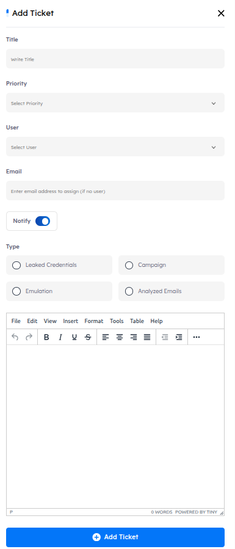
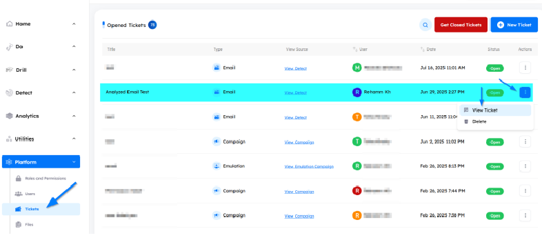

## Main Page

dPhish provides a comprehensive ticketing system to manage all services it covers, from raising a ticket to its resolution and closure.

- Utilization
    1. Raise tickets for issues or requests related to platform services.
    2. Track ticket statuses and updates throughout the resolution process.
    3. Manage and close tickets efficiently to ensure streamlined support.
    
    

---

1. **Title:** The name or subject of the ticket. This is the main identifier that briefly describes the issue or request.  
2. **Type:** The category of the ticket, indicating its source.  
    - For example:  
        - A ticket created from an Emulation Campaign.  
        - A ticket created from an Analyzed Email.  
3. **View Source:** A link or reference that leads to the original source of the issue.  
    - If the ticket is from a campaign, the link will direct to that campaign.  
    - If the ticket is from an analyzed email, the link will open the email analysis details.  
4. **User:** The person who reported or submitted the ticket.  
5. **Date:** The creation date of the ticket.  
6. **Status:** The current state of the ticket, e.g.:  
    - `Open` – still being handled.  
    - `Closed` – resolved or no further action needed.  
    7. **Actions:**  Available operations you can perform on the ticket, such as:  
    - Deleting the ticket.  
    - Opening the ticket to view details and comments.
    - Checking for any new comments or time-based actions related to the ticket.

## Tickets Features

- ### Actions Features

    - View Ticket: Allows viewing the details of an open ticket and provides the option to close it.
    - Delete: Permanently removes a ticket from the system

- ### Search Functionality

    - Located at the top right corner, the search button allows you to find a ticket by its name or User quickly.

---

## Managing Tickets

- ### New Ticket

    - **How to**: To open a new ticket, click on the `New Ticket` button. An interface will appear requiring the following details:
    
    1. **Title**: The title of the ticket (mandatory).
    2. **User**: The user assigned to the ticket.
    3. **Email**: An alternative email address if the assigned person lacks access to the dPhish system.
    4. **Type**: The type of ticket being raised (e.g., Dark/Detect, Campaign, Emulation).
    5. **Description**: Additional information or context related to the ticket.
    6. **Priority**: Select priority of the ticket (e.g, `low`, `medium`, `high`).

---

- #### General Notes:

    - Make sure that the `Notify` button is enabled to alert the assigned user about the raised ticket.
    - Tickets can be opened for the following modules:
        
        1. **Phishing Simulation Campaigns (Do)**: Manage issues related to phishing campaigns.
        2. **Adversary Emulation Campaigns (Do)**: Address concerns related to adversary emulation.
        3. **Analyzed Emails (Detect)**: Handle issues regarding analyzed emails.
        4. **Leaked Credentials (Detect)**: Raise tickets for leaked credentials.

---

- ### How to Close an Open Ticket

    - To close an open ticket, navigate to the `Actions` button next to the ticket and select `View Ticket`. This will open the ticket details interface, where you can review the ticket's information and choose the option to close it.

    - There are two separate pages for open and closed tickets. To navigate between them, use the `Get Closed Tickets` button to view all closed tickets. To return to the open tickets page, click the `Get Opened Tickets` button, and you'll be able to see the open tickets again.

- ### View Ticket: 
    - Allows viewing the details of an open ticket and provides the option to close it.

- #### Steps to view Ticket:  
    1. Go to Platform > Tickets  
    2. From Actions menu, select “View Ticket”:

    

---

- #### Ticket Details and Outer Metadata

    

    1. **Creation date** & **user**.  
    2. **Assign To:** The user assigned to the ticket.  
    3. **Notify To:** The email that will be notified.  
    4. **Priority:** The priority of the ticket (Low, Medium, High..).  
    5. **Type:** The type of the ticket (Leaked Credentials, Campaign, Emulation, Analyzed Emails).  
    6. **Source:** The URL of the source (Leaked Credential, Campaign Page, Emulation Page…etc.).  
    7. **Status:** The status of the ticket (Open, Closed).  
    8. **Comments:** The comments that are written by users in the ticket (reporter & assignee).
    9. **Reply Section:** You can write a reply in this area to send it to the reporter user.

    

    10. **Send Reply:** This button will send the reply to the reporter.  
    11. **Close Ticket:** This button will close the ticket.