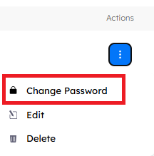
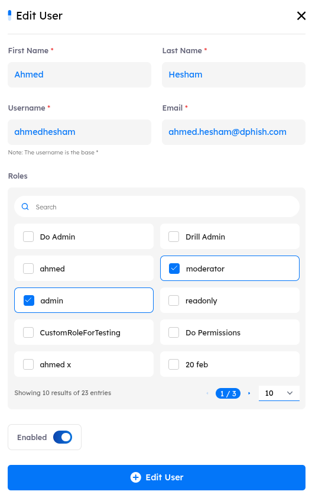

## Main Page

- Utilization
    1. Manage only `admin users` access.
    2. Control their `Roles` and `level of access` within the platform.
    3. Monitor and manage `account activation status` for each admin user.
    
---

## Users Features

- ### Actions Features

    - Change Password
    - Edit
    - Delete

- ### Search Functionality

    - Located at the top right corner, the `search` button allows you to find a user by its `name` or `email` quickly.

- ### Filtering Options

    - Next to the `Search` button, the `Filter` button allows you to search based on the users’ `email`, `role`, and `active status`.

---

## Managing Users

- ### Create New User

    - **How to**: To give access to a new user, click the `New User` button, which will open a configuration interface where you can enter the user’s details, including `first name`, `last name`, `username`, `email`, `Roles`, and `activation status`.

---

- #### General Notes:

    1. All the fields are `required`.
    2. The account is `enabled` by default.
    3. The user won’t be notified with his account creation and access credentials, unless the `Notify User on Creation` button is activated.
        a. **Location**: `Settings` > `Platform` > `Notify User on Creation`

---

- ### Change Password

    - **How to**: To change the password of an existing user, click on `Actions` next to the user and select `Change Password`. A pop-up will appear prompting you to enter and confirm the `new password`.

> [!NOTE]
> Only administrators have the authority to change passwords for both admin users and drill users.

---

- ### Edit User

    - **How to**: To Edit an existing user information, click on `Actions` next to the user and select `Edit`. A pop-up will appear prompting you with the user information which you can edit.

> [!NOTE]
> Only administrators have the authority to edit for both admin users and drill users.

---

- ### Delete User

    - **How to**: To delete a user, click on `Actions` next to the user and select `Delete`. A pop-up will appear warning you with the following “You will not be able to recover it once it is deleted.”

> [!NOTE]
> Only administrators have the authority to edit for both admin users and drill users.

