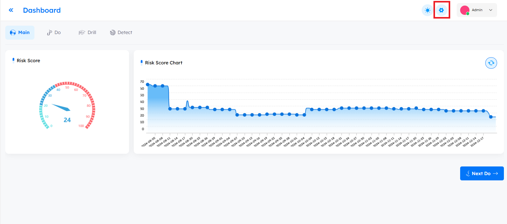
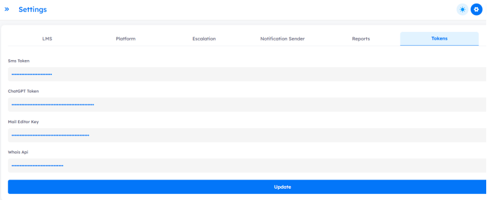
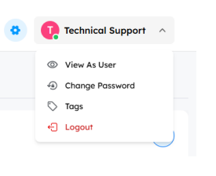

# Overview
> The `settings page` enables management to configure LMS options, customize platform colors, manage campaign reports, adjust platform settings, set course escalation timelines, configure notification sender settings, enable SSO and Azure integration, and handle token management.

- **How to access**: To access the settings page, click the `Settings` button located in the top-right corner of the platform interface.

---

### Settings Overview

- The settings page allows administrators to configure various aspects of the platform. It is divided into the following tabs:

    1. **LMS**
    2. **Reports**
    3. **Platform**
    4. **Escalation**
    5. **Notification Sender**
    6. **SSO**
    7. **Azure**
    8. **Tokens**

## LMS

- The admin can manage all aspects related to the LMS from this tab, including colors, logos, asset sizes, footer details, and additional settings detailed below.

| Setting Name        | Description    | Default Value                                  |
| ----------- | ----------- | ----------------------------------------
| Default Dialect      | This setting determines the default language dialect for stories, courses, and policies. It will be automatically applied if no specific dialect is selected by the user.       | en |
| Default Language   | This setting specifies the default language displayed on the login page.        | en          |
| Certificate Logo      | Allows admins to upload a logo to be displayed on certificates issued via the LMS.       | |
| Number Of Retake Course   | Specifies the maximum number of times a user is allowed to retake a course.        | 3              |
| Story Accents      | Allows the admin to specify the accents of the LMS stories available to drill users separated by commas. The available accents include: <ul><li>**EN**: English </li><li> **AR**: Arabic</li><li> **EG**: Egyptian</li><li> **SA**: Saudi</li></ul>           | ar,eg,sa,en |
| Policy Accents      | Allows the admin to specify the accents of the policy content available to drill users. Similar to the Story Accents, the available accents are: <ul><li>**EN**: English </li><li> **AR**: Arabic</li><li> **EG**: Egyptian</li><li> **SA**: Saudi</li></ul>   | ar,eg,sa,en |
| Favicon      | This setting allows the admin to upload a custom favicon, which is the small icon displayed in the browser tab next to the page title when the LMS platform is accessed.    |     |
| Enable OTP                 | **Enable OTP** button requires users to enter an OTP sent to their email when they try to log in. If this button is turned off, users can access the platform directly without being asked for an OTP.    | enabled   |
| certificate logo size      | This setting allows the admin to specify the size of the logo that will appear on the certificates issued through the LMS.    |  100   |
| footer logo size     | This setting allows the admin to specify the size of the logo that will appear in the footer of the LMS pages.    |  100   |
| header logo size    | This setting allows the admin to define the size of the logo displayed in the header of the LMS pages.    |  100   |
| login logo size   | This setting allows the admin to define the size of the logo that appears on the login page of the LMS.    |  192   |
| email logo size   | This setting allows the admin to define the size of the logo used in email templates.    |  192   |
| Cyber Aware Subject  |          |  Stay Cyber Aware   |
| Email Notification Logo   | Upload a logo to be displayed within email notifications sent from the system.    |     |
| wide logo   | Represents the header logo displayed in the LMS.  |     |
| LMS Guide AR   | It's a video in Arabic that explains how the user interacts with lms.    |     |
| LMS Guide EN   | It's a video in English that explains how the user interacts with lms.    |     |
| New Joiners Auto Assign   | Automatically adds newly created drill users to a designated "New Joiners" drill group. If this group is already assigned to a course, any newly added user will be automatically enrolled in that course.  |    enabled   |
| Footer Text Arabic  | Enter the text that will appear in the footer of the platform when displayed in Arabic.  |    مركزة جميع المهام المتعلقة بمكافحة التصيد الاحتيالي في منصة واحدة لتحقيق أقصى قدر من العائد بأسعار تنافسية بما في ذلك منصة التوعية، وتقييم التصيد الاحتيالي، والمكونات الإضافية لإعداد التقارير، والكشف عن تهديدات البريد الإلكتروني والاستجابة لها.   |
| Support Email   | Specify the email address that will be used for support-related communication. |  support@dphish.com   |
| Support Mobile   | Enter the mobile number that will be used for support-related communication. |     |
| Social LinkedIn  | | https://www.linkedin.com/company/88017705    |
| Social YouTube   | | https://www.youtube.com/@dphish   |
| Social X         | | https://x.com/dPhish1  |
| Footer Text       | This field allows you to customize the footer text displayed in the LMS platform when the language is set to English. | Centralize all anti-phishing-related tasks in one platform to maximize the return with competitive prices including awareness platform, phishing assessment, reporting plugins, detection, and response for email threats.  |
| logo         | Represents the logo displayed on the login page of the LMS. |   |
| Access For Targets (on creation)         | When `enabled`, any target added to the system will automatically be created as a drill user and will receive access credentials via email. The target will only be notified if the `"Notify User on Creation"` button is also enabled. |  enabled |
| Quiz Success Mark         | This setting defines the minimum passing score required for a target to successfully complete a quiz within a course. |  70  |
| Body BG Color        |  |  255 255 255  |
| BG light Color        |  |  247 247 247  |
| Dark Color            |  |  21 21 21 |
| Gray Light Color     |  |  209 204 204  |
| Gray Color     |  |  26 26 26  |
| Secondary Color    |  |  11 154 249 |
| Primary Color    |  |  0 65 194 |

---

> [!NOTE]
> Changes to colors are applied immediately after saving.

--- 

## Reports

- This tab allows the admin to manage executive reports related to campaigns, including adding recommendations.

| Setting Name        | Description    | Default Value                                  |
| ----------- | ----------- | ----------------------------------------
| Description AR    | Displayed as a description on the login page when the selected language is Arabic.       | Description Here |
| Title AR    | Displayed as the title on the login page when the selected language is Arabic.      | Title Here |
| Description EN    | Displayed as a description on the login page when the selected language is English.      | Description Here |
| Title EN    | Displayed as a title on the login page when the selected language is English.     | Title Here |
| Recommendations    | Those recommendations can be added to the executive report of the campaigns. Multiple sentences can be assigned by separating them with commas.      |  |
| Failure Threshold    | `Failure rate of campaign`   |  |

---

## Platform

- This tab enables administrators to manage general platform settings, such as enabling fast login, notifying users about account creation, and other platform-related configurations that will be detailed below.

| Setting Name        | Description    | Default Value                                  |
| ----------- | ----------- | ----------------------------------------
| Auto Remove Interval   | This setting is related to two actions in post-campaigns: "Add tag to target info" and "Add to drill group." After the specified interval in days, these actions will automatically be removed.      | 90 |
| Mail Gateway IPs    | This setting is used for filtering mail gateways while capturing trackers associated with targets in a simulated campaign. It helps ensure that only relevant email traffic is considered during campaign tracking. |       | 
| Change Password On First Login   | This setting allows new users to change their password upon their first login ensuring the enhancement of security.   | Enabled |
| Notify User On Course Assign  | When enabled, this setting sends a notification to users whenever a new course is assigned to them, ensuring they are informed promptly.    | Enabled  |
| Notify User On Creation    | When enabled, this setting automatically sends a notification to new users upon their creation in the system, providing them with their access credentials and relevant details.  |  Enabled     |
| `SSO Service`   | `This setting specifies the type of Single Sign-On (SSO) to be used for user authentication within the platform.`   |  |
| Notify User On Each Escalation   | When enabled, this setting ensures that users will receive notifications for every escalation related to a course deadline, as per the defined escalation days.  | Enabled   |
| Notify User On Course Deletion   | `When enabled, this setting ensures that users are notified whenever a course assigned to them is deleted from the system.`  | Enabled      |
| Fast Login   | When enabled, this setting allows users to bypass the standard login process by enabling a quicker authentication method.       |  Enabled     |
| Fast Login Duration   | the amount of time a user session remains valid after a fast or simplified login method.                           |  Duration by days     |
| Tracking Hosts   |    This setting allows you to specify the tracker hosts to be used in the simulation campaign. You can enter multiple tracker hosts, separated by commas.      | Each customer is provided with the necessary tracker hosts     |
| Notification OTP   |       | OTP For dPhish    |
| Notification New Course   |       | dPhish New Course   |
| Notification New User   |       | dPhish User Created  |
| Platform URL   |       | https://demoksa.dphish.live   |
| Email Service   |       | o365  |
| ChatGPT        |       | Enabled   |
| Admin Email     |       | support@dphish.com  |

---

## Escalation

- This tab allows administrators to specify when admins, managers, and users should be notified about the deadline of a specific course, ensuring timely reminders and actions.

| Setting Name        | Description    | Default Value                                  |
| ----------- | ----------- | ----------------------------------------
| Admin Escalation Days   |  This setting allows administrators to define the number of days `before` or `after` the course deadline when they will be notified.     | 0    |
| Manager Escalation Days   |  This setting allows administrators to define the number of days before or after the course deadline when managers will be notified.     | 0   |
| User Escalation Days   |  This setting allows administrators to define the number of days before or after the course deadline when users will be notified.     |  -5   |

---

> [!NOTE]
> - To notify before the deadline, use a minus "–" sign for the number of escalation days.
> - To notify after the deadline, use a plus "+" sign for the number of escalation days.
> - Example: -5, +4

---

## Notification Sender

- This tab configures the notification sender responsible for all tenant-generated emails, including new user access credentials, OTPs, assigned courses, and more.

| Setting Name        | Description    | Default Value                                  |
| ----------- | ----------- | ----------------------------------------
| Custom Notification Sender   | This setting enables the admin to add a custom notification sender and must be activated to use this feature.    | enabled    |
| Sender TLS  | This setting allows enabling or disabling `TLS` (Transport Layer Security) for the notification sender. It accepts a boolean value: true (enabled) or false (disabled).  | true    |
| Sender Password  | This setting is used to securely configure the password for the custom notification sender account.    |     |
| Sender user  | This setting specifies the username or email address of the custom notification sender account. It must `match` the credentials of the configured email service.    | notification@dphish.com    |
| Sender Port  | This setting specifies the port number used by the custom notification sender for email delivery.      |   587   |
| Sender Host | This setting specifies the hostname address of the mail server used by the custom notification sender.     |   smtp.office365.com   |
| Sender From  | This setting specifies the email address that will appear in the "From" field of emails sent from the tenant.     |   dPhish Notification <notification@dphish.com>   |

---

> [!NOTE]
> - Ensure the sender password is accurate to avoid email delivery issues.

## Tokens

- **SMS Token:** a secret API token used to authenticate and authorize your system when sending SMS messages through an external SMS gateway or service provider.
- **ChatGPT Token:** a secret API key used to authenticate your application or system when interacting with OpenAI's ChatGPT API.
- **Mail Editor Key:** a secret token used to allow the system or any external client to access or interact with the mail editor securely.
- **WHOIS API Token:** a secret authentication key that allows your application or system to access WHOIS information about domain names through a WHOIS API service.

---

## User Menu Items

- **View As User:** Allows the admin to access and view the LMS, without having to log out of the platform.
- **Change Password:** Allows the admin to change the password of their own account.
- **Tags:** Displays all the tags available on the platform.
- **Logout:** Allows the admin to log out from the platform.

---