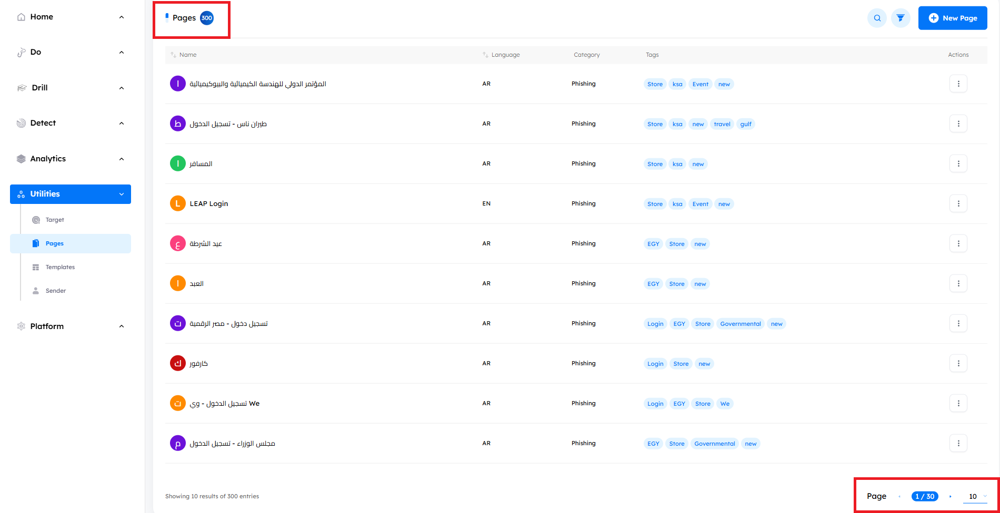
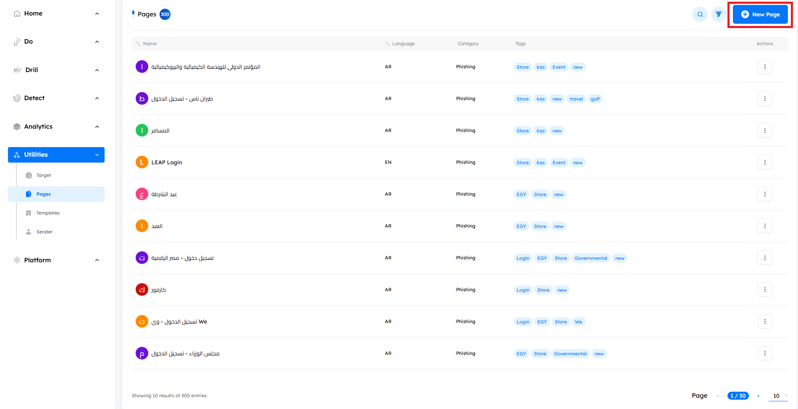
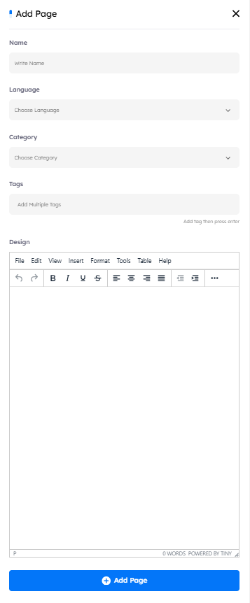

## Overview

> `Pages` are used in campaigns to either phish target credentials (phishing) or raise awareness and deliver a message (announcement). You can manage pages from this tab, including creating new pages and editing existing ones.

# Main Page

Upon accessing the `Pages tab`, users encounter key indicators at the top of the page, displaying the total number of pages. The interface includes pagination controls, allowing users to set the number of pages displayed per page by adjusting options at the bottom of the page.

---

## Pages Features

- ### Page Details and outer metadata

    - A comprehensive information bar above the pages provides essential details such as the page name, language, category, tags, and actions for further management.

        1. **Name**: The name of the page.
        2. **Language**: The language in which the page is created. Available languages include `English`, `Arabic`, `German`, and `French`.
        3. **Category**: The type of page (Phishing or Announcement).
        4. **Tags**: Additional labels for easy identification and organization.
        5. **Actions**
            - `View`: Preview the page without the ability to edit any information.
            - `Edit`: Modify the page details and content.
            - `Clone`: Duplicate the page for reuse.
            - `Delete`: Remove the page permanently.

- ### Search Functionality

    - Located at the top right corner, the search button allows you to find a page by its name quickly.

- ### Filtering Options

    - Next to the Search button, the `Filter` button allows you to search based on the page’s `tags`, `language`, `category`.

## Managing Pages
- ### Create New Page

    - **How to**: Click on the `New Page` button. An interface will appear containing a text editor and a development environment, allowing you to create and design the page.

    

    

> [!NOTE]
> The same Integrated Development Environment (IDE) is used when editing an existing page.