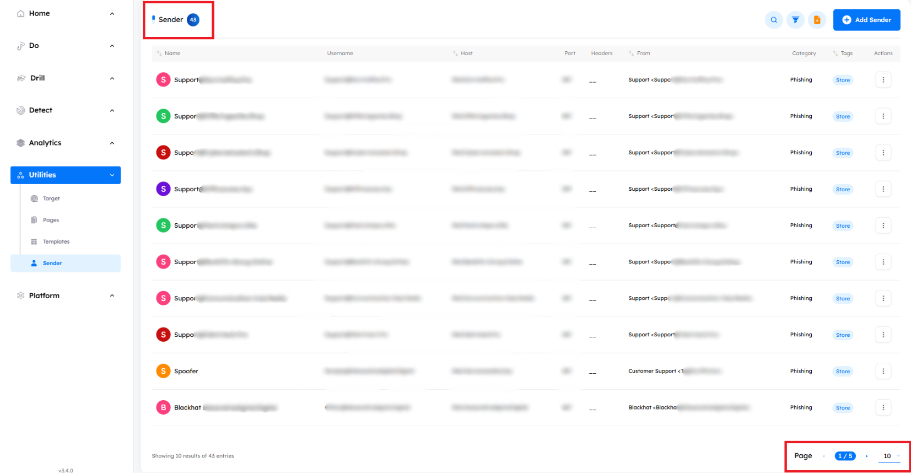
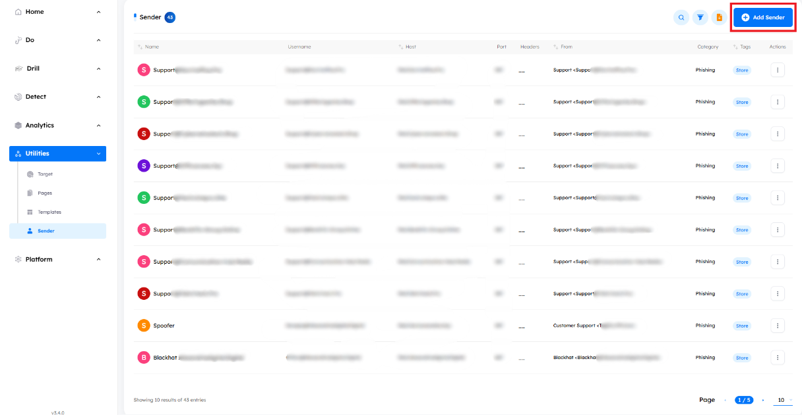
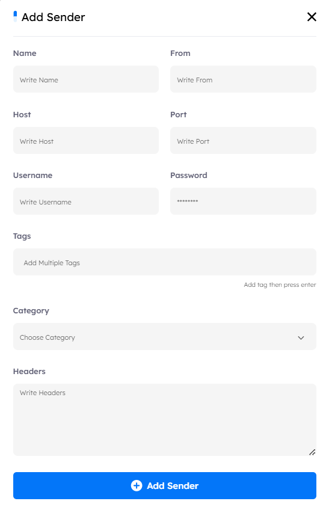

## Overview

> The `Sender` tab contains all the available senders that the administrator can use in campaigns to send phishing emails or awareness emails and tips. You can manage all the senders from this section.

# Main Page

Upon accessing the `Senders tab`, users encounter key indicators at the top of the page, displaying the total number of senders. The interface includes pagination controls, allowing users to set the number of senders displayed per page by adjusting options at the bottom of the page.

---

## Senders Features

- ### Senders Details and outer metadata

    - A comprehensive information bar above the senders provides essential details for effective management. These details include:

        1. **Name**: The name of the sender.
        2. **Username**: The username associated with the sender's account.
        3. **Host**: The host address used by the sender.
        4. **Port**: The port number for the sender's connection.     
        5. **Header**: The header information for email configuration.
        6. **From**: The email address from which the message is sent.
        7. **Category**: The type of sender used for (Phishing or Announcement).
        8. **Tags**: Additional labels for easy identification and organization.
        9. **Actions**
            - `View`: Preview the sender's details.
            - `Edit`: Modify the sender details.
            - `Clone`: Duplicate the sender for reuse.
            - `Delete`: Remove the sender permanently.

- ### Search Functionality

    - Located at the top right corner, the search button allows you to find a sender by its name quickly.

- ### Filtering Options

    - Next to the `Search` button, the `Filter` button allows you to search based on the sender’s `name`, `from`, `host`, `tag`, and `category`.

- ### Export Data

    - The `Export Data` button allows you to export a file containing all senders data. And an email will be sent to the registered admin panel email with a link to download the report.

## Managing Senders
- ### Add Senders

    - **How to**: To add a sender, click the `Add Sender` button, which will open a configuration interface where you can enter the sender’s details, including name, username, host, port, header, "from" address, category, and tags. After filling in the required information, save the sender to add it to the system.

    

    

> [!NOTE]
> All the fields are required except: Tags and Headers.