## Overview

> The Target service manages all available targets within the tenant, including individuals for phishing simulation campaigns and devices for adversary emulation to test security controls. Targets can be added to the tenant in various ways, such as uploading a CSV file, using LDAP integration, or importing from Azure. Each method is detailed below.

# Main Page

Upon accessing the `Target tab`, users encounter key indicators at the top of the page, displaying the total number of targets. The interface includes pagination controls, allowing users to set the number of targets displayed per page by adjusting options at the bottom of the page.

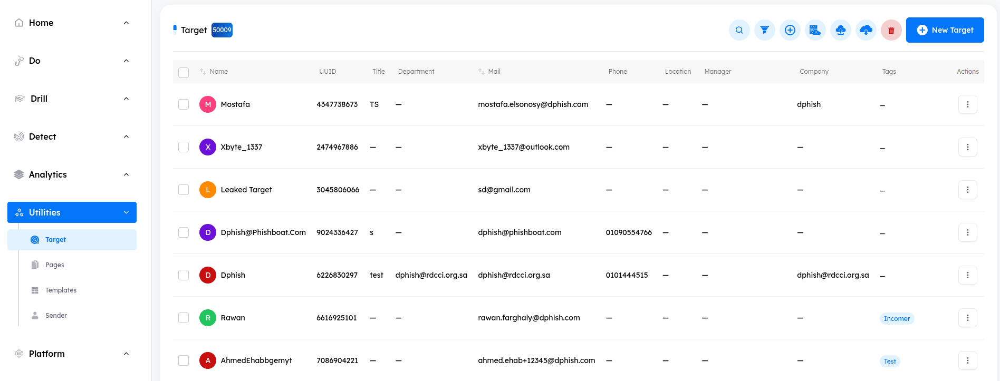

---

## Target Features

- ### Target Details and Additional Metadata

    - A comprehensive information bar above the targets provides essential details such as the target name, UUID, title, department, mail, phone, location, manager, company, tags, and actions for further management.
        
        1. **Checkboxes**: are available for selecting multiple targets for bulk actions.
        2. **Target Name**: The name of the target.
        3. **UUID**: Universal Unique Identifier (UUID) for the target.
        4. **Title**: The title or position of the target.
        5. **Department**: The department to which the target belongs.
        6. **Mail**: The email address of the target.
        7. **Phone**: The phone number of the target.
        8. **Location**: The physical location of the target.
        9. **Manager**: The manager associated with the target.
        10. **Company**: The company the target is part of.
        11. **Tags**: Labels or tags assigned to the target for categorization.
        12. **Arrows**: The sorting feature in column headers.
        12. **Actions**:
            - `View`: View target’s information.
            - `Edit`: Edits target’s information.
            - `Create Drill Account`: Create drill user for specific target, granting them access to the LMS.
            - `Delete`: Deletes the target from the system.

    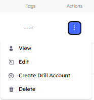

> [!NOTE]
> Columns such as `Name` and `Mail` are sortable using the provided arrows in order descending.

---

- ### Search Functionality

    - Located at the top right corner, the search button allows you to find a target by its name or email quickly.

- ### Filtering Options

    - Next to the `Search` button, the `Filter` button allows you to search based on the target’s `name`, `title`, `mail`, `tags`, `department` or `company`.

- ### Export Data

    - The `Export Data` button allows you to export a file containing all targets data.

- ## Managing Targets

    - The client can onboard the company's employees (targets) through four different methods.

        1. Manual
        2. CSV File
        3. LDAP integration
        4. Office365 integration

- ### General Notes

    1. Importing users exceeding the permitted license limit will lead to the complete rejection of the imported data.
    2. Duplicating any user (based on their email address) will result in the entire imported data being discarded.
    3. When using a CSV file to import targets, adding or removing any columns in the file will cause the entire imported data to be rejected.

- ### Add new target manually

    - To add a new target manually, click the `New Target` button and enter the required information.

> [!NOTE]
> The following columns are required
>   - Name
>   - Mail

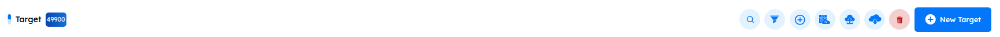

---

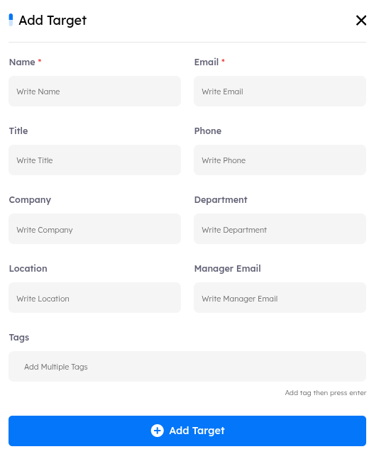

---

- ### Delete All Targets
    
    1. The `Delete All Targets` button allows you to delete all targets from the list.

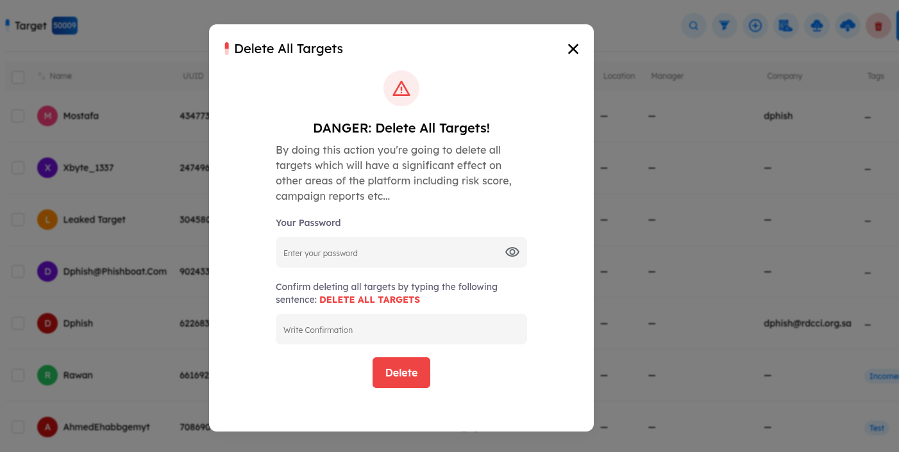

---

- ### CSV File

    1. Download the CSV Template from the `Import Targets` button.
    2. Fill it with the targets’ data. 
    3. Select the completed file and upload it to the system.

- **To download the CSV template**: navigate to `Utilities module` > `Import Targets` > `CSV Sample`

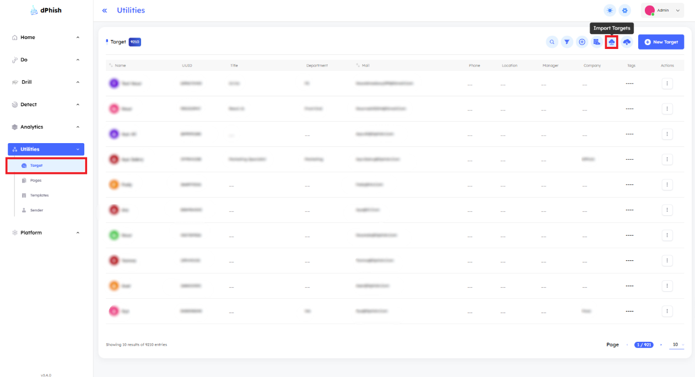
    

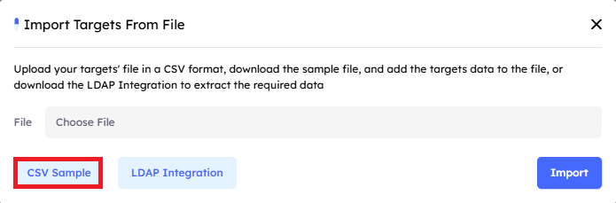

---

> [!NOTE]
> The following columns are required in the CSV file
>   - Name
>   - Mail

- ### LDAP Integration

    1. Navigate to `Platform` > `Email Services` in your admin panel.

    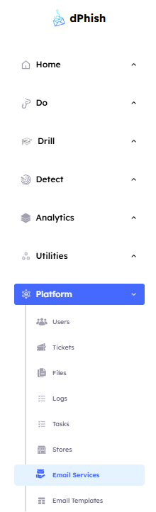

    2. Add `New Email` to begin the integration setup.

    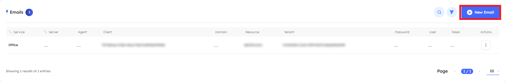

    3. Choose `LDAP` and fill in the required LDAP `connection details` (e.g., Server, Domain, User, Password, Other).

    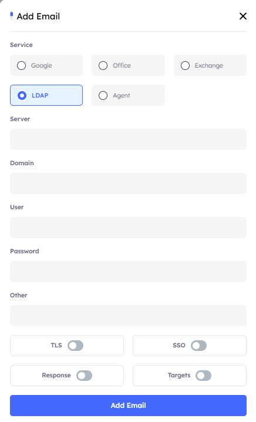

    4. Select and enable the service for integration, such as `Targets`.

    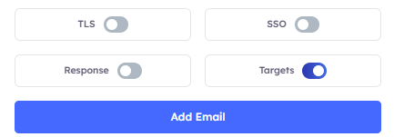

    5. Save configurations.

    6. Get back to `Targets tab` Use Sync Button to import the targets from the active directory.

    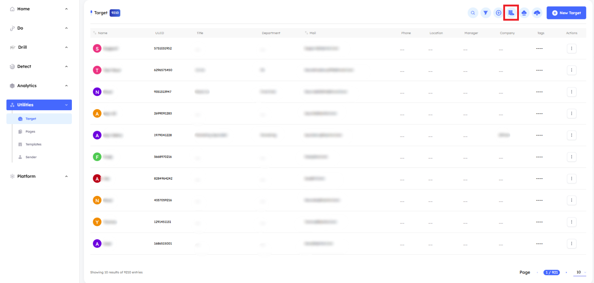

---
## Azure/O365 Integration
- dPhish integration with Azure is based on “Microsoft Graph”, accordingly the client has to **Register an application on Azure and share the following**

    1. `Sign in to the Azure portal`:
        - Go to [Azure portal] (https://portal.azure.com/).
        - Sign in with your Azure account.
    2. `Navigate to Azure Active Directory`:
        - In the left-hand navigation pane, click on "Azure Active Directory."
    3. `Register a new application`:
        - In the Azure Active Directory blade, select "App registrations" or "App registrations (Preview)."
        - Click on "New Registration" to create a new application registration.
    4. `Configure the application registration`:
        - Enter a name for your application.
        - Choose the appropriate Supported account types based on your requirements (e.g., single tenant, multi-tenant).
        - For the Redirect URI, you can leave it blank for now or specify a redirect URI if needed.
    5. `Register the application`:
        - After filling in the required details, click on the "Register" button to create the application.
    6. `Add API permissions`:
        - Once the application is registered, navigate to "API permissions" or "API permissions (Preview)."
        - Click on "Add a permission" and select "Microsoft Graph" as the API you want to access.
        - Choose "Delegated permissions" or "Application permissions" depending on your scenario.
        - Search for and select the permissions you need. For reading all users' information, you might need permissions like:
            - User.Read
            - User.Read.All
            - User.Export.All

            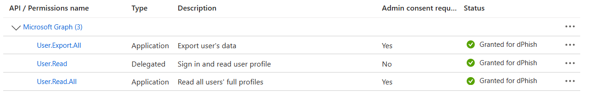

    7. Grant admin consent:
        - Go to "API permissions," click on "Grant admin consent for [your tenant]," and confirm the consent.
    8. Get application (client) ID and tenant ID:
        - In the application overview, note down the `Application (client) ID`, `Client Secret`,  and `Directory (tenant) ID`. You'll need these values for authentication.
    9. Generate `Client Secret`:
        - In the application's overview, navigate to "Certificates & secrets."
        - Click on "New client secret," enter a description, choose an expiration period, and click "Add." Note down the client's secret value as it will be required for authentication.

    - These steps should guide you through creating an Azure AD application with permission to read all users' information. For more detailed guidance and visual aids, refer to Azure's documentation.

    ## After the preparation of Azure AD follow the below steps:

    1. Navigate to `Platform` > `Email Services` in your admin panel.

        

    2. Add `New Email` to begin the integration setup.

        

    3. Choose `Office` and fill in the required office `connection` details (e.g., Tenant, Client, Secret, Resource, Other).

        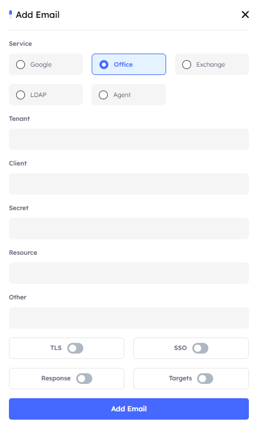

    4. Select and enable the service for integration, such as `Targets`.

        

    5. Save configurations.

    6. Get back to `Targets tab` Use Sync Button to import the targets from the active directory.

        
    
- ### Create Drill Accounts

    - The admin has access to `three methods` for creating `drill accounts`, each differing in the number of users created and the level of management required.

        1. Create drill accounts to all the targets.
        2. Create drill account to a specific target.
        3. Auto access for targets (on creation).
        4. Create drill account via drill module.

    - **Create drill accounts to all the targets**
    - **Purpose**: Provide LMS access to a large number of targets.
    - **How to**: Click the `Create Drill Accounts` button. The system will automatically generate accounts for all targets in the system and send them an email with their access credentials.

        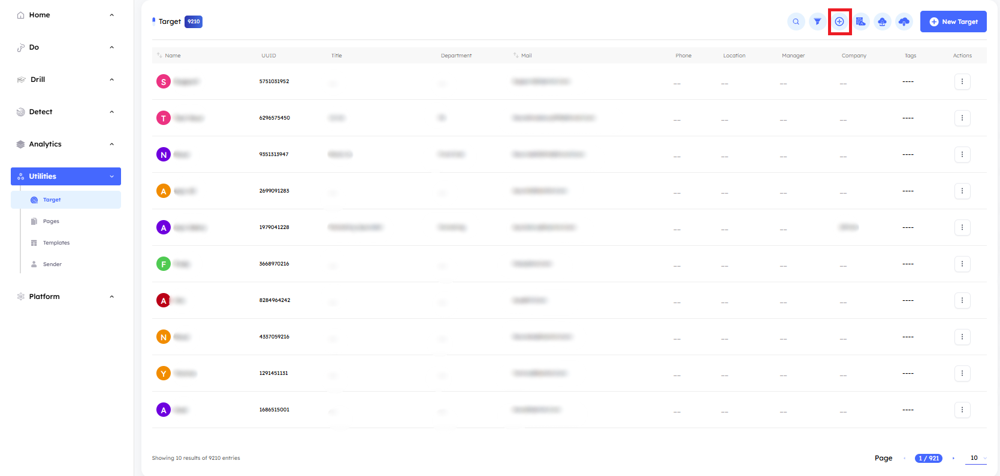

        ---

        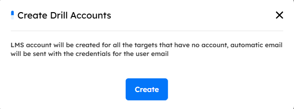

    - **Create drill account to a specific target**
    - **Purpose**: Provide LMS access to a single target.
    - **How to**: Click the `Actions` button next to the desired target, then select `Create Drill Account` to generate their account.

        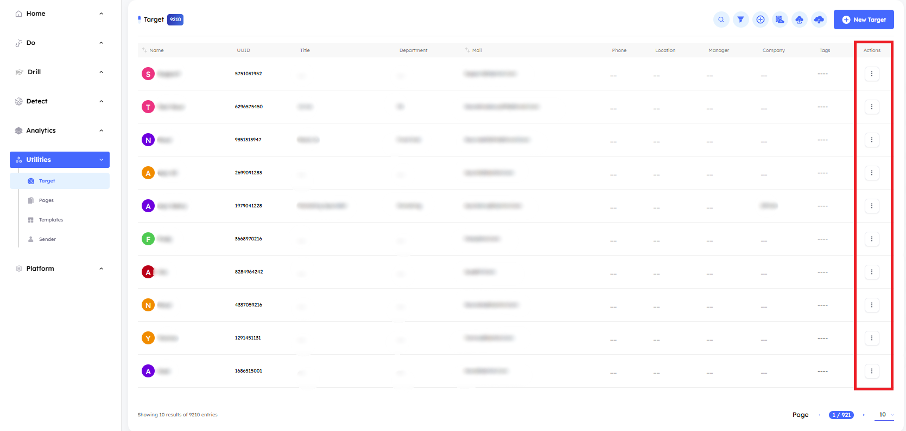

        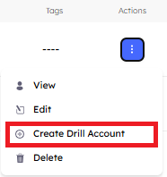

    - **Auto access for targets (on creation)**
    - **Purpose**: Automatic access to the LMS for new targets.
    - **How to**: Go to `Settings` > `LMS` and enable the `Access For Targets (On Creation)` button. Whenever a new target is added to the system, an account will be automatically created for them, and they will receive an email with their access credentials.

        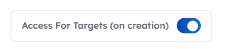

    > [!NOTE]
    > After creating a new user, they will receive an email with their access credentials and a link to the tenant. This feature will only execute if enabled in the settings (Settings > Platform > Notify user on creation).

    - **Create drill account via drill module**
    - **Purpose**: Manually create a new user and manage their access to the LMS.
    - **How to**: The administrator can click the `New User` button from the `Drill` > `Users section`, enter the user's information manually, and choose to enable or disable the account during creation.

        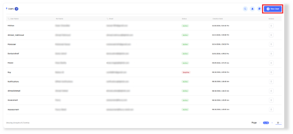

    - Each user is defined by the following metadata fields:
        1. **First Name**
        2. **Last Name**
        3. **Username**: The unique identifier for the user in the system.
        4. **Email**: The email address associated with the user’s account.
        5. **Enabled**: This is an enable button that toggles the user’s account status between Active and Inactive.

        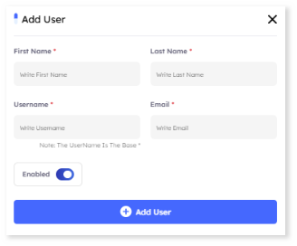

    > [!NOTE]
    > After creating a new user, they will receive an email with their access credentials and a link to the tenant. This feature will only execute if enabled in the settings (Settings > Platform > Notify user on creation).
