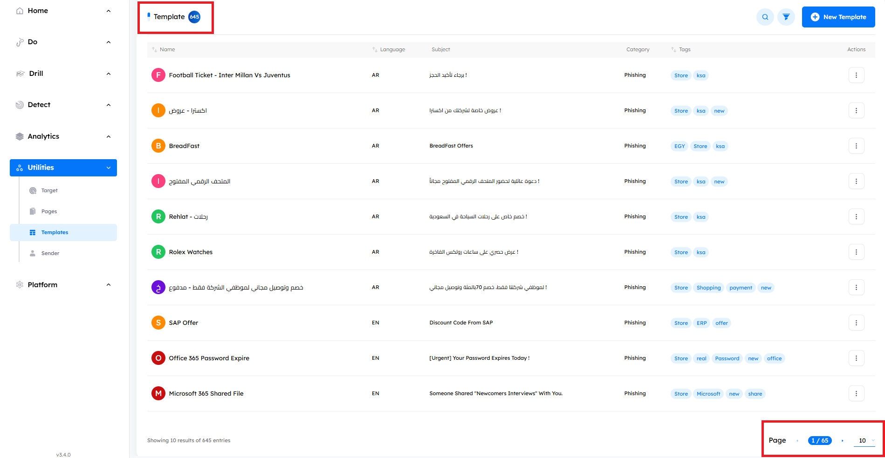
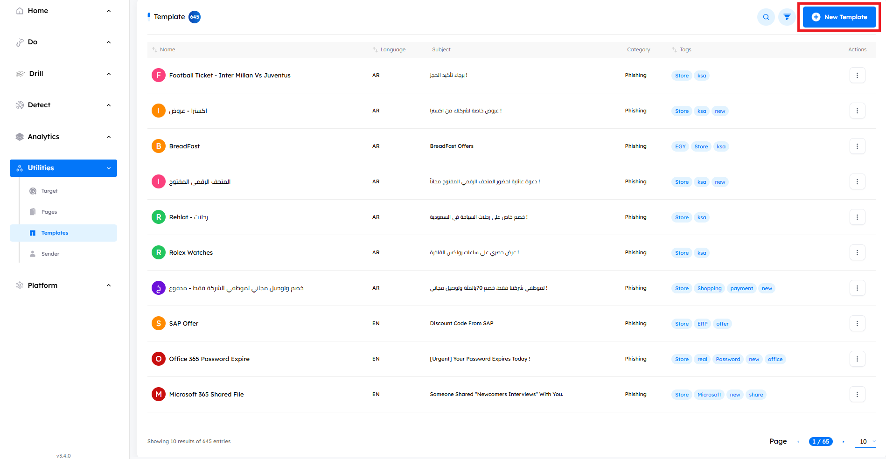
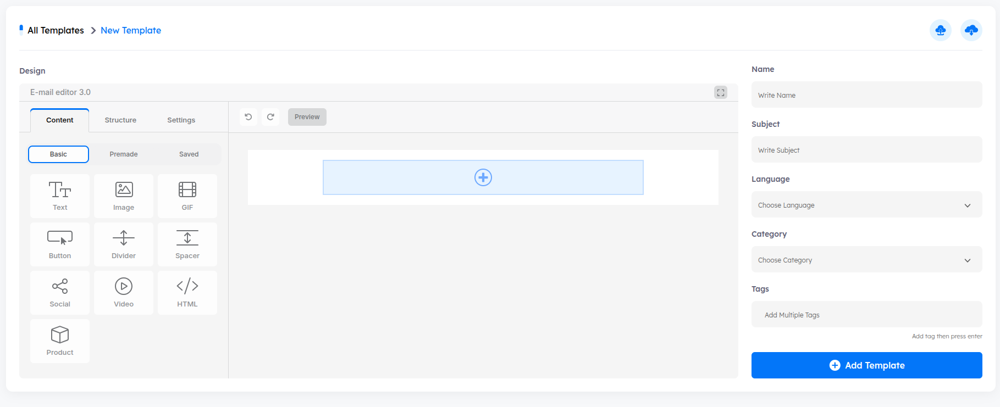

## Overview

> `Templates` are used in campaigns to either phish targets (phishing) or deliver awareness messages (awareness). You can manage templates from this tab, including creating new templates and editing existing ones.

# Main Page

Upon accessing the `Templates tab`, users encounter key indicators at the top of the page, displaying the total number of templates. The interface includes pagination controls, allowing users to set the number of templates displayed per page by adjusting options at the bottom of the page.

---

## Templates Features

- ### Templates Details and outer metadata

    - A comprehensive information bar above the templates provides essential details such as the template name, language, category, tags, and actions for further management.

        1. **Name**: The name of the template.
        2. **Language**: The language in which the template is created. Available languages include `English`, `Arabic`, `German`, and `French`.
        3. **Subject**: The subject of the email that the target will receive.
        4. **Category**: The type of page (Phishing or Announcement).
        5. **Tags**: Additional labels for easy identification and organization.
        6. **Actions**
            - `View`: Preview the template without the ability to edit any information.
            - `Edit`: Modify the template details and content.
            - `Clone`: Duplicate the template for reuse.
            - `Delete`: Remove the template permanently.

- ### Search Functionality

    - Located at the top right corner, the search button allows you to find a template by its name quickly.

- ### Filtering Options

    - Next to the `Search` button, the `Filter` button allows you to search based on the template’s `tags`, `language`, `category`.

## Managing Templates
- ### Create New Templates

    - **How to**: Click on the `New Template` button. An interface will appear containing a text editor and a development environment, allowing you to create and design templates.

    

    

> [!NOTE]
> The same Integrated Development Environment (IDE) is used when editing an existing template.